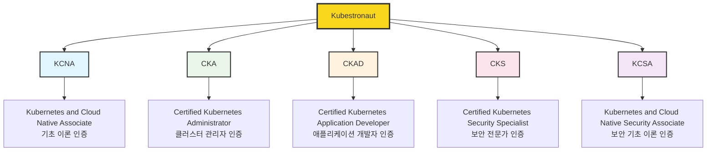

# CNCF Kubestronaut

> 안녕하세요! 이 글은 CNCF의 인증 프로그램인 Kubestronaut에 대한 종합적인 정보를 제공합니다. 쿠버네티스와 클라우드 네이티브 기술의 전문성을 인정받고 싶은 모든 분들께 도움이 되기를 바라며, 혹시 부족한 부분이나 개선할 점이 있다면 언제든 피드백 부탁드립니다.

## 들어가며

클라우드 네이티브 기술이 현대 IT 인프라의 핵심이 된 지금, 쿠버네티스 전문성을 체계적으로 인증받을 수 있는 프로그램이 바로 **CNCF Kubestronaut**입니다. 단순히 하나의 자격증을 취득하는 것이 아니라, 쿠버네티스 생태계 전반에 대한 깊이 있는 이해와 실무 능력을 종합적으로 검증받는 프리미엄 인증 프로그램입니다.

2025년 현재, Kubestronaut는 전 세계 쿠버네티스 커뮤니티에서 많은 엔지니어들이 시도하는 인증으로 자리잡았습니다.

## Kubestronaut란 무엇인가?

### 프로그램 개요

**CNCF Kubestronaut**는 Cloud Native Computing Foundation(CNCF)에서 주관하는 최상위 인증 프로그램으로, 쿠버네티스 관련 모든 공식 인증을 완주한 개인에게 부여되는 특별한 타이틀입니다. 이는 단순한 자격증 취득을 넘어서, 쿠버네티스 생태계의 다양한 영역에서 전문성을 인정받았음을 의미합니다.

### 필요한 인증 (5개)

Kubestronaut 타이틀을 획득하기 위해서는 다음 5개의 CNCF 쿠버네티스 인증을 **모두** 취득하고 **모든 인증이 유효한 상태**를 유지해야 합니다:

#### 1. KCNA (Kubernetes and Cloud Native Associate)
- **난이도**: 입문 수준
- **시험 시간**: 90분
- **문제 유형**: 60개 객관식
- **합격 점수**: 75%
- **유효 기간**: 3년
- **내용**: 쿠버네티스와 클라우드 네이티브 생태계의 기초 개념

#### 2. CKA (Certified Kubernetes Administrator)
- **난이도**: 중급-고급
- **시험 시간**: 2시간
- **문제 유형**: 15-20개 실습 문제
- **합격 점수**: 66%
- **유효 기간**: 3년
- **내용**: 쿠버네티스 클러스터 설치, 구성, 관리, 트러블슈팅

#### 3. CKAD (Certified Kubernetes Application Developer)
- **난이도**: 중급
- **시험 시간**: 2시간
- **문제 유형**: 15-20개 실습 문제
- **합격 점수**: 66%
- **유효 기간**: 3년
- **내용**: 쿠버네티스 환경에서 애플리케이션 설계, 빌드, 배포

#### 4. CKS (Certified Kubernetes Security Specialist)
- **난이도**: 고급
- **시험 시간**: 2시간
- **문제 유형**: 15-16개 실습 문제
- **합격 점수**: 67%
- **유효 기간**: 2년
- **전제 조건**: 유효한 CKA 인증 필수
- **내용**: 쿠버네티스 보안 설정, 취약점 관리, 보안 모니터링

#### 5. KCSA (Kubernetes and Cloud Native Security Associate)
- **난이도**: 중급
- **시험 시간**: 90분
- **문제 유형**: 60개 객관식
- **합격 점수**: 75%
- **유효 기간**: 3년
- **내용**: 클라우드 네이티브 보안 원칙, 4C 보안 모델, 보안 도구

### Kubestronaut 혜택

Kubestronaut 타이틀을 획득하면 다음과 같은 독점적인 혜택을 평생 누릴 수 있습니다:

#### 🧥 독점 Kubestronaut 재킷
- 전 세계적으로 인정받는 Kubestronaut만의 특별한 재킷
- 5번째 인증 취득 후 30일 내 CNCF에서 개별 연락
- 사이즈 선택 및 배송 지원 (관세는 개인 부담)
- **평생 단 1회만 제공**

#### 🏆 Credly 디지털 배지
- LinkedIn 프로필 및 이력서에 활용 가능한 공식 배지
- 전문성을 시각적으로 어필할 수 있는 검증된 자격 증명

#### 💬 전용 커뮤니티 액세스
- **Kubestronaut 전용 Slack 채널**: 전 세계 최고 수준 전문가들과의 네트워킹
- **전용 메일링 리스트**: 최신 기술 동향 및 독점 정보 공유
- 기술 토론, 커리어 상담, 협업 기회 제공

#### 💰 할인 혜택
- **연간 5개 인증시험 50% 할인 쿠폰**: 본인 사용 또는 타인에게 선물 가능
- **CNCF 이벤트 25% 할인**: 연간 3회까지 적용 가능 (KubeCon, CloudNativeCon 등)

## 각 인증별 상세 정보

### KCNA: 클라우드 네이티브 여정의 시작

KCNA는 쿠버네티스와 클라우드 네이티브 생태계에 대한 **기초 지식을 검증**하는 입문 수준의 인증입니다. 개발자, 시스템 관리자, 학생 등 누구나 접근할 수 있도록 설계되었습니다.

#### 주요 학습 영역
- **쿠버네티스 기초** (46%): 아키텍처, 컴포넌트, API 기본 개념
- **컨테이너 오케스트레이션** (22%): 컨테이너 기술, 스케줄링, 라이프사이클
- **클라우드 네이티브 아키텍처** (16%): 마이크로서비스, 서비스메시, 서버리스
- **클라우드 네이티브 관찰성** (8%): 모니터링, 로깅, 추적
- **클라우드 네이티브 애플리케이션 배포** (8%): CI/CD, GitOps, 배포 전략

### CKA: 쿠버네티스 관리의 핵심

CKA는 **쿠버네티스 클러스터를 설치, 구성, 관리**할 수 있는 실무 능력을 검증하는 실습 기반 인증입니다. 시스템 관리자, DevOps 엔지니어, 플랫폼 엔지니어에게 필수적인 인증입니다.

#### 주요 학습 영역
- **클러스터 아키텍처, 설치 및 구성** (25%): kubeadm 클러스터 구축, 고가용성 설정
- **워크로드 및 스케줄링** (15%): Pod, Deployment, DaemonSet, 스케줄링 정책
- **서비스 및 네트워킹** (20%): Service, Ingress, NetworkPolicy, DNS
- **스토리지** (10%): PV, PVC, StorageClass, 백업/복구
- **트러블슈팅** (30%): 클러스터 진단, 로그 분석, 성능 최적화

### CKAD: 애플리케이션 개발의 전문성

CKAD는 **쿠버네티스 환경에서 애플리케이션을 설계, 빌드, 배포**할 수 있는 능력을 검증하는 개발자 중심의 인증입니다.

#### 주요 학습 영역
- **애플리케이션 설계 및 빌드** (20%): 멀티 컨테이너 패턴, 이미지 빌드
- **애플리케이션 배포** (20%): Deployment 전략, Helm, Kustomize
- **애플리케이션 관찰성 및 유지보수** (15%): Health Check, 로깅, 디버깅
- **애플리케이션 환경, 구성 및 보안** (25%): ConfigMap, Secret, RBAC
- **서비스 및 네트워킹** (20%): Service 타입, Ingress, NetworkPolicy

### CKS: 보안 전문가의 증명

CKS는 **쿠버네티스 보안을 전문적으로 구현**할 수 있는 고급 능력을 검증하는 최고 난이도의 실습 인증입니다. **유효한 CKA 인증이 전제조건**입니다.

#### 주요 학습 영역
- **클러스터 설정** (10%): CIS 벤치마크, 보안 설정
- **클러스터 강화** (15%): RBAC, 네트워크 정책, AppArmor
- **시스템 강화** (15%): 최소 권한, 호스트 보안
- **마이크로서비스 취약점 최소화** (20%): Pod Security, OPA Gatekeeper
- **공급망 보안** (20%): 이미지 스캐닝, 서명 검증
- **모니터링, 로깅 및 런타임 보안** (20%): Falco, 감사 로그, 이상 탐지

### KCSA: 보안 이론의 기초

KCSA는 **클라우드 네이티브 보안 원칙과 모범 사례**에 대한 이론적 지식을 검증하는 객관식 인증입니다.

#### 주요 학습 영역
- **클라우드 네이티브 보안 기초** (14%): 4C 보안 모델, 위협 모델링
- **클라우드 네이티브 아키텍처** (22%): 제로 트러스트, 서비스메시 보안
- **플랫폼 보안** (16%): 컨테이너 런타임, 이미지 보안
- **규정 준수 및 거버넌스** (18%): 정책 관리, 감사
- **위협 탐지 및 대응** (20%): 모니터링, 인시던트 대응
- **보안 테스팅** (10%): 취약점 스캐닝, 침투 테스트

## 비용 및 구매 옵션

### 공식 가격 정책 (2025년 기준)

#### 개별 인증 가격
| 인증 | 정가 (USD) | 재시험 (USD) | 유효기간 |
|------|------------|--------------|----------|
| KCNA | $250 | $125 | 3년 |
| CKA | $450 | $225 | 3년 |
| CKAD | $450 | $225 | 3년 |
| CKS | $450 | $225 | 2년 |
| KCSA | $250 | $125 | 3년 |
| **총합** | **$1,850** | **$925** | - |

#### Kubestronaut Bundle (추천)
- **Bundle 가격**: $2,495 (개별 구매 대비 약 26% 할인)
- **포함 사항**: 5개 인증 + 각 인증당 1회 무료 재시험
- **유효기간**: 구매일로부터 1년 (시험 응시 기한)
- **추가 혜택**: 50% 할인 쿠폰 5개 제공

### 할인 혜택

#### 정기 할인 프로모션
- **조기 등록 할인**: 특정 기간 중 15-20% 할인
- **시즌 할인**: 연말연시, 여름 시즌 특별 할인
- **커뮤니티 할인**: CNCF 멤버십 보유 시 추가 할인

#### 특별 할인 대상
- **학생 할인**: 50% 할인 (유효한 학생증 및 이메일 필요)
- **실업자 지원**: 무료 바우처 프로그램 (별도 신청)
- **개발도상국 할인**: 지역별 차등 가격 적용

## 시험 준비 및 응시 정보

### 시험 환경

#### 온라인 프록터링 시험
- **시험 플랫폼**: PSI Secure Browser
- **감독 방식**: 실시간 원격 감독
- **신분 확인**: 정부 발급 사진이 있는 신분증 필수
- **환경 요구사항**: 조용하고 잘 밝혀진 개인 공간

#### 기술적 요구사항
- **인터넷 연결**: 안정적인 광대역 연결 (최소 1Mbps 업로드/다운로드)
- **웹캠**: HD 화질의 웹캠 필수
- **마이크**: 명확한 음질의 마이크
- **브라우저**: Chrome 또는 Chromium 기반 브라우저

### 시험 예약 및 진행

#### 예약 과정
1. **Linux Foundation 계정 생성**
2. **시험 구매 또는 바우처 등록**
3. **PSI 플랫폼에서 시험 예약**
4. **시험 전 시스템 체크** (24시간 전까지)

#### 시험 당일 절차
1. **30분 전 체크인 시작**
2. **신분증 확인 및 환경 점검**
3. **시험 시작 및 진행**
4. **결과 확인** (실습 시험: 24시간 내, 객관식: 즉시)

## 학습 리소스 및 권장 자료

### 공식 학습 자료

#### Linux Foundation 공식 강의
- **LFS258**: Kubernetes Fundamentals
- **LFS458**: Kubernetes Administration
- **LFS465**: Software Supply Chain Security
- **LFS262**: Implementing DevSecOps

#### 무료 리소스
- **Kubernetes 공식 문서**: [kubernetes.io](https://kubernetes.io/docs/)
- **CNCF 교육 자료**: 웨비나, 백서, 케이스 스터디
- **GitHub**: 오픈소스 학습 자료 및 실습 코드

### 추천 서적

#### 기초 이론서
- **"Kubernetes in Action"** - Marko Lukša (한국어 번역본 가능)
- **"Kubernetes: Up and Running"** - Kelsey Hightower
- **"The Kubernetes Book"** - Nigel Poulton

#### 시험 준비서
- **"Certified Kubernetes Administrator Study Guide"** - Benjamin Muschko
- **"Certified Kubernetes Application Developer Study Guide"** - Benjamin Muschko
- **"Certified Kubernetes Security Specialist Study Guide"** - Benjamin Muschko

### 온라인 교육 플랫폼

#### 전문 교육 플랫폼
- **KodeKloud**: 실습 환경 제공, 한국어 자막 지원
- **A Cloud Guru**: 종합적인 클라우드 교육
- **Whizlabs**: 시험 문제은행 특화
- **Udemy**: 다양한 강사의 강의 선택 가능

#### 실습 환경
- **Killer Shell**: 실제 시험 환경과 유사한 연습
- **Katacoda**: 브라우저 기반 실습 환경
- **Play with Kubernetes**: 무료 실습 클러스터

## 커뮤니티 및 네트워킹

### 한국 커뮤니티

#### 주요 커뮤니티
- **CNCF Korea**: 공식 한국 챕터, 정기 밋업 및 워크샵
- **Kubernetes Korea**: Slack 채널 및 스터디 그룹
- **Cloud Native Computing Seoul**: 월간 기술 모임
- **DevOps Korea**: 데브옵스 및 클라우드 네이티브 기술 공유

#### 온라인 커뮤니티
- **카카오톡 오픈채팅**: 실시간 질의응답 및 정보 공유
- **Facebook 그룹**: 한국 쿠버네티스 사용자 그룹
- **LinkedIn**: 전문가 네트워킹 및 채용 정보

### 글로벌 커뮤니티

#### CNCF 공식 채널
- **CNCF Slack**: 전 세계 전문가들과의 직접 소통
- **Kubernetes SIG**: 특별 관심 그룹 참여
- **CNCF YouTube**: 기술 발표 및 교육 콘텐츠

#### 주요 컨퍼런스
- **KubeCon + CloudNativeCon**: 연 2회 (북미, 유럽)
- **KubeCon + CloudNativeCon China**: 아시아 지역 최대 행사
- **Kubernetes Community Days**: 지역별 커뮤니티 이벤트

## Golden Kubestronaut (참고 정보)

2025년부터 새롭게 도입된 **Golden Kubestronaut**는 CNCF의 모든 인증(현재 14개)을 완주한 최상위 전문가를 위한 특별 프로그램입니다. Kubestronaut 5개 인증에 추가로 PCA, ICA, CCA, CAPA, CGOA, CBA, OTCA, KCA, LFCS 인증이 필요하며, **평생 타이틀**과 함께 백팩, 비니, 연간 KubeCon 50% 할인 등의 프리미엄 혜택을 제공합니다.

## 타이틀 유지 및 갱신

### 유지 조건

Kubestronaut 타이틀을 유지하기 위해서는 **5개 인증이 모두 유효한 상태**를 유지해야 합니다:

- **타이틀 유지**: 첫 번째 인증이 만료되는 해의 말까지 타이틀 유지
- **갱신 기회**: 매년 10월 만료 예정자에게 갱신 안내 발송
- **타이틀 복구**: 타이틀을 잃은 후 다시 5개 인증을 모두 갱신하면 복구 가능 (재킷은 재지급 안됨)

### 갱신 혜택

Kubestronaut 타이틀을 유지하는 동안 **매년 1월**에 다음 혜택을 받습니다:
- 새로운 50% 할인 쿠폰 5개
- CNCF 이벤트 할인 쿠폰 갱신
- 전용 커뮤니티 지속 접근

### 네트워킹 효과

#### 전문가 네트워크
- **전 세계 전문가**: Kubestronaut 전용 커뮤니티를 통한 글로벌 네트워킹
- **기술 동향**: 최신 기술 트렌드 및 베스트 프랙티스 공유
- **협업 기회**: 오픈소스 프로젝트 및 기술 이니셔티브 참여

#### 이벤트 및 컨퍼런스
- **우선 접근**: KubeCon 등 주요 컨퍼런스 조기 등록 및 할인
- **스피커 기회**: 기술 컨퍼런스 발표자로 초청 기회 증가
- **멘토링**: 후배 개발자 및 신입 전문가 멘토링 기회

## 자주 묻는 질문 (FAQ)

### 인증 관련

**Q: 특정 순서로 인증을 취득해야 하나요?**
A: 공식적인 순서는 없지만, CKS는 유효한 CKA가 전제조건입니다. 일반적으로 KCNA → CKA → CKAD → KCSA → CKS 순서를 권장합니다.

**Q: 모든 인증이 동시에 유효해야 하나요?**
A: 네, Kubestronaut 타이틀을 유지하려면 5개 인증이 모두 유효 상태여야 합니다.

**Q: 재킷을 여러 번 받을 수 있나요?**
A: 아니요, Kubestronaut 재킷은 평생 단 한 번만 제공됩니다.

### 시험 관련

**Q: 시험을 한국어로 볼 수 있나요?**
A: 모든 CNCF 시험은 영어로만 제공됩니다.

**Q: 재시험 정책은 어떻게 되나요?**
A: Bundle 구매 시 각 시험당 1회 무료 재시험이 포함됩니다. 추가 재시험은 정가의 50%로 구매 가능합니다.

**Q: 시험 환경에서 외부 자료를 참고할 수 있나요?**
A: 실습 시험(CKA, CKAD, CKS)에서는 Kubernetes 공식 문서만 참고 가능합니다.

## 결론

CNCF Kubestronaut는 단순한 자격증 컬렉션이 아닌 K8s 생태계에 대해 빠르게 이해할수 있는 프로그램이라고 생각합니다.
과거와 다르게 실제 문제 유형도 많이 바뀌게 되면서, 더욱 실무자들에게도 많은 도움이 되고 있습니다.

저는 2025년 현재 KCNA를 보유하고 과거 CKA 자격이 만료되었기에, 올해 Kubestronaut에 도전할 생각입니다.

## 참고 자료

### 공식 자료
- [CNCF Kubestronaut Program](https://www.cncf.io/training/kubestronaut/) - 공식 프로그램 페이지
- [CNCF Training & Certification](https://www.cncf.io/training/certification/) - 전체 인증 정보
- [Linux Foundation Training](https://training.linuxfoundation.org/) - 교육 및 시험 플랫폼

### 학습 리소스
- [Kubernetes Official Documentation](https://kubernetes.io/docs/) - 공식 문서
- [CNCF Landscape](https://landscape.cncf.io/) - 클라우드 네이티브 생태계 지도
- [Kubestronaut FAQ](https://www.cncf.io/training/kubestronaut/kubestronaut
