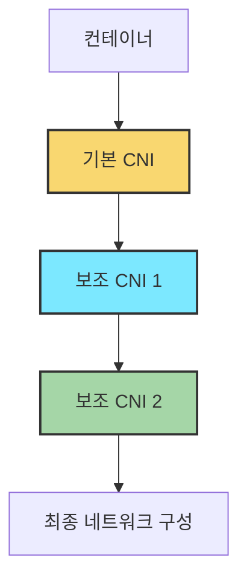
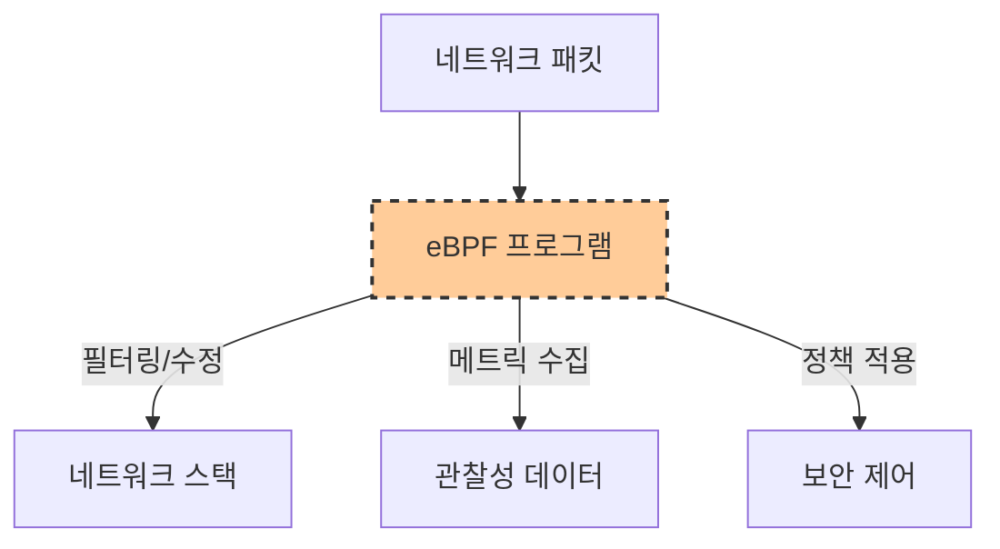
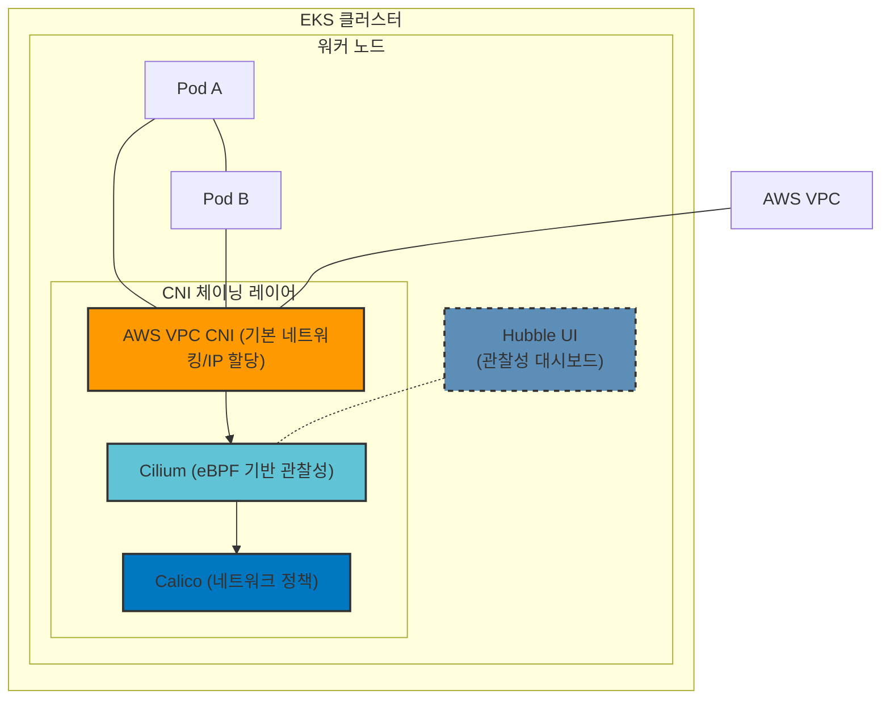
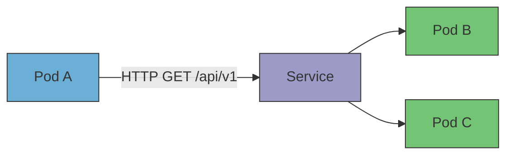

# 기존 CNI 환경을 유지하며 eBPF 기능 확장하기: EKS에서의 CNI 체이닝

## 소개

Kubernetes 환경에서 네트워크는 단순한 연결 이상의 중요한 역할을 합니다. <br>특히 대규모 마이크로서비스 아키텍처에서는 네트워크 관찰성(Observability)과 세밀한 네트워크 정책이 필수적입니다. <br>하지만 클라우드 제공업체의 기본 CNI(예: AWS VPC CNI)는 네트워크 연결성은 우수하지만, 고급 보안 기능이나 관찰성 측면에서는 한계를 가질 수 있습니다.<br>
특히 이미 운영 중인 CNI를 변경하기 어려운 환경에서는, 기존 구조를 유지하면서 기능을 확장할 수 있는 접근이 필요합니다.

이 글에서는 AWS EKS 환경에서 AWS VPC CNI, Cilium, Calico를 함께 활용하는 CNI 체이닝(Chaining) 구성에 대해 살펴보겠습니다. <br>특히 eBPF 기술을 기반으로 한 Cilium CNI 체이닝이 어떻게 강력한 네트워크 관찰성과 보안 기능을 제공하는지 알아보겠습니다.

## CNI 체이닝이란?

CNI(Container Network Interface)는 Kubernetes에서 컨테이너 네트워킹을 담당하는 표준 인터페이스입니다. <br>CNI 체이닝은 여러 CNI 플러그인을 순차적으로 결합하여 각 CNI의 장점을 활용하는 접근 방식입니다.



### CNI 체이닝의 주요 이점

1. **기능별 분리와 특화**: 각 CNI가 자신의 전문 영역에 집중할 수 있습니다.
2. **기존 인프라 활용**: 현재 사용 중인 CNI를 교체하지 않고 확장할 수 있습니다.
3. **점진적 마이그레이션**: 기존 CNI를 유지하면서 새로운 기능을 추가할 수 있습니다.
4. **다양한 기능 조합**: 여러 CNI의 기능을 결합해 최적의 네트워킹 환경을 구성할 수 있습니다.

## eBPF: CNI 체이닝을 가능하게 하는 핵심 기술

eBPF는 Linux 커널에서 안전하게 프로그램을 실행할 수 있는 혁신적인 기술입니다. <br>Cilium, Calico, Weave Net 등 CNI 도구는 eBPF를 활용하여 패킷 필터링, 네트워크 모니터링, 보안 정책 적용 등 다양한 기능을 제공합니다.

### eBPF가 CNI 체이닝에 가져오는 이점

1. **커널 레벨 처리**: 네트워크 스택 초기 단계에서 패킷을 처리하여 높은 성능 제공
2. **세밀한 제어**: 네트워크 흐름의 모든 측면을 프로그래밍 방식으로 제어 가능
3. **동적 업데이트**: 커널을 수정하거나 재부팅하지 않고도 네트워크 동작 변경 가능
4. **낮은 오버헤드**: 기존 네트워크 솔루션보다 효율적인 리소스 활용



## AWS EKS에서의 멀티 CNI 아키텍처

AWS EKS에서 멀티 CNI 아키텍처를 구현할 때 일반적으로 AWS VPC CNI를 기본으로 하고, Cilium과 Calico를 보조 CNI로 추가합니다.<br>이 조합은 강력하면서도 유연한 네트워크 스택을 제공합니다.



### 각 CNI 컴포넌트의 역할

#### AWS VPC CNI

AWS VPC CNI는 EKS의 기본 네트워킹 레이어로, AWS 인프라와의 통합을 담당합니다.

- **VPC IP 주소 할당**: Pod에 직접 VPC IP 주소 할당
- **ENI 기반 네트워킹**: AWS 네트워크 인터페이스 활용
- **AWS 보안 그룹 통합**: AWS 보안 메커니즘과 연동
- **기본 제공 솔루션**: EKS 클러스터에 기본 설치됨

#### Cilium (eBPF 기반 관찰성 레이어)

Cilium은 eBPF 기술을 활용하여 네트워크 트래픽에 대한 깊은 통찰력을 제공합니다.

- **L3-L7 네트워크 가시성**: HTTP, gRPC 등 애플리케이션 레벨 트래픽 모니터링
- **서비스 맵 시각화**: Pod 간 통신 흐름 실시간 시각화
- **성능 메트릭 수집**: 지연 시간, 처리량, 오류율 등 모니터링
- **동적 트러블슈팅**: 네트워크 문제 실시간 분석

#### Calico (네트워크 정책 레이어)

Calico는 강력한 네트워크 정책 집행과 고급 보안 기능을 제공합니다.

- **세밀한 네트워크 정책**: 복잡한 멀티티어 애플리케이션 보호
- **제로 트러스트 네트워크**: 명시적으로 허용된 통신만 가능
- **네트워크 분리**: 논리적 경계를 통한 워크로드 격리
- **Policy API 호환성**: Kubernetes NetworkPolicy API 완벽 지원

## CNI 체이닝 구현 단계

AWS EKS에서 AWS VPC CNI + Cilium + Calico 체이닝을 구현하는 단계별 과정을 살펴보겠습니다.

### 1. 사전 확인

먼저 AWS VPC CNI 버전이 체이닝을 지원하는지 확인합니다. v1.11.2 이상을 권장합니다.

```bash
# VPC CNI 버전 확인
kubectl -n kube-system get ds aws-node -o jsonpath='{.spec.template.spec.containers[0].image}'
```

### 2. Helm 저장소 추가

Cilium 설치를 위한 Helm 저장소를 추가합니다.

```bash
helm repo add cilium https://helm.cilium.io/
helm repo update
```

### 3. Cilium 설치 (체이닝 모드)

AWS VPC CNI와의 체이닝 모드로 Cilium을 설치합니다.

```bash
helm install cilium cilium/cilium --version 1.17.3 \
  --namespace kube-system \
  --set cni.chainingMode=aws-cni \
  --set cni.exclusive=false \
  --set routingMode=native \
  --set enableIPv4Masquerade=false
```

각 옵션의 의미는 다음과 같습니다:

- `cni.chainingMode=aws-cni`: AWS VPC CNI와 체이닝 구성
- `cni.exclusive=false`: 다른 CNI와 함께 사용 허용
- `routingMode=native`: 기본 라우팅 사용
- `enableIPv4Masquerade=false`: AWS VPC 라우팅과의 충돌 방지

### 4. Hubble 활성화

네트워크 관찰성을 위한 Hubble 컴포넌트를 활성화합니다.

```bash
helm upgrade cilium cilium/cilium \
  --namespace kube-system \
  --reuse-values \
  --set hubble.enabled=true \
  --set hubble.relay.enabled=true \
  --set hubble.ui.enabled=true \
  --set "hubble.metrics.enabled={dns,drop,tcp,flow,port-distribution,icmp,http}"
```

### 5. Calico 정책 설정 (선택사항)

이미 Cilium의 네트워크 정책으로 충분할 수 있지만, 특정 사용 사례에서는 Calico의 정책 기능이 필요할 수 있습니다.

```bash
# Calico 설치 전 operator 설정
kubectl create -f https://raw.githubusercontent.com/projectcalico/calico/v3.26.0/manifests/tigera-operator.yaml

# 체이닝 모드로 Calico 설치
cat <<EOF | kubectl apply -f -
apiVersion: operator.tigera.io/v1
kind: Installation
metadata:
  name: default
spec:
  calicoNetwork:
    containerIPForwarding: Enabled
    ipPools: []
  cni:
    type: AmazonVPC
EOF
```

## eBPF 기반 Cilium Hubble로 네트워크 관찰성 향상

Cilium의 Hubble은 eBPF 기술을 활용하여 Kubernetes 네트워크 트래픽에 대한 깊은 통찰력을 제공합니다. 이는 서비스 간 통신 패턴을 이해하고 네트워크 문제를 신속하게 진단하는 데 매우 유용합니다.

### Hubble UI 설정

Hubble UI에 접속하기 위한 포트포워딩을 설정합니다.

```bash
# Cilium CLI 설치
# macOS
brew install cilium-cli

# Linux
curl -L --remote-name-all https://github.com/cilium/cilium-cli/releases/latest/download/cilium-linux-amd64.tar.gz
sudo tar xzvfC cilium-linux-amd64.tar.gz /usr/local/bin

# Hubble UI 접속
cilium hubble port-forward &
cilium hubble ui
```

또는 kubectl을 사용한 방법:

```bash
kubectl -n kube-system port-forward svc/hubble-relay 4245:80 &
kubectl -n kube-system port-forward svc/hubble-ui 12000:80 &
```

### Hubble의 강력한 시각화 기능



Hubble UI는 다음과 같은 강력한 기능을 제공합니다:

1. **서비스 맵**: Pod 간 통신을 실시간으로 시각화
2. **프로토콜 분석**: HTTP, gRPC, DNS 등 상위 계층 프로토콜에 대한 통찰력
3. **오류 감지**: 네트워크 정책 위반, 연결 실패 등 시각화
4. **필터링 및 검색**: 특정 서비스, 네임스페이스, 상태코드 등으로 필터링

## 실제 운영 환경에서의 고려사항

CNI 체이닝은 강력한 기능을 제공하지만, 운영 환경에 적용할 때 몇 가지 중요한 고려사항이 있습니다.

### 성능 영향

eBPF는 매우 효율적이지만, 여러 CNI 레이어를 통과하는 것은 약간의 오버헤드를 발생시킬 수 있습니다:

- **레이턴시**: 일반적으로 마이크로초 단위의 미미한 추가 지연
- **CPU 사용량**: 모니터링과 정책 적용으로 인한 소폭 증가
- **메모리 사용**: 각 CNI의 상태 정보 저장에 필요한 추가 메모리


### 업그레이드 및 호환성

CNI 체이닝 환경에서는 각 구성 요소의 호환성을 주의 깊게 확인해야 합니다:

- AWS VPC CNI, Cilium, Calico 버전 간 호환성 유지
- Kubernetes 버전 업그레이드 시 CNI 설정 재검토
- CNI 업그레이드 시 단계적 롤아웃 권장

### 문제 해결 팁

1. **CNI 설정 확인**:
   ```bash
   kubectl get cm -n kube-system cni-config -o yaml
   ```

2. **Pod 네트워크 인터페이스 확인**:
   ```bash
   kubectl debug <pod-name> -it -- ip addr
   ```

3. **Cilium 상태 확인**:
   ```bash
   cilium status --wait
   ```

4. **네트워크 정책 검증**:
   ```bash
   cilium policy get
   ```

## 유스케이스: 실제 환경에서의 활용

### 마이크로서비스 아키텍처 관찰성

수십 또는 수백 개의 마이크로서비스가 있는 환경에서는 서비스 간 통신 패턴을 이해하는 것이 중요합니다. <br>Cilium Hubble은 서비스 간 의존성과 통신 패턴을 시각화하여 다음과 같은 이점을 제공합니다:

- **서비스 매핑**: 자동으로 서비스 간 통신 토폴로지 생성
- **병목 현상 식별**: 과도한 트래픽이 발생하는 서비스 식별
- **이상 감지**: 비정상적인 통신 패턴 감지

### 제로 트러스트 보안 구현

모든 통신을 명시적으로 허용해야 하는 제로 트러스트 환경에서는 CNI 체이닝이 이상적입니다:

- **AWS VPC CNI**: 기본 네트워킹 인프라 제공
- **Cilium**: 통신 패턴 모니터링 및 이상 감지
- **Calico**: 세밀한 네트워크 정책 적용

### 규제 준수 및 감사

금융, 의료 등 규제가 엄격한 산업에서는 네트워크 활동에 대한 상세한 감사 로그가 필요합니다:

- **트래픽 로깅**: 모든 네트워크 통신에 대한 상세 로그
- **정책 위반 알림**: 허용되지 않은 통신 시도 감지
- **증거 수집**: 규제 준수 감사를 위한 데이터 제공

## 결론

EKS 환경에서 AWS VPC CNI, Cilium, Calico를 체이닝하는 아키텍처는 각 CNI의 강점을 결합합니다.

이러한 CNI 체이닝은:

1. AWS 인프라와의 원활한 통합 (AWS VPC CNI)
2. 강력한 관찰성과 트러블슈팅 기능 (Cilium/Hubble)
3. 세밀한 네트워크 정책 (Calico)

을 결합하여 복잡한 마이크로서비스 환경에서도 각 CNI 만의 강점만을 사용할수 있습니다.

특히 기존 CNI를 유지해야 하는 상황에서 네트워크 기능을 고도화하고자 한다면, CNI 체이닝은 실용적이고 강력한 대안이 될 수 있습니다.

---

**참고 자료**
- [Cilium CNI 체이닝 공식 문서](https://docs.cilium.io/en/stable/installation/cni-chaining/)
- [AWS EKS CNI 문서](https://docs.aws.amazon.com/eks/latest/userguide/managing-vpc-cni.html)
- [eBPF 기술 개요](https://ebpf.io/what-is-ebpf/)
- [Hubble 네트워크 관찰성 도구](https://github.com/cilium/hubble)