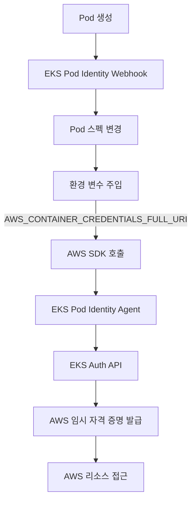
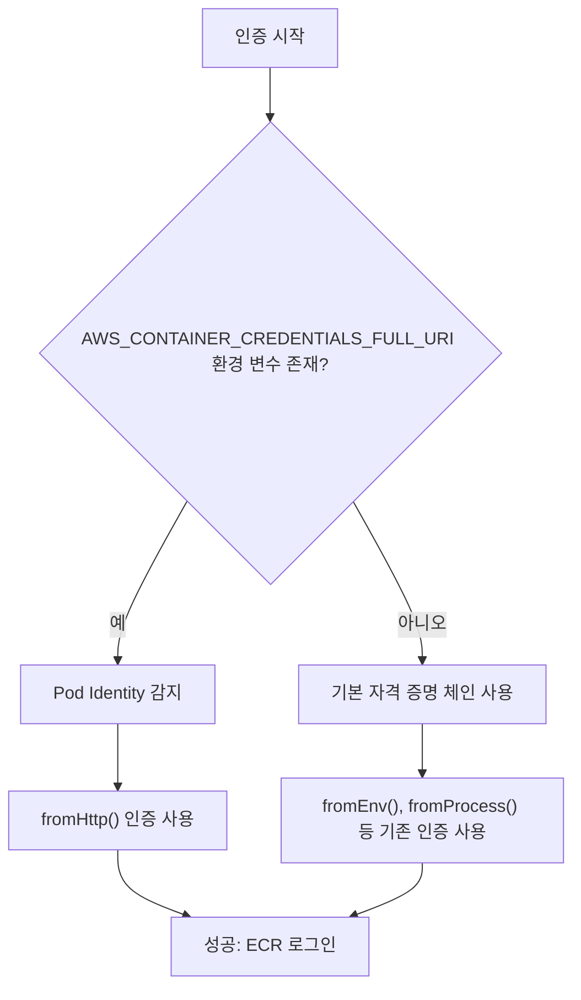

# Amazon ECR 로그인 Action에 EKS Pod Identity 지원 기능 추가하기

## 목차

- 개요
- 배경 및 문제 상황
- Amazon EKS Pod Identity 소개
- 문제 분석 및 해결 방안
- 구현 상세
- 테스트 결과
- PR 영향 및 적용 가이드
- 결론

## 개요

이 문서는 GitHub Actions의 `amazon-ecr-login` 액션에 Amazon EKS Pod Identity 지원 기능을 추가하는 과정과 그 배경에 대해 설명합니다. EKS Pod Identity는 Amazon EKS에서 실행되는 애플리케이션에 AWS 리소스 접근 권한을 관리하는 새로운 방법으로, 기존 IRSA(IAM Roles for Service Accounts)보다 간소화된 인증 경험을 제공합니다.

이번 변경은 GitHub Issues [#624](https://github.com/aws-actions/amazon-ecr-login/issues/624)와 [#735](https://github.com/aws-actions/amazon-ecr-login/issues/735)에서 제기된 EKS Pod Identity 환경에서 `amazon-ecr-login` 액션이 정상적으로 작동하지 않는 문제를 해결합니다.

## 배경 및 문제 상황

### 문제 발생 상황

다음과 같은 상황에서 `amazon-ecr-login` 액션 실행 시 오류가 발생합니다:

1. **GitHub Actions 셀프 호스티드 러너를 EKS 클러스터에서 실행할 때**
2. **EKS Pod Identity를 사용하여 서비스 계정을 설정했을 때**
3. **GitHub Actions 워크플로우에서 `aws-actions/amazon-ecr-login` 액션을 사용할 때**

### 오류 메시지

```
Run aws-actions/amazon-ecr-login@v2
  with:
    mask-password: true
    registry-type: private
    skip-logout: false
Error: 169.254.170.23 is not a valid container metadata service hostname
```

위 오류는 AWS SDK가 컨테이너 메타데이터 서비스를 잘못된 방식으로 접근하려고 시도할 때 발생합니다. EKS Pod Identity 환경에서는 다른 엔드포인트를 통해 AWS 자격 증명을 획득해야 하는데, `amazon-ecr-login` 액션이 이를 인식하지 못하는 것이 문제의 원인입니다.

### 기존 임시 해결책

이 문제에 대한 임시 해결책으로 사용자들은 다음과 같이 환경 변수를 비워서 메타데이터 서비스 호출을 우회해야 했습니다:

```yaml
- name: Login to Amazon ECR
  id: login-ecr
  uses: aws-actions/amazon-ecr-login@v1
  env:
    AWS_CONTAINER_CREDENTIALS_FULL_URI: ''
```

이 방법은 임시적인 해결책일 뿐, 근본적인 문제 해결이 필요했습니다.

### 사용자 영향

이 문제로 인해 사용자들은 다음과 같은 불편함을 겪었습니다:

1. **EKS Pod Identity와 IRSA를 동시에 유지해야 함**: 다른 AWS 서비스에는 Pod Identity를 사용하면서도, ECR 로그인을 위해 IRSA 설정을 유지해야 했습니다.
2. **추가 IAM 설정 복잡성**: IRSA를 위한 별도의 IAM 설정과 관리가 필요했습니다.
3. **인프라스트럭처 불일치**: 테라폼이나 다른 IaC 도구에서 Pod Identity를 지원하도록 설정했음에도, GitHub Actions 러너만 예외적으로 관리해야 했습니다.

## Amazon EKS Pod Identity 소개

### EKS Pod Identity란?

Amazon EKS Pod Identity는 2023년 11월에 출시된 기능으로, Kubernetes 파드에 AWS 리소스에 대한 접근 권한을 간소화된 방식으로 부여합니다. 기존의 IRSA와 달리 EKS Pod Identity는 다음과 같은 이점을 제공합니다:

- IAM OIDC Provider 설정 불필요
- 클러스터 추가 시 IAM 역할 신뢰 정책 업데이트 불필요
- IAM 역할 세션 태그(Session Tags) 지원
- 클러스터 간 역할 재사용 용이성

### 작동 방식

EKS Pod Identity는 다음과 같은 방식으로 작동합니다:



EKS Pod Identity Webhook은 Pod 생성 시 다음과 같은 환경 변수를 주입합니다:

```yaml
env:
- name: AWS_CONTAINER_CREDENTIALS_FULL_URI
  value: http://169.254.170.23/v1/credentials
- name: AWS_CONTAINER_AUTHORIZATION_TOKEN_FILE
  value: /var/run/secrets/pods.eks.amazonaws.com/serviceaccount/eks-pod-identity-token
```

이 환경 변수들은 AWS SDK가 EKS Pod Identity Agent를 통해 임시 자격 증명을 획득하는 데 사용됩니다.

### EKS Pod Identity vs IRSA 비교

| 특성 | IRSA | EKS Pod Identity |
|---|---|---|
| 설정 복잡성 | OIDC Provider 설정 필요 | 서비스 주체 설정만 필요 |
| 계정 확장성 | AWS 계정당 OIDC Provider 100개 제한 | 제한 없음 |
| 역할 확장성 | 신뢰 정책 크기 제한 (2048자) | 제한 없음 |
| 세션 태그 | 지원 안 함 | 지원함 |
| 지원 환경 | EKS, EKS-A, ROSA, 자체 관리형 K8s | EKS만 지원 |

## 문제 분석 및 해결 방안

### 문제 원인

`amazon-ecr-login` 액션의 문제는 AWS SDK 자격 증명 공급자 체인에서 발생합니다. AWS SDK는 여러 공급자를 순차적으로 시도하는데, EKS Pod Identity 환경에서는 `AWS_CONTAINER_CREDENTIALS_FULL_URI` 환경 변수로 지정된, 유효한 HTTP 자격 증명 공급자를 사용해야 합니다.

그러나 액션의 기존 코드는 이 환경을 인식하지 못하고 컨테이너 메타데이터 서비스(IMDS)를 사용하려고 시도하여 오류가 발생했습니다.

### 해결 방안

이 문제를 해결하기 위한 접근 방식은 다음과 같습니다:

1. **EKS Pod Identity 환경 감지**: `AWS_CONTAINER_CREDENTIALS_FULL_URI` 환경 변수가 설정되어 있는지 확인하여 Pod Identity 환경인지 감지
2. **HTTP 자격 증명 공급자 사용**: Pod Identity 환경에서는 `fromHttp()` 함수를 사용하여 HTTP 엔드포인트에서 자격 증명 획득
3. **기존 인증 방식 유지**: 다른 환경에서는 기존의 기본 자격 증명 공급자 체인 사용

## 구현 상세

변경된 구현의 흐름은 다음과 같습니다:



### 코드 변경사항

PR에서 수정된 주요 코드는 다음과 같습니다:

```javascript
// 자격 증명 제공자 결정 로직
if (process.env.AWS_CONTAINER_CREDENTIALS_FULL_URI) {
  // EKS Pod Identity 환경 감지
  core.debug('Using HTTP credential provider for authentication');
  return fromHttp();
} else {
  // 기존 인증 방식 사용
  core.debug('Using default credential provider chain for authentication');
  return defaultProvider();
}
```

이 변경으로 인해 액션은 환경을 자동으로 감지하고 적절한 자격 증명 제공자를 선택하게 되었습니다.

## 테스트 결과

변경된 코드를 다양한 환경에서 테스트하여 기능이 의도한 대로 작동하는지 확인했습니다.

### Pod Identity 환경 테스트

EKS Pod Identity가 활성화된 환경에서의 테스트:

```json
{
    "UserId": "AROXXXXXX:eks-cluster-pod-identity",
    "Account": "123456789012",
    "Arn": "arn:aws:sts::123456789012:assumed-role/eks-cluster-pod-identity-role/session-id"
}
```

- **결과**: `fromHttp()` 인증 방식이 사용되었으며, Amazon ECR 로그인 및 Docker 이미지 푸시/풀 작업이 성공적으로 수행됨

### IRSA 환경 테스트

기존 IRSA가 설정된 환경에서의 테스트:

```json
{
    "UserId": "AROYYYYYY:botocore-session",
    "Account": "123456789012",
    "Arn": "arn:aws:sts::123456789012:assumed-role/eks-cluster-irsa-role/session-id"
}
```

- **결과**: 기본 AWS 자격 증명 체인이 사용되었으며, 기존과 동일하게 Amazon ECR 로그인 및 Docker 이미지 작업이 성공적으로 수행됨

## PR 영향 및 적용 가이드

### PR 영향

이 PR은 다음과 같은 영향을 미칩니다:

1. **EKS Pod Identity 환경에서 로그인 실패 해결**
   - Pod Identity를 사용하는 EKS 클러스터에서 실행되는 GitHub Actions 러너가 별도의 설정 없이 ECR에 로그인 가능

2. **기존 인증 방식과의 호환성 유지**
   - IRSA나 인스턴스 역할을 사용하는 기존 워크플로우에 영향 없음

3. **불필요한 임시 해결책 제거**
   - `AWS_CONTAINER_CREDENTIALS_FULL_URI: ''` 설정이 더 이상 필요하지 않음

### 적용 가이드

PR 병합 후에는 별도의 조치 없이 `amazon-ecr-login@v1` 액션을 사용하면 자동으로 EKS Pod Identity 환경을 감지하고 적절한 인증 방식을 사용합니다.

```yaml
# 기존 방식 (임시 해결책 필요)
- name: Login to Amazon ECR
  id: login-ecr
  uses: aws-actions/amazon-ecr-login@v1
  env:
    AWS_CONTAINER_CREDENTIALS_FULL_URI: ''  # 임시 해결책 필요

# 새로운 방식 (PR 병합 후)
- name: Login to Amazon ECR
  id: login-ecr
  uses: aws-actions/amazon-ecr-login@v1
  # 별도의 환경 변수 설정 불필요
```

## 결론

이번 PR을 통해 GitHub Actions의 `amazon-ecr-login` 액션이 Amazon EKS Pod Identity 환경에서도 원활하게 작동할 수 있게 되었습니다. 이로써 EKS Pod Identity를 사용하는 사용자들도 별도의 임시 해결책 없이 GitHub Actions 워크플로우를 구성할 수 있게 되었습니다.

이 개선은 다음과 같은 이점을 제공합니다:

1. **인프라 단순화**: EKS Pod Identity만으로 모든 AWS 서비스와의 인증을 처리할 수 있어 IRSA 설정 유지가 불필요
2. **보안 강화**: 세션 태그 기반의 세분화된 권한 관리 가능
3. **관리 복잡성 감소**: 신뢰 정책 업데이트와 OIDC Provider 관리 불필요
4. **일관된 환경**: GitHub Actions 워크플로우와 다른 애플리케이션이 동일한 인증 메커니즘 사용

EKS Pod Identity는 기존의 IRSA보다 간소화된 인증 경험을 제공하며, 이번 변경을 통해 GitHub Actions 사용자들도 이 이점을 충분히 활용할 수 있게 되었습니다.
```