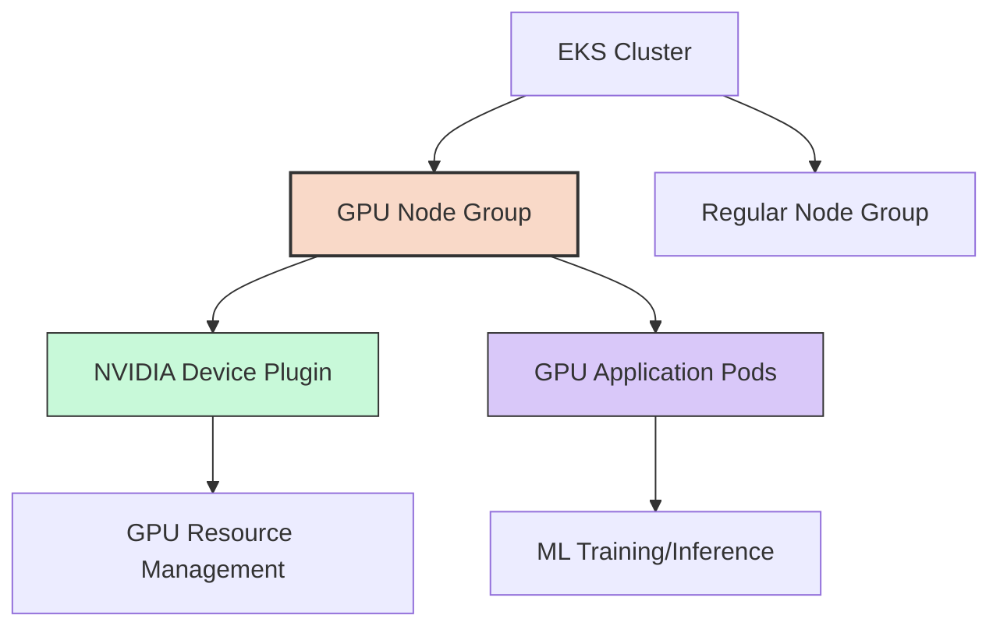

# EKS 클러스터에 GPU 노드 그룹 설정 가이드: 노드 그룹 구성부터 Time-Slicing까지

)

## 목차

1. [소개](#소개)
2. [아키텍처 개요](#아키텍처-개요)
3. [GPU 노드 그룹 구성](#gpu-노드-그룹-구성)
4. [NVIDIA Device Plugin 설정](#nvidia-device-plugin-설정)
5. [GPU 워크로드 배포 및 테스트](#gpu-워크로드-배포-및-테스트)
6. [GPU Time-Slicing으로 자원 최적화](#gpu-time-slicing으로-자원-최적화)
7. [모니터링 및 운영 관리](#모니터링-및-운영-관리)
8. [성능 최적화 팁](#성능-최적화-팁)
9. [결론](#결론)

## 소개

기계 학습, 딥 러닝, 컴퓨터 비전 및 기타 연산 집약적 워크로드를 실행하려면 강력한 GPU 리소스가 필수적입니다. Amazon EKS(Elastic Kubernetes Service)는 GPU 가속 워크로드를 위한 탁월한 플랫폼을 제공하지만, 이러한 고가의 리소스를 효율적으로 활용하려면 적절한 구성과 최적화가 필요합니다.

이 글에서는 EKS 클러스터에 GPU 노드 그룹을 설정하는 방법부터 NVIDIA Device Plugin 배포, GPU 노드 보호를 위한 테인트(taint) 적용, 그리고 하나의 물리적 GPU를 여러 워크로드에서 공유할 수 있는 Time-Slicing 기술까지 전 과정을 단계별로 설명합니다.

## 아키텍처 개요

EKS 클러스터에서 GPU 워크로드를 지원하는 완전한 아키텍처는 다음과 같은 구성 요소로 이루어집니다:

1. **GPU 노드 그룹**: NVIDIA 드라이버가 사전 설치된 Amazon EKS 최적화 AMI를 사용
2. **NVIDIA Device Plugin**: Kubernetes에서 컨테이너가 GPU에 접근할 수 있도록 지원
3. **노드 라벨 및 테인트**: GPU 노드를 식별하고 일반 워크로드로부터 보호
4. **GPU 테스트 애플리케이션**: 노드 설정이 올바르게 작동하는지 검증



## GPU 노드 그룹 구성

### AMI 선택과 인스턴스 유형

GPU 노드 그룹을 생성할 때는 NVIDIA 드라이버가 사전 설치된 AMI를 선택하는 것이 중요합니다. AWS는 이를 위한 최적화된 이미지를 제공합니다.

```bash
# 사용 가능한 Amazon EKS 최적화 NVIDIA AMI 조회
aws ec2 describe-images \
    --owners amazon \
    --filters "Name=name,Values=amazon-eks-node-al2023-x86_64-nvidia*" \
    --query 'sort_by(Images, &CreationDate)[-1].Name'
```

GPU 워크로드에 적합한 인스턴스 유형:

| 인스턴스 유형 | GPU | vCPU | 메모리 | 사용 사례 |
|--------------|-----|------|-------|---------|
| g4dn.xlarge  | 1x NVIDIA T4 | 4 | 16 GB | 추론, 가벼운 학습 |
| g5.xlarge    | 1x NVIDIA A10G | 4 | 16 GB | 중급 학습, 고성능 추론 |
| p3.2xlarge   | 1x NVIDIA V100 | 8 | 16 GB | 고급 학습 워크로드 |

### Self-Managed 노드 그룹 설정

AWS CDK 또는 Terraform으로 GPU 노드 그룹을 생성할 때, 노드 라벨과 테인트를 자동으로 적용하기 위해 `cloudinit_pre_nodeadm` 스크립트를 활용할 수 있습니다:

```hcl
# Terraform 예제
cloudinit_pre_nodeadm = [
  {
    content_type = "application/node.eks.aws"
    content      = <<-EOT
      ---
      apiVersion: node.eks.aws/v1alpha1
      kind: NodeConfig
      spec:
        kubelet:
          flags:
            - "--node-labels=nvidia.com/gpu=true"
            - "--register-with-taints=nvidia.com/gpu=true:NoSchedule"
      EOT
  }
]
```

이 구성을 통해:
1. `nvidia.com/gpu=true` 라벨이 노드에 적용됨
2. `nvidia.com/gpu=true:NoSchedule` 테인트로 인해 특별히 허용(toleration)을 설정하지 않은 일반 파드는 GPU 노드에 스케줄링되지 않음

## NVIDIA Device Plugin 설정

GPU 노드를 클러스터에 추가한 후에는 NVIDIA Device Plugin을 배포해야 합니다. 이 플러그인은 Kubernetes가 GPU 리소스를 인식하고 관리할 수 있게 해줍니다.

```yaml
# nvidia-device-plugin.yaml
apiVersion: apps/v1
kind: DaemonSet
metadata:
  name: nvidia-device-plugin-daemonset
  namespace: kube-system
spec:
  selector:
    matchLabels:
      name: nvidia-device-plugin-ds
  template:
    metadata:
      labels:
        name: nvidia-device-plugin-ds
    spec:
      nodeSelector:
        nvidia.com/gpu: "true"  # GPU 노드에만 배포
      tolerations:
      - key: nvidia.com/gpu
        operator: Exists
        effect: NoSchedule
      containers:
      - image: nvcr.io/nvidia/k8s-device-plugin:v0.14.0
        name: nvidia-device-plugin-ctr
        securityContext:
          allowPrivilegeEscalation: false
          capabilities:
            drop: ["ALL"]
        volumeMounts:
          - name: device-plugin
            mountPath: /var/lib/kubelet/device-plugins
          - name: dev
            mountPath: /dev
      volumes:
        - name: device-plugin
          hostPath:
            path: /var/lib/kubelet/device-plugins
        - name: dev
          hostPath:
            path: /dev
```

플러그인을 적용하고 확인합니다:

```bash
kubectl apply -f nvidia-device-plugin.yaml
kubectl -n kube-system get pods -l name=nvidia-device-plugin-ds
```

성공적으로 배포되면, GPU 노드에서 다음 명령어로 GPU 리소스가 인식되는지 확인할 수 있습니다:

```bash
kubectl describe node <gpu-node-name> | grep nvidia.com/gpu
# 출력 예시: nvidia.com/gpu:        1
```

## GPU 워크로드 배포 및 테스트

이제 GPU 노드가 제대로 동작하는지 검증하기 위한 테스트 애플리케이션을 배포해 보겠습니다:

```yaml
# gpu-test.yaml
apiVersion: apps/v1
kind: Deployment
metadata:
  name: gpu-test-deployment
spec:
  replicas: 1
  selector:
    matchLabels:
      app: gpu-test
  template:
    metadata:
      labels:
        app: gpu-test
    spec:
      nodeSelector:
        nvidia.com/gpu: "true"
      tolerations:
      - key: "nvidia.com/gpu"
        operator: "Equal"
        value: "true"
        effect: "NoSchedule"
      containers:
      - name: cuda-container
        image: nvcr.io/nvidia/k8s/cuda-sample:vectoradd-cuda12.5.0
        command: ["/bin/sh", "-c", "nvidia-smi && sleep 3600"]
        resources:
          limits:
            nvidia.com/gpu: "1"
```

이 파드의 로그를 확인하면 `nvidia-smi` 명령어의 출력을 볼 수 있습니다:

```bash
kubectl apply -f gpu-test.yaml
kubectl logs -f deployment/gpu-test-deployment
```

성공적인 출력 예시:

```
Mon Mar 17 09:10:34 2025
+-----------------------------------------------------------------------------+
| NVIDIA-SMI 560.35.05              Driver Version: 560.35.05    CUDA Version: 12.6 |
|-------------------------------+----------------------+----------------------+
| GPU  Name    Persistence-M | Bus-Id        Disp.A | Volatile Uncorr. ECC |
| Fan  Temp  Perf  Pwr:Usage/Cap|         Memory-Usage | GPU-Util  Compute M. |
|                           |                      |               MIG M. |
|===============================+======================+======================|
|   0  Tesla T4           On | 00000000:00:1E.0 Off |                    0 |
| N/A   25C    P8     9W /   70W |      1MiB / 15360MiB |      0%      Default |
|                           |                      |                  N/A |
+-------------------------------+----------------------+----------------------+

+-----------------------------------------------------------------------------+
| Processes:                                                                  |
|  GPU   GI   CI        PID   Type   Process name                  GPU Memory |
|        ID   ID                                                   Usage      |
|=============================================================================|
|  No running processes found                                                 |
+-----------------------------------------------------------------------------+
```

이 출력은 파드가 NVIDIA Tesla T4 GPU에 성공적으로 액세스했음을 보여줍니다.

## GPU Time-Slicing으로 자원 최적화

GPU는 비용이 높은 리소스이므로 효율적인 활용이 중요합니다. NVIDIA Device Plugin의 Time-Slicing 기능을 사용하면 하나의 물리적 GPU를 여러 컨테이너에서 공유할 수 있습니다.

### Time-Slicing 구성

먼저 ConfigMap을 생성하여 Time-Slicing을 설정합니다:

```yaml
# gpu-timeslicing-config.yaml
apiVersion: v1
kind: ConfigMap
metadata:
  name: nvidia-device-plugin-config
  namespace: kube-system
data:
  config.yaml: |
    version: v1
    flags:
      migStrategy: none
    sharing:
      timeSlicing:
        resources:
        - name: nvidia.com/gpu
          replicas: 4  # 물리 GPU 1개를 가상으로 4개로 분할
```

NVIDIA Device Plugin이 이 구성을 사용하도록 업데이트합니다:

```yaml
# nvidia-device-plugin-timeslicing.yaml
apiVersion: apps/v1
kind: DaemonSet
metadata:
  name: nvidia-device-plugin-daemonset
  namespace: kube-system
spec:
  # ... 이전 설정과 동일 ...
  template:
    # ... 이전 설정과 동일 ...
    spec:
      containers:
      - image: nvcr.io/nvidia/k8s-device-plugin:v0.14.0
        name: nvidia-device-plugin-ctr
        args: ["--config-file", "/config/config.yaml"]
        # ... 이전 설정과 동일 ...
        volumeMounts:
          # ... 이전 마운트와 동일 ...
          - name: config-volume
            mountPath: /config
      volumes:
        # ... 이전 볼륨과 동일 ...
        - name: config-volume
          configMap:
            name: nvidia-device-plugin-config
```

업데이트된 설정을 적용합니다:

```bash
kubectl apply -f gpu-timeslicing-config.yaml
kubectl apply -f nvidia-device-plugin-timeslicing.yaml
```

### Time-Slicing 검증

노드를 확인하면 이제 1개의 물리 GPU가 4개의 가상 GPU로 보고되는 것을 확인할 수 있습니다:

```bash
kubectl describe node <gpu-node-name> | grep nvidia.com/gpu
# 출력 예시: nvidia.com/gpu:        4
```

이제 여러 GPU 워크로드를 배포하여 테스트합니다:

```bash
kubectl scale deployment/gpu-test-deployment --replicas=4
kubectl get pods -o wide
```

모든 파드가 동일한 GPU 노드에서 실행되고 있다면 Time-Slicing이 성공적으로 적용된 것입니다.

## 모니터링 및 운영 관리

### DCGM Exporter로 GPU 메트릭 수집

NVIDIA DCGM(Data Center GPU Manager) Exporter를 배포하여 Prometheus와 Grafana를 통해 GPU 메트릭을 모니터링할 수 있습니다:

```yaml
# dcgm-exporter.yaml
apiVersion: apps/v1
kind: DaemonSet
metadata:
  name: dcgm-exporter
  namespace: kube-system
spec:
  selector:
    matchLabels:
      name: dcgm-exporter
  template:
    metadata:
      labels:
        name: dcgm-exporter
    spec:
      nodeSelector:
        nvidia.com/gpu: "true"
      tolerations:
      - key: nvidia.com/gpu
        operator: Exists
        effect: NoSchedule
      containers:
      - name: dcgm-exporter
        image: nvcr.io/nvidia/k8s-dcgm-exporter:3.1.7-3.1.7-ubuntu20.04
        ports:
        - name: metrics
          containerPort: 9400
        securityContext:
          runAsNonRoot: false
          runAsUser: 0
        volumeMounts:
        - name: device-plugin
          mountPath: /var/lib/kubelet/device-plugins
      volumes:
      - name: device-plugin
        hostPath:
          path: /var/lib/kubelet/device-plugins
```

### 주요 모니터링 지표

DCGM Exporter를 설정한 후 Prometheus와 Grafana로 다음과 같은 중요한 GPU 메트릭을 모니터링할 수 있습니다:

1. **GPU 사용률**: DCGM_FI_DEV_GPU_UTIL
2. **메모리 사용량**: DCGM_FI_DEV_FB_USED
3. **온도**: DCGM_FI_DEV_TEMPERATURE_GPU
4. **전력 사용량**: DCGM_FI_DEV_POWER_USAGE
5. **메모리 대역폭**: DCGM_FI_DEV_MEM_COPY_UTIL

## 성능 최적화 팁

### CUDA 버전 호환성 확인

애플리케이션의 CUDA 요구사항과 노드에 설치된 CUDA 버전의 호환성을 확인하세요. 현재 예시의 AL2023 NVIDIA AMI에는 CUDA 12.5가 포함되어 있습니다.

```bash
# 노드에서 CUDA 버전 확인
kubectl debug node/<gpu-node-name> -it --image=ubuntu:20.04
chroot /host
/usr/local/cuda/bin/nvcc --version
```

### Time-Slicing 최적화

Time-Slicing은 GPU 자원을 효율적으로 공유할 수 있게 해주지만, 워크로드 특성에 맞게 설정해야 합니다:

1. **추론 워크로드**: 일반적으로 Time-Slicing에 적합
2. **학습 워크로드**: 전체 GPU 자원이 필요하므로 Time-Slicing을 사용하지 않는 것이 좋음
3. **최적의 분할 비율**: 워크로드의 메모리 요구사항과 처리량을 고려하여 결정

### 사용자 정의 리소스 유형 활용

다양한 GPU 성능 요구사항을 가진 워크로드가 있다면, 사용자 정의 리소스 유형을 활용할 수 있습니다:

```yaml
sharing:
  timeSlicing:
    resources:
    - name: nvidia.com/gpu
      replicas: 2
    - name: nvidia.com/gpu-high-memory
      replicas: 1
      timeSlicingProfile: high-memory
    - name: nvidia.com/gpu-low-latency
      replicas: 4
      timeSlicingProfile: low-latency
```

## 결론

EKS 클러스터에 GPU 노드 그룹을 구성하고 NVIDIA Device Plugin을 설정하는 것은 AI/ML 워크로드를 위한 강력한 인프라를 구축하는 첫 단계입니다. 이 글에서 설명한 모범 사례를 따르면 다음과 같은 이점을 얻을 수 있습니다:

1. **비용 최적화**: Time-Slicing을 통한 GPU 리소스 활용도 증가
2. **보안 강화**: 테인트를 통한 GPU 노드 보호
3. **운영 효율성**: 자동화된 노드 라벨링 및 구성
4. **성능 향상**: 워크로드 특성에 맞는 GPU 리소스 할당

Kubernetes와 EKS의 유연성, NVIDIA GPU의 강력한 성능, 그리고 Time-Slicing과 같은 최적화 기술을 결합하면 비용 효율적이고 확장성 있는 GPU 기반 인프라를 구축할 수 있습니다. 이는 현대 AI/ML 워크로드의 요구사항을 충족하는 데 이상적입니다.

---

이 글이 EKS에서 GPU 워크로드를 실행하는 데 도움이 되었기를 바랍니다. 질문이나 의견이 있으시면 댓글로 남겨주세요!

---

**참고 자료:**
- [NVIDIA Kubernetes Device Plugin GitHub](https://github.com/NVIDIA/k8s-device-plugin)
- [Amazon EKS 최적화 가속 AMI](https://docs.aws.amazon.com/eks/latest/userguide/eks-optimized-ami.html)
- [NVIDIA GPU Operator](https://github.com/NVIDIA/gpu-operator)
- [NVIDIA DCGM Exporter](https://github.com/NVIDIA/dcgm-exporter)