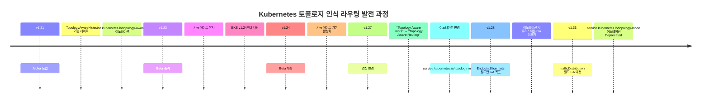
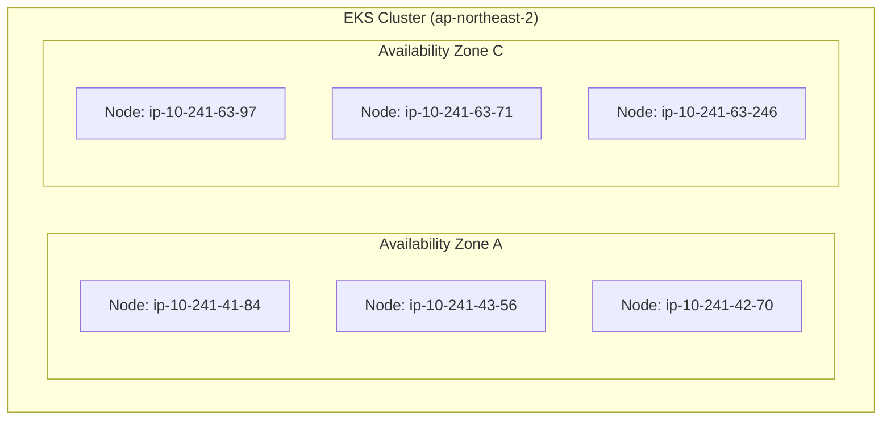
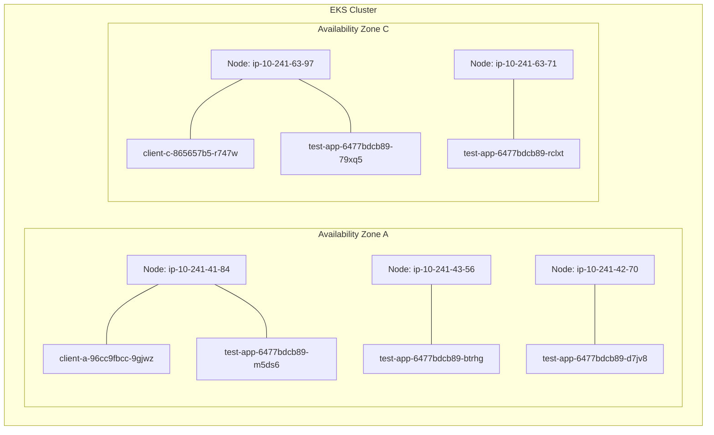
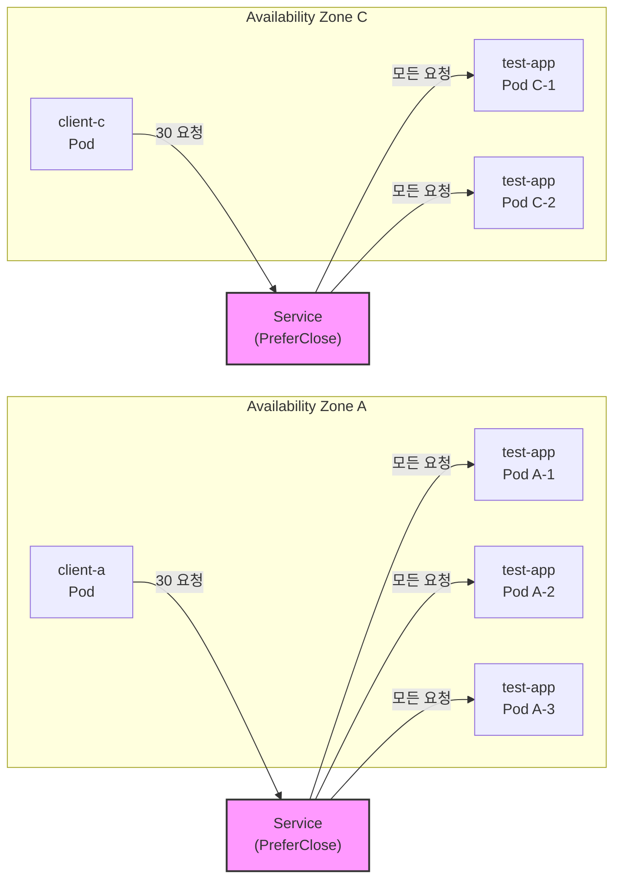
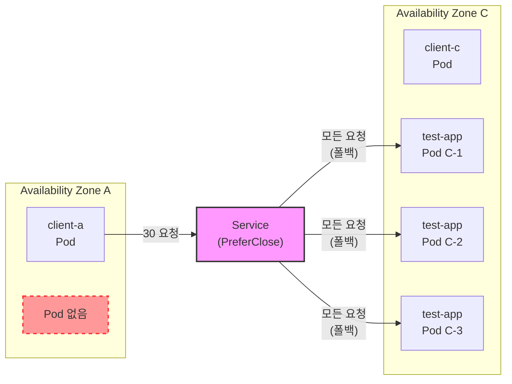
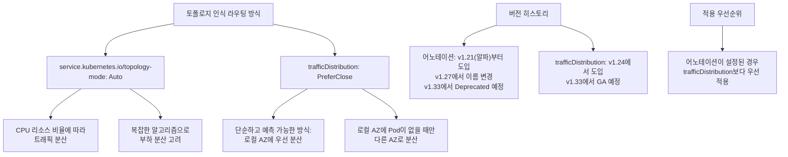
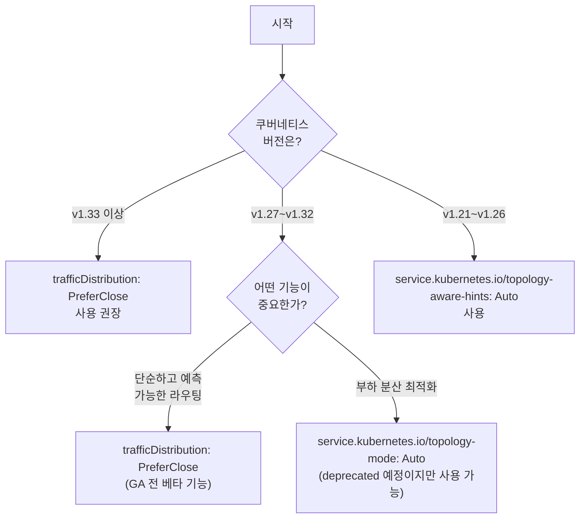

# EKS에서 trafficDistribution: PreferClose를 활용한 AZ 간 통신 최적화

## 목차
- [개요](#개요)
- [토폴로지 인식 라우팅 발전 역사](#토폴로지-인식-라우팅-발전-역사)
- [trafficDistribution: PreferClose 소개](#trafficdistribution-preferclose-소개)
- [테스트 환경 구성](#테스트-환경-구성)
- [테스트 시나리오 및 결과](#테스트-시나리오-및-결과)
- [기존 Topology-Aware Routing과의 비교](#기존-topology-aware-routing과의-비교)
- [적용 가이드라인 및 고려사항](#적용-가이드라인-및-고려사항)
- [결론](#결론)

## 개요

Kubernetes 클러스터, 특히 AWS EKS와 같은 클라우드 환경에서는 여러 가용 영역(Availability Zone, AZ)에 걸쳐 워크로드가 배포됩니다. 서로 다른 AZ 간 통신은 추가적인 네트워크 비용과 지연 시간을 발생시키는데, 이를 최소화하기 위해 Kubernetes에서는 토폴로지 인식 트래픽 라우팅 기능을 제공합니다.

이 문서에서는 Kubernetes의 토폴로지 인식 라우팅 기능의 발전 과정과 최신 방식인 `trafficDistribution: PreferClose` 옵션을 EKS 환경에서 테스트한 결과를 공유합니다.

## 토폴로지 인식 라우팅 발전 역사

Kubernetes에서 토폴로지 인식 라우팅 기능은 다음과 같이 발전해왔습니다:




### 주요 변화 요약

1. **v1.21 (알파)**: "Topology Aware Hints"라는 이름으로 처음 도입
   - `TopologyAwareHints` 기능 게이트 필요
   - `service.kubernetes.io/topology-aware-hints` 어노테이션 사용

2. **v1.23 (베타)**: 베타 단계로 승격
   - EKS는 v1.24부터 이 기능 지원

3. **v1.24**: 기능 게이트가 기본적으로 활성화

4. **v1.27**: 이름 및 어노테이션 변경
   - "Topology Aware Hints" → "Topology Aware Routing"
   - 어노테이션이 `service.kubernetes.io/topology-mode`로 변경

5. **v1.28**: EndpointSlice의 hints 필드만 GA 목표
   - 어노테이션과 라우팅 휴리스틱은 GA 대상에서 제외

6. **v1.33 (예정)**:
   - `service.kubernetes.io/topology-mode` 어노테이션이 deprecated 예정
   - `spec.trafficDistribution` 필드가 GA로 승격 예정
   - 이전 어노테이션은 하위 호환성을 위해 유지되지만 사용 권장하지 않음

## trafficDistribution: PreferClose 소개

### 기능 소개

`trafficDistribution: PreferClose`는 Kubernetes Service 리소스의 필드로, 같은 AZ 내에서 우선적으로 트래픽을 분산시키는 기능을 제공합니다. 이를 통해 AZ 간 네트워크 통신을 최소화하여 지연 시간과 데이터 전송 비용을 줄일 수 있습니다.

### 동작 방식

1. EndpointSlice 컨트롤러가 각 엔드포인트의 토폴로지 정보(가용 영역)를 힌트로 기록
2. kube-proxy가 이 힌트를 활용하여 같은 AZ 내에서 우선적으로 트래픽 라우팅
3. 동일 AZ에 가용한 엔드포인트가 없는 경우에만 다른 AZ로 트래픽 라우팅

### 설정 방법

```yaml
apiVersion: v1
kind: Service
metadata:
  name: my-service
spec:
  selector:
    app: my-app
  ports:
  - port: 80
    targetPort: 8080
  trafficDistribution: PreferClose  # v1.33에서 GA 예정
```

v1.33 이전 버전에서는 아래와 같이 어노테이션을 사용 (Kubernetes v1.27 이상):

```yaml
apiVersion: v1
kind: Service
metadata:
  name: my-service
  annotations:
    service.kubernetes.io/topology-mode: Auto
spec:
  selector:
    app: my-app
  ports:
  - port: 80
```

## 테스트 환경 구성

### 클러스터 환경

테스트는 ap-northeast-2 리전의 EKS 클러스터에서 수행되었으며, 노드는 A존과 C존에 분산 배치되었습니다.




### 테스트용 리소스 구성

```yaml
# 네임스페이스
apiVersion: v1
kind: Namespace
metadata:
  name: topo-test
---
# 애플리케이션: test-app (5 replicas, 기본 스케줄링)
apiVersion: apps/v1
kind: Deployment
metadata:
  name: test-app
  namespace: topo-test
spec:
  replicas: 5
  selector:
    matchLabels:
      app: test-app
  template:
    metadata:
      labels:
        app: test-app
    spec:
      containers:
      - name: http-echo
        image: hashicorp/http-echo:0.2.3
        args:
        - "-text=$(POD_NAME)"
        env:
        - name: POD_NAME
          valueFrom:
            fieldRef:
              fieldPath: metadata.name
        ports:
        - containerPort: 5678
---
# Service: ClusterIP + PreferClose
apiVersion: v1
kind: Service
metadata:
  name: test-app-svc
  namespace: topo-test
spec:
  type: ClusterIP
  selector:
    app: test-app
  ports:
  - port: 80
    targetPort: 5678
  trafficDistribution: PreferClose
---
# A존 클라이언트
apiVersion: apps/v1
kind: Deployment
metadata:
  name: client-a
  namespace: topo-test
spec:
  replicas: 1
  selector:
    matchLabels:
      app: client-a
  template:
    metadata:
      labels:
        app: client-a
    spec:
      nodeSelector:
        topology.kubernetes.io/zone: ap-northeast-2a
      containers:
      - name: curl
        image: nicolaka/netshoot:latest
        command: ["sleep","3600"]
---
# C존 클라이언트
apiVersion: apps/v1
kind: Deployment
metadata:
  name: client-c
  namespace: topo-test
spec:
  replicas: 1
  selector:
    matchLabels:
      app: client-c
  template:
    metadata:
      labels:
        app: client-c
    spec:
      nodeSelector:
        topology.kubernetes.io/zone: ap-northeast-2c
      containers:
      - name: curl
        image: nicolaka/netshoot:latest
        command: ["sleep","3600"]
```

### 초기 Pod 배치



## 테스트 시나리오 및 결과

### 시나리오 1: EndpointSlice 힌트 확인

EndpointSlice에는 각 Pod의 AZ 정보가 힌트로 저장되어 있습니다.

```bash
kubectl -n topo-test get endpointslices \
  -l kubernetes.io/service-name=test-app-svc \
  -o jsonpath='{.items[*].endpoints[*].hints.forZones}'
```

결과:
```
[{"name":"ap-northeast-2c"}] [{"name":"ap-northeast-2a"}] [{"name":"ap-northeast-2a"}] [{"name":"ap-northeast-2a"}] [{"name":"ap-northeast-2c"}]
```

### 시나리오 2: 동일 AZ 내 트래픽 분산



#### A존 클라이언트 호출 결과

```
  11 test-app-6477bdcb89-btrhg
  13 test-app-6477bdcb89-d7jv8
   6 test-app-6477bdcb89-m5ds6
```

**분석**: A존 클라이언트의 모든 요청이 **A존에 위치한 3개의 Pod으로만** 분산되었습니다.

#### C존 클라이언트 호출 결과

```
  19 test-app-6477bdcb89-79xq5
  11 test-app-6477bdcb89-rclxt
```

**분석**: C존 클라이언트의 모든 요청이 **C존에 위치한 2개의 Pod으로만** 분산되었습니다.

### 시나리오 3: 폴백(Fallback) 메커니즘 검증

A존의 Pod를 모두 제거하고 C존에만 Pod이 있는 상황에서 테스트했습니다.



#### A존 클라이언트 호출 결과 (A존 Pod 없는 상황)

```
   9 test-app-54fb4d54c6-9vvtj
  12 test-app-54fb4d54c6-hl2r4
   9 test-app-54fb4d54c6-wv2qw
```

**분석**: A존에 Pod이 없으므로, 클러스터 전체(실제로는 C존)의 Pod로 트래픽이 분산되었습니다.

### 시나리오 4: 복구 후 동작 확인

A존과 C존에 다시 Pod을 분산 배치한 후 테스트했습니다.

```
  12 test-app-6477bdcb89-k6p49
  18 test-app-6477bdcb89-pmfm2
```

**분석**: A존 클라이언트의 요청이 다시 A존 Pod에게만 분산되었습니다.

## 기존 Topology-Aware Routing과의 비교

Kubernetes에서는 AZ 간 통신을 최적화하기 위한 두 가지 주요 접근 방식이 있습니다:

### 1. service.kubernetes.io/topology-mode: Auto (기존 방식)

```yaml
apiVersion: v1
kind: Service
metadata:
  name: my-service
  annotations:
    service.kubernetes.io/topology-mode: Auto  # v1.27부터 사용, v1.33에서 Deprecated 예정
spec:
  selector:
    app: my-app
  ports:
  - port: 80
```

### 2. trafficDistribution: PreferClose (신규 방식)

```yaml
apiVersion: v1
kind: Service
metadata:
  name: my-service
spec:
  selector:
    app: my-app
  ports:
  - port: 80
  trafficDistribution: PreferClose  # v1.33에서 GA 예정
```

### 주요 차이점



1. **분산 알고리즘**:
   - **topology-mode: Auto**: 할당 가능한 CPU 리소스 비율에 따라 트래픽을 분산합니다. 더 복잡한 휴리스틱을 사용하며, 엔드포인트 수가 적을 때 폴백 동작을 포함하는 등 부하 분산을 고려합니다.
   - **PreferClose**: 단순하고 예측 가능한 방식으로 작동합니다 - "해당 존에 엔드포인트가 있으면 그 존의 모든 트래픽을 받고, 존에 엔드포인트가 없으면 트래픽이 다른 존으로 분산됩니다".

2. **적용 우선순위**:
   - `service.kubernetes.io/topology-mode` 어노테이션이 Auto로 설정된 경우, `trafficDistribution` 필드보다 우선 적용됩니다.

3. **버전 상태**:
   - `service.kubernetes.io/topology-mode`: v1.27부터 도입되었으며, v1.33에서 deprecated 예정
   - `trafficDistribution`: v1.33에서 GA(정식 버전)로 승격 예정

## 적용 가이드라인 및 고려사항

### 어떤 옵션을 사용해야 할까?



1. **Kubernetes 버전 기준**:
   - **v1.33 이상**: `trafficDistribution: PreferClose` 사용 권장 (GA 버전)
   - **v1.27~v1.32**: 두 옵션 모두 사용 가능하나, 향후 마이그레이션을 고려하면 `trafficDistribution: PreferClose` 권장
   - **v1.21~v1.26**: `service.kubernetes.io/topology-aware-hints: Auto` 사용

2. **기능적 요구사항 기준**:
   - **단순하고 예측 가능한 라우팅이 중요**: `trafficDistribution: PreferClose` 권장
   - **복잡한 부하 분산 최적화가 필요**: `topology-mode: Auto` 고려 (v1.33 이전 버전에서)

3. **마이그레이션 계획**:
   - v1.33 이후에는 점진적으로 `trafficDistribution: PreferClose`로 마이그레이션할 계획 수립 필요

### 주의사항

1. **Pod 분포 관리**:
   - `PreferClose`를 사용할 경우, 애플리케이션 Pod이 AZ 간에 적절하게 분산되도록 관리해야 합니다.
   - 특정 AZ에 Pod이 과도하게 집중되면 불균형한 부하 분산이 발생할 수 있습니다.

2. **가용성과 복원력**:
   - 특정 AZ에 장애가 발생하면 해당 AZ의 트래픽이 다른 AZ로 이동할 수 있습니다.
   - 모든 AZ의 서비스가 갑작스런 트래픽 증가를 처리할 수 있도록 충분한 용량을 확보해야 합니다.

3. **모니터링**:
   - AZ 별 트래픽 패턴과 Pod 부하를 모니터링하여 필요한 경우 Pod 분산 전략을 조정하세요.

4. **단계적 적용**:
   - 프로덕션 환경에 적용하기 전에 테스트 환경에서 충분히 검증하세요.
   - 특히 트래픽이 많은 서비스에는 단계적으로 적용하는 것이 좋습니다.

## 결론

EKS 환경에서 토폴로지 인식 라우팅 기능, 특히 `trafficDistribution: PreferClose` 옵션을 사용하면 다음과 같은 이점을 얻을 수 있습니다:

1. **네트워크 비용 최적화**: AZ 간 데이터 전송 비용을 최소화할 수 있습니다.
2. **지연 시간 감소**: 같은 AZ 내에서의 통신은 지연 시간이 줄어듭니다.
3. **예측 가능한 트래픽 패턴**: 트래픽 흐름이 단순하고 예측 가능해집니다.
4. **안정적인 폴백 메커니즘**: 로컬 AZ에 Pod이 없을 경우에만 다른 AZ로 트래픽이 분산됩니다.

테스트 결과, `trafficDistribution: PreferClose` 옵션은 의도한 대로 정확하게 작동하며, 로컬 AZ 내에서 트래픽을 효과적으로 유지하는 것을 확인했습니다. 이는 특히 마이크로서비스 아키텍처에서 서비스 간 호출이 많은 경우 상당한 비용 절감과 성능 향상을 가져올 수 있습니다.

쿠버네티스 v1.33에서는 `trafficDistribution: PreferClose`가 GA로 승격될 예정이므로, 장기적인 관점에서 새로운
서비스에는 이 방식을 적용하는 것이 권장됩니다. 기존에 `topology-mode: Auto` 어노테이션을 사용 중인 서비스는 향후 v1.33 이후에 점진적으로 마이그레이션을 계획하는 것이 좋습니다.

## 참고 문헌

1. [Kubernetes 공식 문서: 토폴로지 인식 라우팅](https://kubernetes.io/docs/concepts/services-networking/topology-aware-routing/)
2. [KEP-2433: Topology Aware Hints](https://github.com/kubernetes/enhancements/blob/master/keps/sig-network/2433-topology-aware-hints/README.md)
3. [Kubernetes v1.33 Changelog](https://github.com/kubernetes/kubernetes/blob/master/CHANGELOG/CHANGELOG-1.33.md)
4. [EKS 워크숍: 토폴로지 인식 힌트](https://www.eksworkshop.com/advanced/320_servicemesh_with_appmesh/topology_aware_hints/)
5. [AWS 블로그: EKS에서 토폴로지 인식 라우팅](https://aws.amazon.com/blogs/containers/introducing-topology-aware-hints-for-kubernetes/)