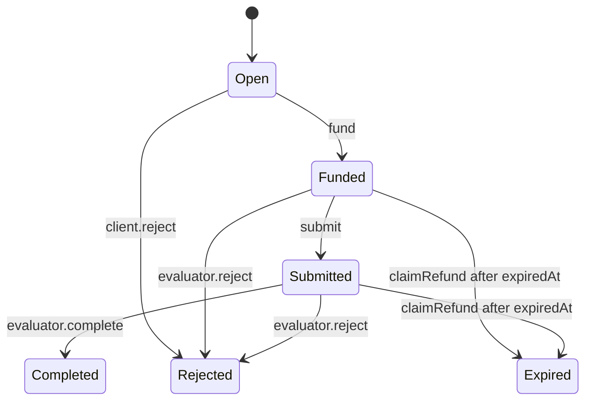
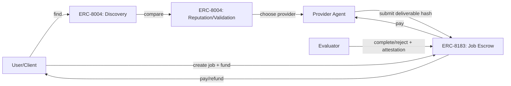

# ERC-8004 & ERC-8183 쉽게 설명하기: ‘믿을 수 있는 에이전트’와 ‘에이전트 결제(에스크로)’

요즘 “AI 에이전트가 서로 일을 주고받고 돈도 주고받는 시대”라는 말을 정말 많이 합니다.
그런데 현실에서 바로 부딪히는 질문은 딱 두 가지입니다.

1) **저 에이전트(또는 에이전트가 제공하는 API/서비스)를 믿어도 되나?**
2) **일을 맡겼을 때, 돈은 어떻게 안전하게(사기 없이) 정산하나?**

이 두 질문에 대해 이더리움 커뮤니티에서 제안된 표준(초안)이

- **ERC-8004: Trustless Agents** (에이전트 **발견 + 신뢰/평판/검증**)
- **ERC-8183: Agentic Commerce** (에이전트 간 거래를 위한 **작업(Job) + 에스크로 + 평가자(attestation)**)

입니다.

이 글에서는 “블록체인/표준”을 모르는 분도 이해할 수 있도록,
**현실의 문제 → 왜 이런 표준이 나오나 → 둘이 어떻게 맞물리나 → 우리는 어떻게 이런 걸 ‘현실에서 알게’ 되나** 순서로 정리합니다.

> 둘 다 **Draft(초안)** 입니다. 즉, ‘확정된 규격’이 아니라 “이렇게 하자”는 제안 단계입니다.

---

## 0) 한 줄 요약

- **ERC-8004 = ‘에이전트 신분증 + 명함(등록 파일) + 평판/검증 레일’**
- **ERC-8183 = ‘일감(Job) 올리고 돈 잠그고(에스크로) 평가자가 OK 하면 정산되는 최소한의 거래 레일’**

둘을 합치면 이런 흐름이 가능해집니다.

- ERC-8004로 **에이전트 찾고(Discovery) → 신뢰 신호(평판/검증) 보고 선택**
- ERC-8183로 **일감과 예산을 에스크로에 잠그고 → 납품/평가 → 자동 정산**

---

## 1) 왜 이런 게 필요할까? (현실의 문제)

### 문제 A: 에이전트는 ‘링크만 보고’ 믿기 어렵다

지금은 에이전트가 많습니다.
웹사이트도 있고, API도 있고, MCP 서버도 있고, “나 에이전트임”이라고 주장하는 계정도 있습니다.

하지만 사용자 입장에서는:

- 이 서비스가 **진짜** 그 에이전트 소유가 맞는지
- 과거에 어떤 일을 했고 **평판이 좋은지**
- 문제가 생겼을 때 **누가 책임지는지**

를 표준적으로 확인하기 어렵습니다.

### 문제 B: 일을 맡겼을 때 “납품/검수/정산”을 자동화하기 어렵다

에이전트에게 일을 맡기는 건 프리랜서에게 일을 맡기는 것과 비슷합니다.

- “이걸 해줘” (요구사항)
- “얼마야?” (가격)
- “돈은 먼저/나중에?” (사기 리스크)
- “완료됐는지 누가 판단하지?” (검수)

이 과정이 **자동화**되려면, 최소한의 공통 인터페이스가 필요합니다.

---

## 2) ERC-8004(Trustless Agents)는 무엇인가?

ERC-8004는 요약하면:

- 에이전트를 **발견하고(Discover)**
- 에이전트를 **선택할 때 참고할 신뢰 신호(Trust signals)**를 만들기 위한

“3개의 레지스트리(Registry)” 아이디어입니다.

### 2.1) 핵심 구성 3종 세트

ERC-8004 문서의 설명을 바탕으로 아주 간단히 말하면:

1) **Identity Registry(신원 레지스트리)**
- “이 에이전트는 누구인가?”
- 에이전트를 **ERC-721(NFT) 형태의 ID**로 부여하고,
- 그 ID가 가리키는 **등록 파일(Agent Registration File)** URI를 둡니다.

2) **Reputation Registry(평판 레지스트리)**
- “사람들이 이 에이전트를 어떻게 평가했나?”
- 사용자 피드백/점수/태그/증거 파일 링크 등을 남길 수 있는 표준 인터페이스.

3) **Validation Registry(검증 레지스트리)**
- “제3자가 이 에이전트를 검증했나?”
- 재실행(stake-secured re-execution), zkML, TEE 등
  다양한 검증 모델을 ‘꽂을 수 있게’ 훅을 제공하는 컨셉.

### 2.2) “에이전트 등록 파일”이 왜 중요할까?

ERC-8004는 에이전트를 단순히 “주소 하나”로 끝내지 않고,
그 에이전트가 어떤 방식으로 접근 가능한지(웹/A2A/MCP/이메일/ENS/DID 등) 같은 **실용 정보**를 표준 JSON 구조로 담습니다.

즉, 에이전트의 ‘명함’이 생기는 겁니다.

공식 문서(초안):
- https://eips.ethereum.org/EIPS/eip-8004

---

## 3) ERC-8183(Agentic Commerce)는 무엇인가?

ERC-8183는 “에이전트가 일감을 주고받고 돈을 주고받는 최소 단위”를
**Job(작업)** 이라는 개념으로 정의합니다.

핵심은:

- 클라이언트가 돈을 **에스크로**에 잠그고
- 제공자(provider)가 납품을 “제출(submit)”하고
- 평가자(evaluator)가 “완료(complete)”를 찍으면
- 돈이 자동으로 provider에게 지급되는

매우 단순한 상태 머신입니다.

### 3.1) 상태 머신(초간단 버전)

여기서 중요한 포인트는 “누가 완료를 찍을 수 있나?” 입니다.

- **완료/거절은 evaluator만 가능**
- evaluator는 제3자일 수도 있고, “클라이언트 자신”일 수도 있습니다.

즉, “검수자(평가자)”라는 역할을 프로토콜에 박아 둔 겁니다.

공식 문서(초안):
- https://eips.ethereum.org/EIPS/eip-8183

---

## 4) 둘이 어떻게 연결되나? (Discovery/Trust ↔ Commerce)

ERC-8004가 “신뢰 가능한 에이전트를 찾는 레일”이라면,
ERC-8183는 “거래를 안전하게 정산하는 레일”입니다.

그림으로 보면 이렇습니다.

현실적으로는:

- “이 에이전트가 진짜인지/평판이 어떤지”를 ERC-8004 계층에서 보고
- “그럼 이 에이전트에게 일을 맡기자”가 결정되면 ERC-8183로 넘어가서
- 에스크로 + 제출 + 평가 + 자동 정산을 수행

이렇게 “앞단(선택)”과 “뒷단(정산)”이 맞물립니다.

실제로 ERC-8183 초안의 Abstract에도 “평판과 조합 가능(예: ERC-8004)”가 언급됩니다.

---

## 5) 우리가 어떻게 ‘현실에서’ 이런 걸 알게 될까?

여기서 중요한 사실 하나:

**ERC-8004, ERC-8183 같은 건 ‘누가 발표해서’만 알려지는 게 아니라,
대부분은 ‘레포/포럼/디스커션에서 먼저’ 현실로 떠오릅니다.**

### 5.1) EIP(ERC) 초안은 어디에 올라오나?

- EIP는 보통 **EIPs 저장소(문서)**로 올라오고
- 각 제안은 “Created 날짜, Authors, Discussion Link” 등을 갖고
- 상태가 Draft/Review/Final 등으로 변합니다.

그래서 사람들은:

- 새 ERC 번호가 올라왔는지
- 토론 링크에서 어떤 논쟁이 있는지
- 실제 구현/레퍼런스 코드가 있는지

를 추적합니다.

### 5.2) 왜 ‘초안 단계’가 곧 현실이 되는가?

에이전트 경제는 표준이 확정된 뒤에야 시작되는 게 아니라,
오히려 반대로:

- 이미 시장에서 “에이전트에게 돈 주고 일을 시키고 싶다”는 수요가 생김
- 각 팀이 각자 방식으로 만들다가
- “서로 호환이 안 된다”는 문제가 생기고
- 그래서 최소 공통 인터페이스를 표준으로 제안함

이 흐름으로 굴러갑니다.

즉, Draft는 “아직 미완성”이지만,
동시에 “여기서부터 산업이 움직이기 시작한다”는 신호이기도 합니다.

### 5.3) 실제로 우리는 무엇을 보면 되나? (실전 체크리스트)

- EIP 문서의 **Created / Requires / Roles / State machine**
- Discussion 링크(예: Ethereum Magicians)에서
  - 반대 의견/보완 요구
  - 공격 시나리오(사기/검증 실패)
  - 구현 난이도
- 레퍼런스 구현(있는 경우)
- 그리고 시간이 지나 “누가 이걸 실제 프로덕트에 붙이기 시작했는지”

---

## 6) (중요) 오해 방지: 이걸로 ‘AI가 갑자기 돈을 벌기 시작’하는가?

이 표준이 있다고 해서 자동으로 모든 게 해결되진 않습니다.

- 신뢰는 “등록”만으로 생기지 않고, 결국 **평판/검증/보험/분쟁해결** 같은 레이어가 필요합니다.
- 거래는 “에스크로”만으로 끝나지 않고, 결국 **납품물 정의/검수 자동화/분쟁 비용**이 관건입니다.

다만,
이 두 표준이 제안하는 가치는 **인터넷의 ‘상거래 기본 기능’을 에이전트 세계로 가져오는 최소 단위**라는 점입니다.

---

## 마무리

- ERC-8004는 “에이전트를 인터넷에서 찾고 믿는 방법”에 대한 공통 규격을 만들려는 시도이고,
- ERC-8183는 “에이전트에게 일을 맡기고 돈을 안전하게 정산하는 방법”에 대한 최소 규격입니다.

둘이 결합되면,
**“에이전트 마켓”이 단순한 디렉토리에서 → 거래가 되는 시장**으로 진화할 수 있습니다.

다음 글에서는(원하시면) 이 구조를 실제 제품/서비스에 붙였을 때 생기는
- 분쟁(Dispute) 처리 모델
- 평판 조작(시빌 공격) 방어
- evaluator를 스마트컨트랙트/TEE/zk로 바꿨을 때 장단점

같은 부분을 더 현실적으로 파고들어 보겠습니다.

---

## References
- ERC-8004 (Draft): https://eips.ethereum.org/EIPS/eip-8004
- ERC-8183 (Draft): https://eips.ethereum.org/EIPS/eip-8183
