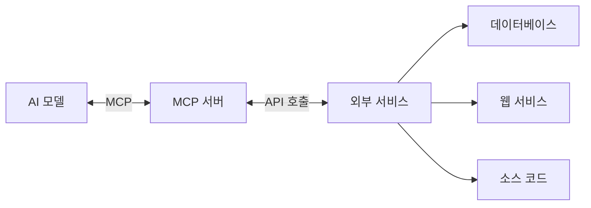
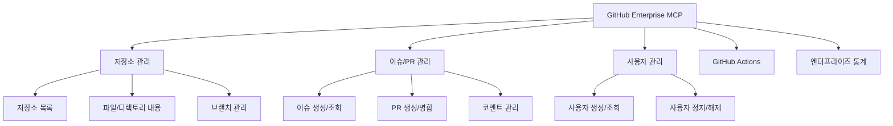
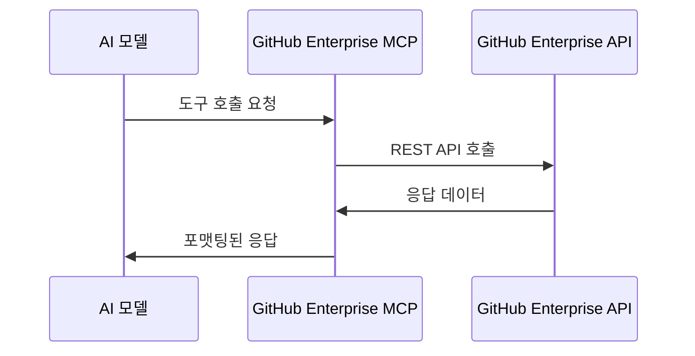

# GitHub Enterprise MCP 서버 구현 해보기

## MCP(Model Context Protocol)란 무엇인가?

최근 AI 기술의 발전으로 코딩 어시스턴트와 같은 도구들이 개발자 생산성을 크게 향상시키고 있습니다. 그러나 AI 모델이 실시간 데이터에 접근하거나 실제 시스템과 상호작용하는 데는 여전히 제약이 있었습니다. 이런 제약을 해결하기 위해 등장한 것이 **Model Context Protocol(MCP)** 입니다.

MCP는 AI 모델이 외부 시스템과 상호작용할 수 있게 해주는 표준화된 프로토콜로, AI가 실시간 데이터를 조회하고 작업을 수행할 수 있는 인터페이스를 제공합니다. 이를 통해 AI는 단순히 정적인 학습 데이터에만 의존하는 것이 아니라, 실제 환경의 최신 정보를 활용할 수 있게 됩니다.



## GitHub MCP 서버의 필요성

소프트웨어 개발에서 GitHub은 중심적인 역할을 합니다. 코드 저장소, 이슈 관리, PR 검토, 코드 검색 등 개발 워크플로우의 많은 부분이 GitHub에서 이루어집니다.

따라서 AI 코딩 어시스턴트가 GitHub과 원활하게 통합된다면 개발자 경험을 크게 향상시킬 수 있습니다.

GitHub MCP 서버는 AI 모델이 GitHub API와 직접 상호작용할 수 있게 해주는 중간 계층입니다. 이를 통해 AI는:

- 저장소의 코드를 실시간으로 검색하고 분석
- 이슈와 PR을 생성, 관리, 검토
- 코드 변경 사항을 제출하고 병합
- 사용자 정보 및 권한 관리

등의 작업을 수행할 수 있습니다.

## 개인 프로젝트: GitHub Enterprise MCP 서버

공식 GitHub MCP 서버가 출시되기 전, 저는 GitHub Enterprise 환경에서 사용할 수 있는 MCP 서버를 직접 개발했습니다. 
<br>이 프로젝트는 [github-enterprise-mcp](https://github.com/containerelic/github-enterprise-mcp)라는 이름으로 공개되어 있습니다.

### 프로젝트 배경

GitHub Enterprise 환경에서 AI 코딩 어시스턴트를 효과적으로 활용하기 위해서는 엔터프라이즈 API에 접근할 수 있는 MCP 서버가 필요했습니다. <br>당시 공식 GitHub MCP 서버가 없었기 때문에, Node.js를 기반으로 자체 구현을 시작했습니다.

이 프로젝트의 주요 목표는:

1. GitHub Enterprise Server API와의 완벽한 통합
2. 다양한 AI 도구(Cursor, Claude 등)와의 호환성
3. 엔터프라이즈 환경에 필요한 확장 기능 지원
4. 보안 및 권한 관리 강화

### 주요 기능



- **저장소 관리**: 저장소 목록 조회, 세부 정보 확인, 브랜치 관리, 파일 및 디렉토리 내용 조회
- **이슈 및 PR 관리**: 이슈/PR 생성, 조회, 업데이트, 코멘트 관리
- **사용자 관리**: 사용자 목록 조회, 생성, 업데이트, 정지/해제
- **GitHub Actions**: 워크플로우 목록 조회, 실행 기록 관리, 워크플로우 트리거
- **엔터프라이즈 기능**: 라이센스 정보 조회, 엔터프라이즈 시스템 통계 확인

### 구현 방식

GitHub Enterprise MCP 서버는 Node.js와 TypeScript를 사용하여 개발되었으며, 다음과 같은 기술적 특징을 가지고 있습니다:

1. **모듈화된 구조**: 각 기능 영역별로 분리된 모듈 구조로 유지보수성 향상
2. **확장 가능한 설계**: 새로운 GitHub API 엔드포인트 추가가 용이한 구조
3. **다국어 지원**: 영어와 한국어 인터페이스 제공
4. **Docker 컨테이너화**: 쉬운 배포와 관리를 위한 Docker 지원
5. **다양한 전송 방식**: HTTP, CLI, 표준 입출력 등 다양한 통신 방식 지원



## 공식 GitHub MCP 서버와의 비교

이후 GitHub에서 [공식 MCP 서버](https://github.com/github/github-mcp-server)를 출시했습니다. 두 프로젝트를 비교해보면:

| 특징 | 내 github-enterprise-mcp | 공식 github-mcp-server |
|------|--------------------------|-------------------------|
| 개발 언어 | Node.js / TypeScript | Go |
| 성능 | 준수 | 최적화됨 |
| 기능 범위 | GitHub Enterprise 특화 | GitHub.com 중심, Enterprise 부분 지원 |
| 확장성 | 중간 | 높음 (도구 세트 개념) |
| 다국어 지원 | 영어, 한국어 | 영어 (설정으로 확장 가능) |
| 라이센스 | ISC | MIT |
| 설치 방법 | npm, Docker | Go 바이너리, Docker |
| 도구 수 | 20+ | 40+ |

### 공식 서버의 장점

- Go 언어 기반으로 더 뛰어난 성능
- 더 많은 도구와 기능 지원
- 더 활발한 유지보수와 업데이트
- 도구 세트(toolsets) 개념을 통한 유연한 구성

### 내 프로젝트의 차별점(제 프로젝트는 허술합니다..)

- GitHub Enterprise 환경에 특화된 기능
- Node.js 생태계 친화적
- 엔터프라이즈 통계 및 관리 도구 강화
- 한국어 인터페이스 기본 지원

## 설치 및 사용 방법

### Docker를 사용한 설치

```bash
# Docker 이미지 빌드
docker build -t github-enterprise-mcp .

# Docker 컨테이너 실행
docker run -p 3000:3000 \
  -e GITHUB_TOKEN="your_github_token" \
  -e GITHUB_ENTERPRISE_URL="https://github.your-company.com/api/v3" \
  -e DEBUG=true \
  github-enterprise-mcp
```

### Cursor와의 통합

Cursor에서 MCP 서버를 사용하려면 `.cursor/mcp.json` 파일에 다음과 같이 설정합니다:

```json
{
  "mcpServers": {
    "github-enterprise": {
      "url": "http://localhost:3000/sse"
    }
  }
}
```

### 사용 예시

Cursor나 Claude와 같은 AI 도구에서 다음과 같이 MCP 도구를 호출할 수 있습니다:

```
# 저장소 정보 조회
mcp_github_enterprise_get_repository(owner="octocat", repo="hello-world")

# 이슈 생성
mcp_github_enterprise_create_issue(
  owner="octocat", 
  repo="hello-world",
  title="버그 발견",
  body="버그에 대한 설명입니다",
  labels=["bug", "priority:high"]
)

# PR 검토
mcp_github_enterprise_list_pull_requests(owner="octocat", repo="hello-world", state="open")
```

## 프로젝트를 통해 배운 점

### 1. 표준화와 상호운용성의 중요성

MCP는 AI와 외부 시스템 간의 표준화된 인터페이스를 제공함으로써 다양한 AI 도구들이 동일한 방식으로 GitHub과 상호작용할 수 있게 합니다. <br>이런 표준화가 생태계 발전에 얼마나 중요한지 실감했습니다.

### 2. 엔터프라이즈 환경의 특수성

GitHub.com과 GitHub Enterprise는 비슷하지만 중요한 차이점이 있습니다. <br>엔터프라이즈 환경에서는 라이센스 관리, 사용자 관리, 시스템 통계 등 추가적인 기능이 필요하며, 이를 위한 특별한 고려사항이 있습니다.


## 결론

MCP와 같은 프로토콜은 AI가 단순한 텍스트 생성을 넘어 실제 개발 환경과 상호작용하는 데 필수적인 요소가 되고 있습니다.<br> 앞으로도 AI와 개발 도구 간의 통합은 더욱 깊어질 것이며, 이는 개발자 생산성과 코드 품질 향상에 큰 기여를 할 것입니다.

저는 Devops 엔지니어로서 개발자 분들에 비해 코딩 실력이 현저히 부족합니다.<br> 새로운 기술 트렌드를 파악하고 직접 구현해보는 경험은 매우 가치 있었으며, 이런 사이드 프로젝트를 통해 얻은 지식은 일상 업무에도 많은 도움이 되고 있습니다.

## 참고 자료

- [개인 GitHub Enterprise MCP 프로젝트](https://github.com/containerelic/github-enterprise-mcp)
- [공식 GitHub MCP 서버](https://github.com/github/github-mcp-server)
- [Model Context Protocol 공식 문서](https://modelcontextprotocol.io/introduction)
- [Cursor 에디터의 MCP 서버 문서](https://code.visualstudio.com/docs/copilot/chat/mcp-servers)
