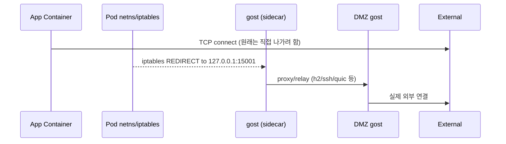
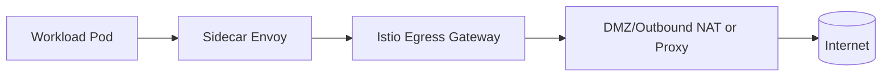

# 폐쇄망 Kubernetes에서 특정 Pod만 외부 통신시키기: gost 기반 DMZ Egress Proxy

폐쇄망(내부망) Kubernetes 환경에서는 보통 **클러스터 전체 egress를 막아야** 합니다.
하지만 현실에서는 다음 같은 요구가 종종 생깁니다.

- 특정 애플리케이션 Pod만 외부 API(결제/지도/알림), Git, 패키지 리포지토리, 이미지 레지스트리 등에 접근해야 한다
- 외부 통신은 반드시 **DMZ 구역의 승인된 프록시/중계**를 통해서만 나가야 한다
- 가능하면 **HTTP/HTTPS 프록시**로 통제하고, 앱 수정이 어려운 경우에는 **투명(transparent) 프록시**가 필요하다

이 글에서는 [gost (GO Simple Tunnel)](https://github.com/ginuerzh/gost)을 활용해,
**내부 폐쇄 K8s의 특정 Pod만 외부로 통신시키는 구조**와 **구축 방법**을 기술적으로 정리합니다.
마지막에는 **Istio로 비슷한 요구를 해결하는 대안**도 비교 관점으로 덧붙입니다.

---

## 목표 아키텍처(요약)

핵심 아이디어는 간단합니다.

1) 내부 K8s는 기본적으로 외부 egress를 막는다
2) 외부로 나가야 하는 트래픽은 **Pod → (클러스터 내 프록시 엔드포인트) → DMZ gost → Internet** 단일 경로로 강제한다
3) 접근 제어/감사/로깅/허용 도메인 정책을 **DMZ egress proxy**에 집중한다

### Mermaid: 전체 흐름(권장)

```mermaid
flowchart LR
  subgraph INTERNAL[내부 폐쇄망]
    subgraph K8S[Kubernetes Cluster]
      POD[특정 Pod
(egress 허용 대상)]
      SIDECAR[gost-client
(HTTP/HTTPS 프록시 또는
transparent redirect 수신)]
      POD -->|HTTP/HTTPS or TCP| SIDECAR
    end
  end

  subgraph DMZ[DMZ 구역]
    GDMZ[gost-server / gost-proxy
(인증/TLS/체인)]
    EGRESS[Outbound Proxy / NAT Gateway
(허용목록, 로깅)]
    GDMZ --> EGRESS
  end

  INTERNET[(Internet)]

  SIDECAR -->|허용된 단일 경로| GDMZ --> INTERNET
```

구성 요소는 두 덩어리입니다.

- **클러스터 내부**: Pod 옆(사이드카) 또는 노드 레벨에서 트래픽을 받아 DMZ로 전달
- **DMZ**: 외부로 나가는 유일한 출구(Egress) 역할 + 통제

---

## gost를 쓰는 이유

gost는 “프록시 + 터널 + 포트포워딩 + 체인(Proxy chain)”을 한 바이너리로 해결합니다.
이 글에서 특히 유용한 포인트는 다음입니다.

- 표준 **HTTP/HTTPS/HTTP2/SOCKS5** 프록시 지원
- **Proxy chain(-F)** 로 “내부 → DMZ → (외부망 프록시/게이트웨이)”처럼 다단 구성이 쉬움
- **redirect(transparent proxy)** 류 패턴에 사용 가능 (앱 수정이 어려울 때 유용)
- 운영 시 단일 바이너리로 배포/업데이트가 간단

참고: gost 문서는 기능이 많아 처음 보면 복잡하지만, “우리 요구”는 크게 두 케이스로 정리할 수 있습니다.

- 케이스 A: 애플리케이션이 프록시 설정 가능 → HTTP/HTTPS 프록시
- 케이스 B: 애플리케이션 수정 불가/다양한 TCP 통신 → 투명 프록시(redirect)

---

## 사전 조건 / 보안 원칙

이 글은 다음 전제를 권장합니다.

- **기본 차단(Default deny egress)**: 클러스터 전체 egress는 막고, 예외만 연다.
- **DMZ로만 egress 허용**: Pod가 인터넷으로 직접 나가면 안 되고, DMZ의 gost(또는 egress gateway)만 도달 가능해야 한다.
- **DMZ에서 정책/감사**: 외부 도메인 allowlist, 인증, TLS, 로그를 DMZ에서 수행한다.

이렇게 하면 “특정 Pod만 외부 통신”을 만들 때도, 통제 지점이 분산되지 않습니다.

---

## 케이스 A) HTTP/HTTPS 프록시(앱이 프록시 설정 가능할 때)

### 1) 클러스터 내부: Pod 옆(sidecar)로 로컬 프록시 제공

가장 구현/운영 난이도가 낮은 방식은 **Sidecar gost**를 두고,
애플리케이션은 `HTTP_PROXY/HTTPS_PROXY` 를 `localhost` 로 향하게 하는 것입니다.

- 장점: iptables/NAT 개입이 최소, 디버깅이 쉽다
- 단점: 앱이 프록시 환경변수를 지원해야 한다

#### 예시: Deployment(개념)

```yaml
apiVersion: apps/v1
kind: Deployment
metadata:
  name: app-with-egress
spec:
  replicas: 1
  selector:
    matchLabels:
      app: app-with-egress
  template:
    metadata:
      labels:
        app: app-with-egress
    spec:
      containers:
        - name: app
          image: your/app:tag
          env:
            - name: HTTP_PROXY
              value: http://127.0.0.1:18080
            - name: HTTPS_PROXY
              value: http://127.0.0.1:18080
            - name: NO_PROXY
              value: ".svc,.cluster.local,10.0.0.0/8,172.16.0.0/12,192.168.0.0/16"
        - name: gost
          image: ginuerzh/gost:latest
          args:
            # 로컬에서 HTTP proxy를 열고(-L), DMZ gost로 전달(-F)
            - "-L=http://:18080"
            - "-F=h2://dmz-gost.example.dmz:443?ping=30"
          ports:
            - containerPort: 18080
```

여기서 포인트는 `-F` 입니다.

- `-L=http://:18080` : Pod 내부(네임스페이스 네트워크)에서 HTTP 프록시를 엽니다.
- `-F=h2://dmz-gost...` : 프록시 체인(포워드)을 DMZ gost로 보냅니다.
  - 운영에서는 평문보다 **h2/TLS** 같은 암호화 채널을 권장합니다.

### 2) DMZ: gost 서버(또는 프록시)로 수신 후 외부로 egress

DMZ에서는 “내부에서 온 연결을 받아 외부로 나가는” 역할을 합니다.
가장 단순한 형태는 DMZ에서 gost를 HTTP 프록시로 열고, 내부가 거기로 붙는 구조입니다.

```bash
# DMZ 서버에서: h2(HTTP/2 터널) 리스닝
gost -L=h2://:443
```

그리고 DMZ에서 실제 외부 통신을 어디로 보낼지는 환경마다 다릅니다.

- DMZ 서버가 직접 NAT 되어 인터넷으로 나가는 경우
- DMZ에서 또 다른 Outbound Proxy(사내 표준 프록시)로 반드시 나가야 하는 경우

후자의 경우는 gost의 체인(-F)을 DMZ 쪽에 한 단계 더 넣는 식으로 구성할 수 있습니다.

```bash
# DMZ에서 외부 표준 프록시로 체인
gost -L=h2://:443 -F=http://corp-outbound-proxy.dmz:3128
```

> 팁: DMZ Outbound Proxy에 도메인 allowlist / URL filtering / 사용자 인증 / 로깅을 집중시키면
> “K8s 내부에서 누가 어디로 나갔는지” 추적이 훨씬 쉬워집니다.

---

## 케이스 B) 투명(Transparent) 프록시가 필요한 경우

HTTP/HTTPS 프록시는 애플리케이션이 환경변수를 따라줘야 합니다.
하지만 현실에서는 다음 상황이 자주 발생합니다.

- 라이브러리/레거시 앱이라 프록시 환경변수 지원이 불완전
- 외부 통신이 HTTP가 아니라 **일반 TCP**(예: 특정 포트의 커스텀 프로토콜)
- 프록시 설정이 애플리케이션마다 달라 표준화가 어렵다

이때는 **Pod 네트워크에서 특정 목적지 트래픽을 강제로 로컬 프록시로 리다이렉트(iptables redirect)** 하는 방식이 필요합니다.

### Mermaid: 투명 프록시(리다이렉트) 흐름



### 구현 패턴

- **sidecar gost**는 로컬 포트를 하나 열어 “리다이렉트된 트래픽”을 받습니다.
- **initContainer** 또는 privileged helper가 Pod netns 안에서 iptables 규칙을 넣어
  특정 트래픽을 gost로 리다이렉트합니다.

#### 예시(개념): initContainer로 iptables 설정

> 주의: 실제로는 CNI, PSP/PSA 정책, Cilium/eBPF 여부, 커널 모듈 등에 따라 권한/구현이 달라집니다.
> 아래는 “패턴”을 보여주기 위한 예시입니다.

```yaml
apiVersion: apps/v1
kind: Deployment
metadata:
  name: app-transparent-egress
spec:
  replicas: 1
  selector:
    matchLabels:
      app: app-transparent-egress
  template:
    metadata:
      labels:
        app: app-transparent-egress
    spec:
      initContainers:
        - name: init-iptables
          image: ghcr.io/nicolaka/netshoot:latest
          securityContext:
            capabilities:
              add: ["NET_ADMIN"]
          command: ["sh", "-c"]
          args:
            - |
              # 예: 443/80 목적지 트래픽을 로컬 15001로 리다이렉트
              iptables -t nat -N GOST_REDIRECT || true
              iptables -t nat -F GOST_REDIRECT

              # 클러스터 내부 통신 제외(서비스/파드 CIDR은 환경에 맞게)
              iptables -t nat -A GOST_REDIRECT -d 10.0.0.0/8 -j RETURN
              iptables -t nat -A GOST_REDIRECT -d 172.16.0.0/12 -j RETURN
              iptables -t nat -A GOST_REDIRECT -d 192.168.0.0/16 -j RETURN

              # 외부로 나가는 TCP 80/443만 잡아서 gost로
              iptables -t nat -A GOST_REDIRECT -p tcp --dport 80  -j REDIRECT --to-ports 15001
              iptables -t nat -A GOST_REDIRECT -p tcp --dport 443 -j REDIRECT --to-ports 15001

              iptables -t nat -A OUTPUT -p tcp -j GOST_REDIRECT

      containers:
        - name: app
          image: your/app:tag
        - name: gost
          image: ginuerzh/gost:latest
          args:
            # 15001로 들어온 트래픽을 DMZ로 전달하는 엔드포인트(예시)
            # 실제로는 목적(HTTP/HTTPS/TCP) 및 gost 모드에 따라 -L 형식이 달라질 수 있음
            - "-L=redirect://:15001"
            - "-F=h2://dmz-gost.example.dmz:443?ping=30"
```

위 예시는 개념적으로는 “Istio의 sidecar redirect”와 동일한 패턴입니다.
즉, 앱이 몰라도 네트워크 레벨에서 트래픽을 옆 컨테이너로 우회시키는 방식입니다.

### 투명 프록시에서 반드시 신경쓸 것

- **예외 처리(RETURN)**: 클러스터 내부(서비스/파드 CIDR) 트래픽까지 잡아버리면 장애가 납니다.
- **루프 방지**: gost 자체의 아웃바운드 트래픽까지 다시 redirect 되지 않게 설계해야 합니다.
  - 보통은 UID 기반 제외(owner match) 또는 별도 라우팅 테이블/마크를 사용합니다.
- **권한/정책**: NET_ADMIN 권한이 필요한 경우가 많아, 플랫폼 보안 정책과 충돌할 수 있습니다.

---

## DMZ 구역 설계 포인트

DMZ는 “외부 통신의 유일한 출구”이므로, 다음을 권장합니다.

1) **고가용성**: gost 서버를 2대 이상 + 로드밸런서(또는 Anycast/keepalived)
2) **인증/암호화**: 내부→DMZ 구간은 TLS/h2/ssh/quic 등 암호화 채널로
3) **정책 집중**: allowlist(도메인/IP), 포트 제한, 로그(누가/언제/어디로)
4) **관측성**: 접속 로그 + 오류율 + latency를 Prometheus/ELK로 수집

---

## (중요) Kubernetes에서 “특정 Pod만 허용” 만드는 방법

gost를 잘 깔아도, 클러스터 레벨 통제가 없으면 우회가 가능합니다.
따라서 아래 2가지를 같이 가져가는 것을 권장합니다.

### 1) NetworkPolicy로 egress를 DMZ로만 열기

예시(개념): 해당 앱 라벨을 가진 Pod만 DMZ IP/Port로 egress 허용

```yaml
apiVersion: networking.k8s.io/v1
kind: NetworkPolicy
metadata:
  name: allow-egress-to-dmz-gost
  namespace: default
spec:
  podSelector:
    matchLabels:
      app: app-with-egress
  policyTypes: ["Egress"]
  egress:
    - to:
        - ipBlock:
            cidr: 203.0.113.10/32   # DMZ gost VIP/IP
      ports:
        - protocol: TCP
          port: 443
```

> 실제로는 CNI가 NetworkPolicy를 지원해야 합니다(Cilium/Calico 등).

### 2) 노드/서브넷 라우팅에서 “인터넷 직접 egress”를 막기

- 내부 노드 서브넷이 인터넷 NAT 라우트로 바로 나가지 않도록
- 방화벽에서 내부 K8s 서브넷 → 인터넷을 차단하고, DMZ만 허용

이 두 가지가 합쳐져야 “정말 특정 Pod만” 외부 통신이 가능해집니다.

---

## 운영 팁(실전)

- **헬스체크**: DMZ gost에 `/healthz` 같은 HTTP 엔드포인트를 두기 어렵다면, TCP connect 체크를 별도로 둡니다.
- **timeout/keepalive**: 장기 연결이 많은 서비스면 ping/keepalive 설정을 조정합니다.
- **로그**: DMZ에서 최소한
  - Source(클러스터/네임스페이스/워크로드)
  - Destination(도메인/IP/포트)
  - 결과(성공/실패/지연)
  를 남기도록 파이프라인을 설계합니다.

---

## 대안: Istio로도 가능할까? (Egress Gateway)

결론부터 말하면 **가능한 경우가 많습니다.**
Istio는 “서비스 메시”이지만, egress 통제 패턴이 잘 정리되어 있습니다.

### Istio Egress Gateway로 구현하는 그림



### Istio 방식의 장점

- iptables redirect/sidecar 패턴이 표준화되어 있음(운영 레퍼런스가 많음)
- ServiceEntry / VirtualService / DestinationRule로 정책을 선언적으로 관리
- 관측성(메트릭/트레이싱)과 인증(mTLS) 연계가 쉬움

### Istio 방식의 한계/주의

- L7(HTTP) 기반 정책은 강력하지만, **모든 TCP 트래픽을 원하는 수준으로 제어**하려면 설계가 복잡해질 수 있습니다.
- 이미 Istio를 쓰고 있지 않다면, 도입 비용이 큽니다(사이드카 오버헤드 포함).

### 그래서 무엇을 선택할까?

- 이미 Istio를 운영 중이고, egress 정책/관측성을 메시로 통합하고 싶다 → **Istio Egress Gateway**
- Istio 없이 “특정 워크로드만 빠르게 egress 열기 + DMZ 단일 출구”가 목적 → **gost + DMZ egress proxy**
- 앱 수정이 어렵고 투명 프록시가 필요한 케이스가 많다 → **(gost or Istio) redirect 기반 패턴**

---

## 마무리

폐쇄망 K8s에서 외부 통신을 열 때 중요한 건 “열었다”가 아니라,

- 누가(어떤 Pod/워크로드가)
- 어디로(어떤 도메인/포트로)
- 어떤 경로로(DMZ 단일 출구)
- 어떤 정책으로(allowlist/로그/감사)

를 **운영 가능한 형태로 만드는 것**입니다.

gost는 이 요구를 비교적 낮은 복잡도로 구현할 수 있는 실전 도구이고,
Istio는 이미 메시를 운영하는 조직이라면 더 강력한 정책/관측성을 제공할 수 있습니다.

필요하시면 다음 확장도 같이 정리할 수 있습니다.

- 도메인 기반 allowlist(특히 HTTPS SNI 기반)
- mTLS/인증서 운영(내부→DMZ 구간)
- HA 구성(Active/Standby 또는 LB)과 장애 시나리오
