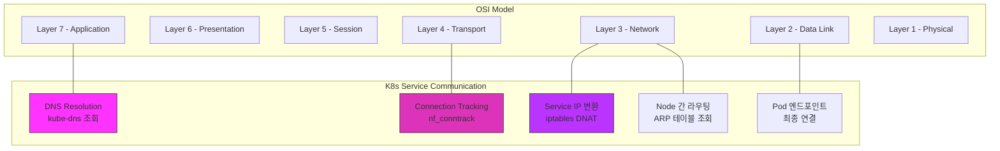
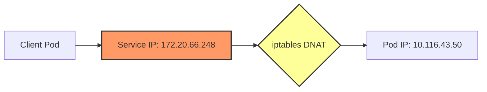
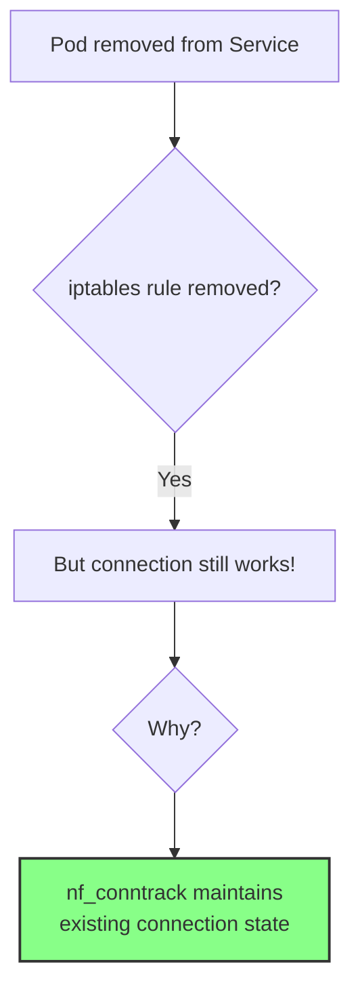
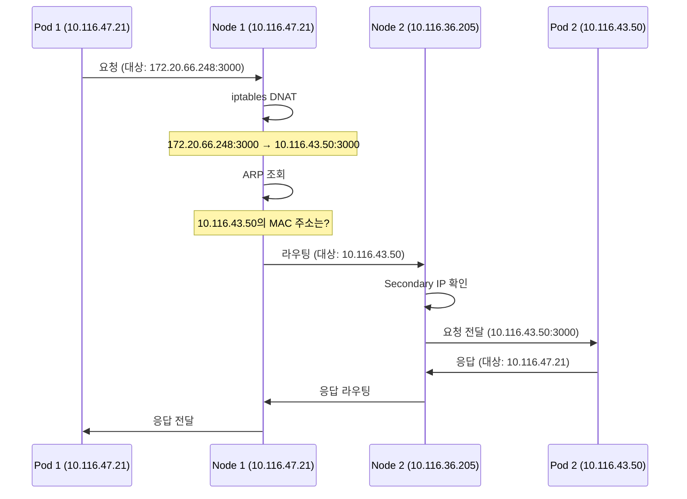

# 쿠버네티스 서비스 네트워크 통신 분석: EKS와 iptables

## 배경

EKS Pod 간 네트워크 통신 시 서비스 endpoint에서 pod이 빠지더라도 기존 TCP 세션을 통해 연결이 유지되는 현상을 확인했습니다. Pod에서 서비스 도메인을 통해 다른 pod에 요청을 보낼 때 어떤 네트워크 구간을 거치는지 확인하기 위해 내부 통신을 상세히 분석해 보았습니다.

## 목적

Pod에서 다른 pod의 service domain으로 질의를 할 시에 실제로 어떻게 TCP 연결이 되는지 확인하기 위함입니다.

## 구성 개요

실제 통신은 복잡한 단계를 거치지만, 이해를 위해 추상화하여 구성도를 작성했습니다. 일반적인 웹 통신 레이어(OSI 7계층)와 비교하면 다음과 같습니다:



## EKS에서 Pod 네트워크 구성

VPC CNI의 경우 L-IPAM(Local IP Address Manager)을 통해 worker node가 속한 subnet 대역으로 pod IP를 할당합니다. 이 경우 worker node의 secondary ip에 pod ip가 등록됩니다.

```bash
# node1
[root@ip-10-119-27-208 /]# ip route | grep 10.119.25.114
10.119.25.114 dev eni018f9e0450d scope link

# pod1
root@sigterm-deployment-85f977dbf8-r44tk:/app# traceroute -n 10.119.20.221
traceroute to 10.119.20.221 (10.119.20.221), 30 hops max, 60 byte packets
 1  10.119.27.208  0.047 ms  0.014 ms  0.022 ms
 2  10.119.22.249  0.824 ms  0.792 ms  0.779 ms
 3  10.119.20.221  0.772 ms  0.777 ms  0.738 ms

# node1
[root@ip-10-119-27-208 /]# arp -a | grep 10.119.25.114
ip-10-119-25-114.ap-northeast-2.compute.internal (10.119.25.114) at 9e:21:89:58:16:65 [ether] on eni018f9e0450d
```

Worker Node의 네트워크 인터페이스를 살펴보면 secondary IP들이 할당되어 있는 것을 확인할 수 있습니다:

```bash
[root@ip-10-119-27-208 /]# curl http://169.254.169.254/latest/meta-data/network/interfaces/macs/0a:0e:2f:2d:63:82/local-ipv4s
10.119.27.208
10.119.25.182
10.119.31.246
10.119.28.242
10.119.25.114
10.119.24.177
10.119.31.144
10.119.30.127
10.119.28.195
10.119.28.32
10.119.27.13
10.119.29.77
10.119.30.12
10.119.31.204
10.119.31.234
```

## Pod 간 통신 과정 상세 분석

### 1. DNS 조회: 서비스 이름을 IP로 변환

Pod에서 서비스 도메인 이름으로 접근할 때, 먼저 kube-dns에 질의하여 IP를 획득합니다:

```bash
00:38:12.668538 IP sigterm-client.34190 > kube-dns.kube-system.svc.cluster.local.domain: 65479+ A? sigterm.monitoring.svc.monitoring.svc.cluster.local. (69)
00:38:12.668563 IP sigterm-client.34190 > kube-dns.kube-system.svc.cluster.local.domain: 49882+ AAAA? sigterm.monitoring.svc.monitoring.svc.cluster.local. (69)
00:38:12.668846 ARP, Request who-has sigterm-client tell 10-116-34-59.monitoring-prometheus-node-exporter.monitoring.svc.cluster.local, length 28
00:38:12.668855 ARP, Reply sigterm-client is-at 22:97:39:83:16:a9 (oui Unknown), length 28
00:38:12.668859 IP kube-dns.kube-system.svc.cluster.local.domain > sigterm-client.34190: 65479 NXDomain*- 0/1/0 (162)
00:38:12.668860 IP kube-dns.kube-system.svc.cluster.local.domain > sigterm-client.34190: 49882 NXDomain*- 0/1/0 (162)
00:38:12.668898 IP sigterm-client.48826 > kube-dns.kube-system.svc.cluster.local.domain: 18329+ A? sigterm.monitoring.svc.svc.cluster.local. (58)
00:38:12.668907 IP sigterm-client.48826 > kube-dns.kube-system.svc.cluster.local.domain: 65191+ AAAA? sigterm.monitoring.svc.svc.cluster.local. (58)
00:38:12.669995 IP kube-dns.kube-system.svc.cluster.local.domain > sigterm-client.48826: 18329 NXDomain*- 0/1/0 (151)
00:38:12.670045 IP kube-dns.kube-system.svc.cluster.local.domain > sigterm-client.48826: 65191 NXDomain*- 0/1/0 (151)
00:38:12.670064 IP sigterm-client.53235 > kube-dns.kube-system.svc.cluster.local.domain: 13180+ A? sigterm.monitoring.svc.cluster.local. (54)
00:38:12.670073 IP sigterm-client.53235 > kube-dns.kube-system.svc.cluster.local.domain: 23679+ AAAA? sigterm.monitoring.svc.cluster.local. (54)
00:38:12.671122 IP kube-dns.kube-system.svc.cluster.local.domain > sigterm-client.53235: 23679*- 0/1/0 (147)
00:38:12.671137 IP kube-dns.kube-system.svc.cluster.local.domain > sigterm-client.53235: 13180*- 1/0/0 A 172.20.66.248 (106)
```

최종적으로 `sigterm.monitoring.svc.cluster.local` 도메인이 `172.20.66.248` IP를 가지고 있음을 확인했습니다.

### 2. iptables: 서비스 IP를 Pod IP로 변환

획득한 IP를 가지고 통신을 하면, 질의한 pod의 node에서 iptables를 통해 해당 service의 endpoints 중 하나로 변환됩니다:

```bash
-A KUBE-SERVICES -d 172.20.66.248/32 -p tcp -m comment --comment "monitoring/sigterm cluster IP" -m tcp --dport 3000 -j KUBE-SVC-MYFK6X2IU5TQJ4TS
-N KUBE-SVC-MYFK6X2IU5TQJ4TS
-A KUBE-SVC-MYFK6X2IU5TQJ4TS -m comment --comment "monitoring/sigterm" -j KUBE-SEP-OIQLZDDV7ZDQ7X4F
-N KUBE-SEP-OIQLZDDV7ZDQ7X4F
-A KUBE-SEP-OIQLZDDV7ZDQ7X4F -s 10.116.43.50/32 -m comment --comment "monitoring/sigterm" -j KUBE-MARK-MASQ
-A KUBE-SEP-OIQLZDDV7ZDQ7X4F -p tcp -m comment --comment "monitoring/sigterm" -m tcp -j DNAT --to-destination 10.116.43.50:3000
```

여기서 service IP `172.20.66.248:3000`이 실제 pod IP `10.116.43.50:3000`으로 변환(DNAT)되는 것을 볼 수 있습니다.



### 3. ARP 테이블 조회 및 라우팅

변환된 IP를 arp table에서 확인한 후 접근하고자 하는 pod이 있는 node로 전달합니다:

```bash
$ arp -a
```

전달 받은 node에서 routing table을 확인하여 해당 IP에 매칭되는 인터페이스로 요청을 전달합니다:

```bash
$ ip route
```

### 4. 실제 TCP 연결 확인

실제 연결 상태를 확인해보면 다음과 같습니다:

```bash
# 10.116.47.21(pod1)
Active Internet connections (servers and established)
Proto Recv-Q Send-Q Local Address           Foreign Address         State       PID/Program name     Timer
tcp        0      0 0.0.0.0:3000            0.0.0.0:*               LISTEN      1/node               off (0.00/0/0)
tcp        0      0 10.116.47.21:53330      172.20.66.248:3000      ESTABLISHED 5573/curl            keepalive (53.44/0/0)

# 10.116.43.50(pod2)
Active Internet connections (servers and established)
Proto Recv-Q Send-Q Local Address           Foreign Address         State       PID/Program name     Timer
tcp        0      0 0.0.0.0:3000            0.0.0.0:*               LISTEN      1/node               off (0.00/0/0)
tcp        0      0 10.116.43.50:3000       10.116.47.21:57360      ESTABLISHED 1/node               off (0.00/0/0)
```

여기서 흥미로운 점을 확인할 수 있습니다:
- 소스 pod에서는 서비스 IP(`172.20.66.248`)로만 연결을 인식합니다
- 목적지 pod에서는 실제 요청 pod의 IP(`10.116.47.21`)를 인식합니다

즉, 소스 pod에서는 서비스 도메인 IP로만 요청을 던지고, 그 요청이 노드의 iptables에서 계속해서 변환되는 작업이 필요합니다. 따라서 정밀한 튜닝을 위해서는 headless 서비스가 오버헤드를 줄일 수 있습니다.

## Pod이 Service에서 제거되어도 연결이 유지되는 이유

Service가 headless 타입일 경우에는 도메인에 대해서 pod IP를 직접 반환받지만, 그렇지 않을 경우에는 service의 IP를 받고, endpoints에서 해당 service에 있는 pod이 빠지면 iptables에서도 빠집니다.

그럼에도 불구하고 기존 세션에 대해서는 정상적으로 요청이 전달되는 이유는 iptables의 경우 세션에 대한 정보를 `/proc/net/nf_conntrack`에 저장해 유지하기 때문입니다:

```bash
$ cat /proc/net/nf_conntrack | grep 10.116.47.21
ipv4     2 tcp      6 86395 ESTABLISHED src=10.116.47.21 dst=172.20.66.248 sport=36910 dport=3000 src=10.116.43.50 dst=10.116.47.21 sport=3000 dport=36910 [ASSURED] mark=0 zone=0 use=2
ipv4     2 udp      17 5 src=10.116.47.21 dst=172.20.0.10 sport=53107 dport=53 src=10.116.4.151 dst=10.116.47.21 sport=53 dport=53107 [ASSURED] mark=0 zone=0 use=2
ipv4     2 udp      17 5 src=10.116.47.21 dst=172.20.0.10 sport=54741 dport=53 src=10.116.4.151 dst=10.116.47.21 sport=53 dport=54741 [ASSURED] mark=0 zone=0 use=2
ipv4     2 udp      17 5 src=10.116.47.21 dst=172.20.0.10 sport=40060 dport=53 src=10.116.4.151 dst=10.116.47.21 sport=53 dport=40060 [ASSURED] mark=0 zone=0 use=2
```



## nf_conntrack에 대한 이해

nf_conntrack은 ip_conntrack의 후속 커널 모듈로 netfilter가 네트워크에서 발생하는 커넥션에 대해 해당 내용을 기록하고 추적하기 위한 모듈입니다. 일반적으로 활성화되지 않지만 iptables를 이용한 NAT 환경에서는 사용됩니다. 특히, 다음과 같은 경우에 사용자 모르게 활성화되어 사용되는 경우가 있습니다:

- `iptables -t nat -L` 같은 NAT 테이블 확인 명령을 한번이라도 수행한 경우
- docker와 같이 iptables의 NAT 기능이 필요한 애플리케이션을 사용할 경우

위 내용을 종합하면, Pod이 Service에서 제거되더라도:
1. 기존 TCP 연결은 nf_conntrack에 의해 추적되고 있습니다
2. 연결 상태 정보는 iptables 규칙과 별개로 유지됩니다
3. 따라서 기존 TCP 세션은 계속 유지됩니다

## Node 간 Pod 통신 원리

EKS에서는 VPC CNI를 통해 Pod IP가 Worker Node의 Secondary IP로 할당됩니다. 이로 인해 노드 간 통신 시 다음과 같은 흐름이 발생합니다:



이 과정에서 중요한 점은:
1. Pod IP가 VPC 내에서 실제 라우팅 가능한 IP라는 점입니다
2. Node 간 통신은 VPC 네트워크 인프라를 통해 이루어집니다
3. Node에서 Pod으로의 라우팅은 Node의 로컬 라우팅 테이블에 의해 처리됩니다

## 결론

1. 쿠버네티스 Service는 가상의 IP(ClusterIP)를 제공하며, 실제 트래픽은 iptables 규칙에 의해 Pod으로 라우팅됩니다.
2. EKS의 VPC CNI는 Pod에 VPC 서브넷 대역의 IP를 할당하여, Pod 간 통신이 VPC 네트워크 레벨에서 직접 이루어질 수 있게 합니다.
3. Service endpoint에서 Pod이 제거되더라도 기존 TCP 연결은 nf_conntrack에 의해 유지됩니다.
4. Headless Service를 사용하면 DNS가 Service IP 대신 Pod IP를 직접 반환하므로, iptables DNAT 과정을 생략할 수 있어 성능 향상이 가능합니다.

위 분석을 통해 EKS 환경에서의 Pod 네트워크 통신 원리와 Service를 통한 트래픽 라우팅 과정을 이해할 수 있습니다.

## 참고 문서
- [AWS VPC CNI 설계 문서](https://github.com/aws/amazon-vpc-cni-k8s/blob/master/docs/cni-proposal.md)
- [Kubernetes Service와 iptables 설정](https://ibiza.tistory.com/29)
- [nf_conntrack 커널 문서](https://www.kernel.org/doc/Documentation/networking/nf_conntrack-sysctl.txt)
- [nf_conntrack과 docker](https://platform9.com/blog/container-namespaces-deep-dive-container-networking/)
```