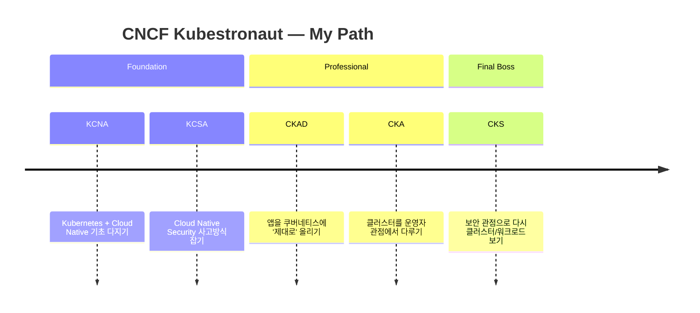

# Kubestronaut 달성 후기: 5개 자격증 완주 + 2026년 시험 정리

작년에 “Kubestronaut 한 번 따보자”라고 말만 해두고… 결국 **5개 자격증을 전부 취득해서 Kubestronaut를 달성**했습니다.

- (제가 마지막으로 딴 순서 기준) **CKS → CKA → CKAD → KCSA → KCNA**
- 핵심은 **5개 모두 ‘유효(active)’ 상태를 동시에 유지**해야 한다는 점입니다. (만료되면 자격/혜택이 조건부로 정리됩니다)

이 글은 두 파트로 구성했습니다.

1) “드디어 땄다” 후기 + 제가 체감한 난이도/전략
2) **2026년 기준으로 5개 시험을 한 번에 정리** (무엇을 준비해야 하는지)

---

## Kubestronaut 요건 (공식)

CNCF FAQ 기준으로 Kubestronaut가 되려면 아래 5개 인증을 모두 취득해야 하고, **전부 만료되지 않은 상태(유효/active)** 여야 합니다.

- CKA
- CKAD
- CKS
- KCNA
- KCSA

> “Do all 5 certifications need to be active at the same time?” → **Yes**

출처: CNCF Kubestronaut FAQ
- https://www.cncf.io/training/kubestronaut/kubestronaut-faq/

---

## 내 Kubestronaut 로드맵 (Mermaid)

제가 실제로는 “기초 → 실습 → 보안” 순서로 쌓아왔고,
마지막 관문으로 CKS를 뚫으면서 완주가 됐습니다.

---

## 2026년 기준: 각 시험 한 장 요약

> 숫자(시간/문항/커트라인 등)는 정책이 바뀔 수 있으니, **응시 전 공식 페이지에서 최종 확인**을 권장합니다.

### 1) KCNA — “클라우드 네이티브 문해력”

- 성격: 객관식 기반(이론/개념 중심)
- 무엇을 보나:
  - 쿠버네티스 기본 오브젝트/아키텍처
  - 컨테이너/오케스트레이션 기초
  - CNCF 생태계(관측/배포/보안/서비스메시 등) 큰 그림
- 준비 팁:
  - “용어”를 안다고 끝이 아니라, **개념 간 관계(왜/언제 쓰는지)** 를 묻는 느낌이 있습니다.

공식 참고:
- KCNA 페이지(시험 정보/도메인): https://training.linuxfoundation.org/certification/kubernetes-cloud-native-associate/

### 2) KCSA — “보안은 옵션이 아니라 기본값”

- 성격: 객관식 기반(보안 개념/프레임워크/위협모델 중심)
- 포인트:
  - 4C, Threat Model, PSS(Policy/Admission), AuthN/AuthZ, 네트워크 정책, 감사로그
  - “Kubernetes 내부 컴포넌트 관점 보안”을 질문 형태로 체득

공식 참고:
- KCSA 도메인/설명: https://training.linuxfoundation.org/certification/kubernetes-and-cloud-native-security-associate-kcsa/

### 3) CKAD — “개발자 관점 실전 쿠버네티스”

- 성격: **실습(Performance-based)**
- 포인트:
  - 디플로이먼트/롤링업데이트, 서비스/인그레스, 환경설정(ConfigMap/Secret), 프로브, 리소스 제한
  - 제한 시간 안에 **`kubectl`로 정확하게 만들어 내는 속도**가 승부

공식 참고:
- CKAD 소개(실습 기반 시험): https://training.linuxfoundation.org/certification/certified-kubernetes-application-developer-ckad/

### 4) CKA — “운영자 관점: 클러스터를 굴리는 사람의 실력”

- 성격: **실습(Performance-based)**
- 포인트:
  - 클러스터 아키텍처/설치/업그레이드, 네트워킹, 스토리지, 트러블슈팅
  - “왜 안 붙지?” “왜 DNS가 안 되지?” 같은 **현업 감각**이 그대로 시험에 등장

공식 참고:
- CKA 소개(실습 기반 시험): https://training.linuxfoundation.org/certification/certified-kubernetes-administrator-cka/

### 5) CKS — “마지막 관문(그리고 진짜 실력 체크)”

- 성격: **실습(Performance-based)**
- 전제: **CKA 합격이 먼저**여야 응시 가능
- 포인트:
  - 클러스터/시스템/워크로드/서플라이체인/런타임 보안까지 전방위
  - 시간 압박이 강해서 **찾아보기(문서/치트시트) + 즉시 적용** 루틴이 중요

공식 참고:
- CKS 소개(실습 기반 시험 + CKA prerequisite): https://training.linuxfoundation.org/certification/certified-kubernetes-security-specialist/

---

## Kubestronaut 달성 혜택 정리 (재킷/People/프라이빗 채널)

제가 가장 궁금했던 부분이라, 여기만 따로 정리합니다.

### 1) Kubestronaut 재킷 (Jacket)

- CNCF FAQ 기준: 자격 충족 시 CNCF 쪽에서 연락/온보딩을 진행하며, **배송은 CNCF가 담당**합니다.
- 다만 **추가 관세/통관 비용은 지원이 어려울 수 있다**고 명시되어 있습니다.
- 재킷은 **평생 1회**만 지급(자격을 잃었다가 다시 획득해도 재킷은 추가 지급 X)

출처: CNCF Kubestronaut FAQ
- https://www.cncf.io/training/kubestronaut/kubestronaut-faq/

### 2) CNCF People(프로필/리스트) 등록

- CNCF FAQ 기준: 주간 단위로 신규 자격자를 확인 → 이메일로 온보딩 폼 안내 → 승인 후 **웹사이트에 listing** 됩니다.

출처: CNCF Kubestronaut FAQ
- https://www.cncf.io/training/kubestronaut/kubestronaut-faq/

### 3) 프라이빗 Slack 채널 / 메일링 리스트

- 공식/커뮤니티 자료에서 반복적으로 언급되는 대표 혜택: **전용 Slack + 메일링 리스트 접근**
- 고수들끼리 “정답 공유” 같은 게 아니라,
  - 실무에서 겪는 케이스를 공유하고
  - 커리어/학습/커뮤니티 정보를 연결해주는
  그런 **밀도 높은 네트워크**가 핵심이라고 봤습니다.

참고(서드파티 설명):
- https://blog.techiescamp.com/kubestronaut/

### 4) 할인 쿠폰(시험/행사)

CNCF FAQ 기준으로,
- **CNCF 이벤트(KubeCon/KubeDays 등) 20% 할인** 관련 안내가 있고
- 50% 바우처(시험용) 사용 범위에 대한 Q&A가 있습니다.

출처: CNCF Kubestronaut FAQ
- https://www.cncf.io/training/kubestronaut/kubestronaut-faq/

---

## 제가 느낀 “합격을 좌우한 것” 3가지

1) **문제풀이 속도는 실력의 일부**
- 실습형은 결국 “아는 것”과 “빨리 해내는 것”이 다릅니다.

2) **문서 탐색/검색 루틴을 미리 ‘자동화’**
- 시간 제한에서 제일 많이 까먹는 게 “어디에 뭐가 있었지?”입니다.

3) **보안은 따로 떼어놓지 말고, 운영/개발에 계속 섞어보기**
- CKS는 ‘보안만 아는 사람’보다 ‘운영+개발을 해본 사람의 보안 감각’을 요구합니다.

---

## 마무리

작년에 던졌던 목표를, 1년(+)에 걸쳐 실제로 회수했습니다.

혹시 Kubestronaut를 목표로 하시는 분께는 이렇게 말하고 싶습니다.

- “5개 합격”은 결과고,
- 그 과정에서 얻는 건 **쿠버네티스 생태계 전체를 다루는 시야**입니다.

다음은… (사람 욕심이 끝이 없어서) Golden 쪽도 한 번 슬쩍 생각은 해보겠습니다.

---

### References
- CNCF Kubestronaut FAQ: https://www.cncf.io/training/kubestronaut/kubestronaut-faq/
- Linux Foundation — CKA: https://training.linuxfoundation.org/certification/certified-kubernetes-administrator-cka/
- Linux Foundation — CKAD: https://training.linuxfoundation.org/certification/certified-kubernetes-application-developer-ckad/
- Linux Foundation — CKS: https://training.linuxfoundation.org/certification/certified-kubernetes-security-specialist/
- Linux Foundation — KCSA: https://training.linuxfoundation.org/certification/kubernetes-and-cloud-native-security-associate-kcsa/
- Linux Foundation — KCNA: https://training.linuxfoundation.org/certification/kubernetes-cloud-native-associate/
- (참고) Techiescamp Kubestronaut 소개: https://blog.techiescamp.com/kubestronaut/
