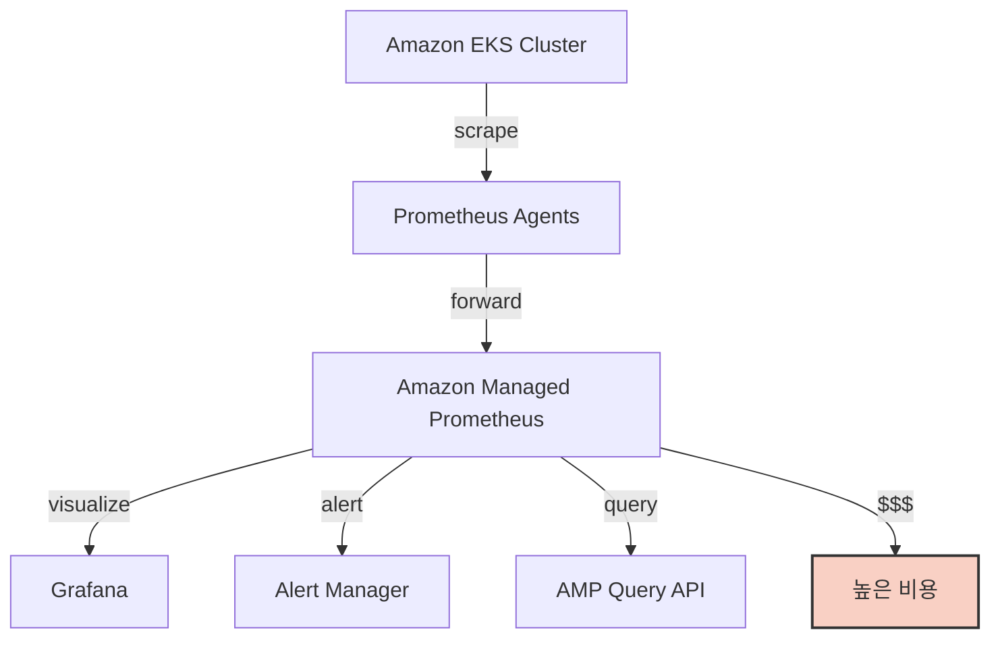
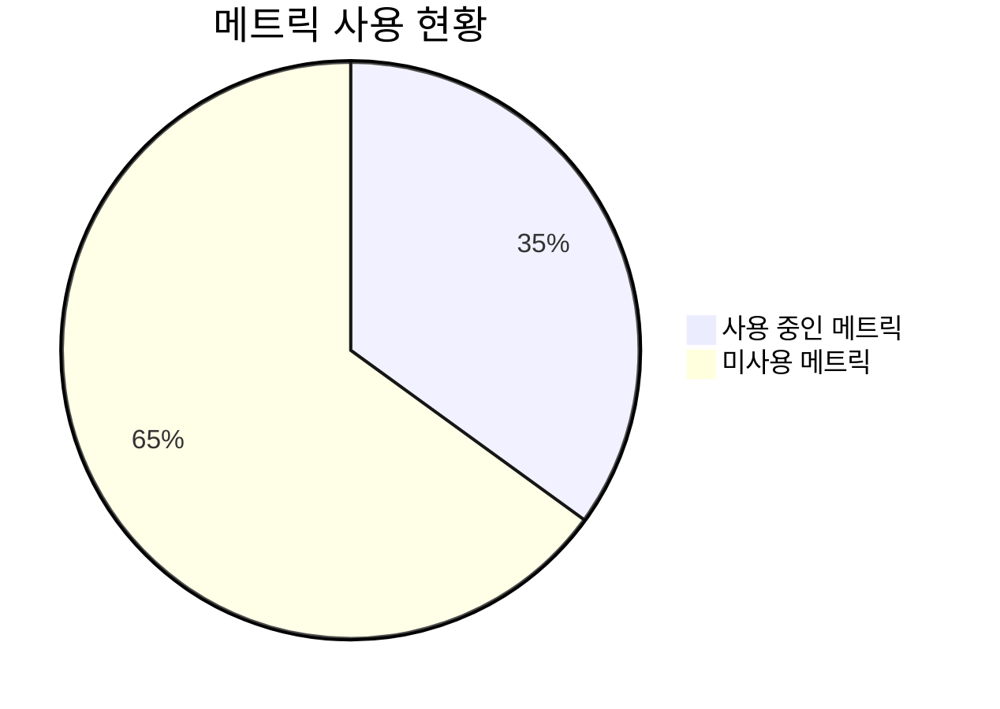
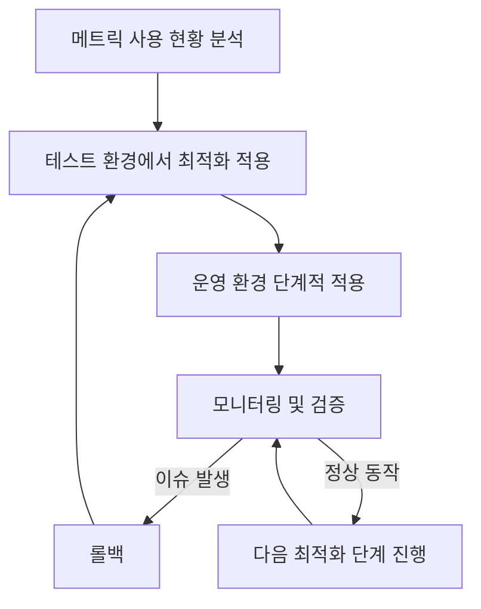

# Amazon Managed Service for Prometheus 비용 최적화 여정: 메트릭 기반 접근법

> 안녕하세요! 이 글은 Amazon Managed Service for Prometheus(AMP)의 비용을 최적화하며 겪었던 경험과 배운 내용을 공유하기 위해 작성되었습니다. 모니터링 시스템의 효율성을 높이면서도 비용을 절감하는 방법에 관심이 있는 분들께 도움이 되길 바랍니다.

## 들어가며

클라우드 환경에서 대규모 서비스를 운영할 때, 모니터링 시스템은 안정적인 운영을 위한 필수 요소입니다. 특히 Kubernetes 환경에서는 Prometheus가 사실상 표준 모니터링 도구로 자리잡았으며, AWS에서는 Amazon Managed Service for Prometheus(AMP)를 통해 관리형 서비스로 이를 제공하고 있습니다. 하지만 서비스 규모가 커질수록 모니터링 데이터의 양도 급증하며, 이에 따라 비용도 증가합니다. 이 글에서는 AMP 비용이 예상보다 높게 발생하는 문제를 분석하고, mimirtool을 활용해 사용률이 낮은 메트릭을 식별하여 제외함으로써 비용을 대폭 절감한 경험을 공유하고자 합니다.

## 문제 상황

### 증가하는 AMP 비용

2025년 초, AWS 청구서를 분석하는 과정에서 Amazon Managed Service for Prometheus 비용이 월 약 6,000달러 수준으로 상당히 높게 발생하고 있음을 발견했습니다. 가상화폐 거래소 특성상 모니터링이 매우 중요하기 때문에 발생하는 비용이라고 생각했지만, 면밀히 분석할 필요가 있었습니다.

AWS Cost Explorer를 통해 비용 구조를 살펴본 결과, 대부분의 비용이 '메트릭 샘플(Ingested Samples)' 항목에서 발생하고 있었습니다. AMP는 수집되는 메트릭 샘플 수에 따라 비용이 부과되며, 당시 우리 시스템에서는 월 평균 약 15억 개의 메트릭 샘플이 수집되고 있었습니다.



### 비효율적인 메트릭 수집

문제의 근본 원인을 파악하기 위해 수집되는 메트릭의 종류와 양을 분석했습니다. 분석 결과, 다음과 같은 문제점들이 발견되었습니다:

1. **과도한 메트릭 수집**: 많은 시스템 및 애플리케이션 메트릭이 기본 설정으로 수집되고 있었으며, 그중 상당수는 실제로 모니터링 대시보드나 알림 설정에 사용되지 않고 있었습니다.

2. **높은 카디널리티(Cardinality)**: 일부 메트릭은 너무 많은 라벨과 값 조합을 가지고 있어 카디널리티가 매우 높았습니다. 특히 동적으로 생성되는 Pod나 컨테이너 이름을 포함하는 메트릭이 많았습니다.

3. **짧은 스크래핑 간격**: 일부 메트릭은 변화가 적음에도 불구하고 짧은 간격(10초)으로 수집되고 있었습니다.

4. **중복 메트릭**: 여러 소스에서 유사한 정보를 제공하는 중복 메트릭이 발견되었습니다.

## 비용 최적화 접근 방법

위 문제들을 해결하기 위해 다음과 같은 체계적인 접근 방식을 채택했습니다:

1. **사용 중인 메트릭 식별**: 실제로 Grafana 대시보드 및 알림 룰에서 사용 중인 메트릭을 정확히 파악합니다.
2. **불필요한 메트릭 제외**: 사용되지 않는 메트릭은 수집 대상에서 제외합니다.
3. **카디널리티 관리**: 높은 카디널리티를 가진 메트릭에 대한 라벨 최적화 작업을 수행합니다.
4. **스크래핑 간격 조정**: 변화가 적은 메트릭의 수집 간격을 늘립니다.

### mimirtool을 활용한 메트릭 사용률 분석

Grafana Labs에서 제공하는 mimirtool은 Prometheus 및 Grafana Mimir(AMP의 기반 기술)와 상호작용하기 위한 강력한 CLI 도구입니다. 이 도구를 활용하여 실제 사용 중인 메트릭과 수집 중인 전체 메트릭을 비교 분석하는 작업을 진행했습니다.

#### 1. Grafana 대시보드에서 사용 중인 메트릭 추출

먼저, Grafana API를 통해 모든 대시보드에서 실제로 사용 중인 메트릭을 추출합니다:

```bash
# mimirtool 설치
curl -fLo mimirtool https://github.com/grafana/mimir/releases/latest/download/mimirtool-linux-amd64
chmod +x mimirtool

# Grafana API 토큰 설정
export GRAFANA_ADDR=https://your-grafana-instance.com
export GRAFANA_TOKEN=your-grafana-api-token

# 사용 중인 메트릭 분석
./mimirtool analyze-dashboard-metrics --grafana-addr=$GRAFANA_ADDR --grafana-token=$GRAFANA_TOKEN --output-file=used-metrics.txt
```

이 명령은 Grafana 내 모든 대시보드를 스캔하여 사용 중인 메트릭 목록을 `used-metrics.txt` 파일로 저장합니다.

#### 2. Prometheus 알림 규칙에서 사용 중인 메트릭 추출

알림 규칙에서 사용 중인 메트릭도 함께 추출합니다:

```bash
# Prometheus API 설정
export PROMETHEUS_ADDR=https://your-amp-endpoint.region.aws.com/workspaces/workspace-id/api/v1

# 알림 규칙 추출
curl -s "$PROMETHEUS_ADDR/rules" | jq -r '.data.groups[].rules[].query' > alert-metrics.txt

# 정규식을 사용하여 메트릭 이름 추출
cat alert-metrics.txt | grep -o -E '[a-z_]+[a-z0-9_]*{' | tr -d '{' | sort | uniq >> used-metrics.txt
```

#### 3. Prometheus에서 수집 중인 전체 메트릭 목록 추출

다음으로, AMP에서 실제로 수집 중인 모든 메트릭 목록을 추출합니다:

```bash
# 메트릭 이름 API 호출
curl -s "$PROMETHEUS_ADDR/label/__name__/values" | jq -r '.data[]' > all-metrics.txt
```

#### 4. 사용되지 않는 메트릭 식별

이제 두 목록을 비교하여 수집은 되고 있지만 실제로 사용되지 않는 메트릭을 식별합니다:

```bash
# 사용되지 않는 메트릭 목록 생성
sort all-metrics.txt | uniq > sorted-all-metrics.txt
sort used-metrics.txt | uniq > sorted-used-metrics.txt
comm -23 sorted-all-metrics.txt sorted-used-metrics.txt > unused-metrics.txt
```

이 과정을 통해 `unused-metrics.txt` 파일에는 현재 수집 중이지만 어떤 대시보드나 알림에서도 사용되지 않는 메트릭 목록이 생성됩니다.

#### 5. 메트릭별 샘플 수 확인

각 메트릭이 얼마나 많은 샘플을 생성하는지 확인하여 우선적으로 제외할 대상을 선정합니다:

```bash
# 메트릭별 샘플 수를 확인하는 스크립트
for metric in $(cat unused-metrics.txt); do
  count=$(curl -s "$PROMETHEUS_ADDR/query?query=count($metric)" | jq -r '.data.result[0].value[1]')
  echo "$metric: $count"
done | sort -t: -k2 -nr > unused-metrics-count.txt
```

이 명령어를 통해 `unused-metrics-count.txt` 파일에는 사용되지 않는 메트릭들이 샘플 수 기준으로 내림차순 정렬되어 저장됩니다.

### 실제로 사용 중인 메트릭과 전체 메트릭의 차이 분석

위 과정을 통해 분석한 결과, 놀랍게도 전체 수집 메트릭 중 약 35%만이 실제로 Grafana 대시보드나 알림 규칙에서 활용되고 있음을 확인했습니다. 나머지 65%의 메트릭은 수집되고 있지만 실질적으로 사용되지 않고 있었습니다.



특히, 다음과 같은 메트릭 유형이 주로 미사용 상태였습니다:

1. 기본 제공되는 상세한 시스템 메트릭 (예: `node_*`, `container_*` 중 세부 항목)
2. 특정 미들웨어의 세부 내부 상태 메트릭
3. 레거시 애플리케이션에서 더 이상 사용되지 않는 커스텀 메트릭
4. 테스트 목적으로 임시 추가되었으나 제거되지 않은 메트릭

샘플 수 분석 결과, 상위 20개의 미사용 메트릭이 전체 메트릭 샘플의 약 40%를 차지하고 있었습니다. 이는 소수의 메트릭만 제외해도 상당한 비용 절감 효과를 얻을 수 있음을 의미했습니다.

## 최적화 구현 과정

### 1. Prometheus 설정 최적화를 통한 메트릭 필터링

먼저, 실제 사용 중인 메트릭 목록을 바탕으로 Prometheus 수집 설정(scrape_config)을 최적화했습니다. 불필요한 메트릭을 제외하기 위해 `metric_relabel_configs`를 활용했습니다.

```yaml
scrape_configs:
  - job_name: 'kubernetes-pods'
    # ... 기존 설정 ...
    metric_relabel_configs:
      # 사용되지 않는 메트릭 제외
      - source_labels: [__name__]
        regex: 'unused_metric_name.*'
        action: drop
      # 높은 카디널리티 메트릭의 라벨 간소화
      - source_labels: [__name__]
        regex: 'high_cardinality_metric'
        action: keep
        target_label: simplified_label
        replacement: 'simple_value'
```

### 2. 카디널리티 제어

높은 카디널리티를 가진 메트릭에 대해서는 라벨을 간소화하거나, 필요한 경우에만 상세 라벨을 유지하도록 수정했습니다. 특히, 동적으로 생성되는 Pod 이름이나 임시 ID 등은 보다 안정적인 값(예: 애플리케이션 이름, 네임스페이스 등)으로 대체했습니다.

```yaml
metric_relabel_configs:
  # Pod 이름 대신 애플리케이션 라벨 사용
  - source_labels: [__meta_kubernetes_pod_label_app]
    target_label: app
    action: replace
  # Pod 이름에서 동적 부분 제거
  - source_labels: [__meta_kubernetes_pod_name]
    regex: '(.*)-[a-z0-9]{9,10}-[a-z0-9]{5}'
    target_label: pod_name
    replacement: '$1'
    action: replace
```

### 3. 스크래핑 간격 조정

변화가 적은 메트릭의 경우, 스크래핑 간격을 10초에서 30초 또는 60초로 늘렸습니다. 이는 수집되는 메트릭 샘플 수를 직접적으로 줄이는 효과가 있었습니다.

```yaml
scrape_configs:
  - job_name: 'slow-changing-metrics'
    scrape_interval: 60s
    # ... 기타 설정 ...
```

### 4. 실행 계획과 단계적 적용

최적화 설정은 다음과 같은 단계로 신중하게 적용했습니다:

1. **테스트 환경 검증**: 모든 변경 사항을 먼저 테스트 환경에 적용하여 모니터링 시스템의 무결성을 검증했습니다.
2. **점진적 적용**: 운영 환경에는 우선 낮은 위험의 변경부터 시작하여 단계적으로 적용했습니다.
3. **모니터링 및 회귀 테스트**: 각 변경 후에는 대시보드와 알림이 정상적으로 작동하는지 철저히 검증했습니다.
4. **롤백 계획 준비**: 문제 발생 시 빠르게 되돌릴 수 있는 롤백 계획을 사전에 마련했습니다.



## 성과와 비용 절감 효과

### 메트릭 샘플 수 감소

최적화 작업을 통해 월 평균 메트릭 샘플 수를 약 15억 개에서 7억 개로 대폭 줄일 수 있었습니다. 이는 약 53%의 감소율입니다.


### 비용 절감 효과

메트릭 샘플 수 감소에 따라 AMP 비용도 월 약 6,000달러에서 3,000달러 수준으로 약 50% 절감되었습니다. 연간으로 환산하면 약 36,000달러의 비용 절감 효과입니다.

| 구분 | 최적화 전 | 최적화 후 | 절감률 |
|------|-----------|-----------|--------|
| 메트릭 샘플 수 | 15억 개/월 | 7억 개/월 | 53% |
| 월 비용 | $6,000 | $3,000 | 50% |
| 연간 비용 | $72,000 | $36,000 | $36,000 절감 |

### 성능 개선 효과

비용 절감뿐만 아니라, 불필요한 메트릭 처리량 감소로 인해 다음과 같은 성능 개선 효과도 얻을 수 있었습니다:

1. **쿼리 응답 시간 개선**: Prometheus 쿼리 응답 시간이 평균 약 30% 빨라졌습니다.
2. **리소스 사용량 감소**: Prometheus 에이전트의 CPU 및 메모리 사용량이 약 40% 감소했습니다.
3. **알림 지연 감소**: 알림 평가 및 발송 지연이 개선되었습니다.

## 교훈 및 모범 사례

이 프로젝트를 통해 얻은 중요한 교훈과 모범 사례를 공유합니다:

### 1. 메트릭 수집 전략의 중요성

클라우드 환경에서 관리형 모니터링 서비스를 사용할 때는 "수집 가능한 모든 것을 수집한다"는 접근보다 "실제로 필요한 것만 수집한다"는 전략이 비용과 성능 측면에서 훨씬 효율적입니다.

### 2. 사용 중심 분석의 가치

실제로 사용 중인 메트릭을 정확히 파악하는 것이 최적화의 첫 단계입니다. mimirtool과 같은 도구를 활용하면 이 과정을 효율적으로 수행할 수 있습니다.

### 3. 카디널리티 관리의 중요성

메트릭의 수뿐만 아니라, 각 메트릭의 카디널리티도 비용에 큰 영향을 미칩니다. 특히 동적인 환경(Kubernetes 등)에서는 라벨 설계에 주의가 필요합니다.

### 4. 최적화와 가시성의 균형

비용 절감을 위해 메트릭을 제거할 때는 시스템 가시성과 운영 능력이 저하되지 않도록 주의해야 합니다. 중요한 메트릭이 실수로 제외되지 않도록 철저한 검증이 필요합니다.

### 5. 정기적인 모니터링 시스템 검토

클라우드 환경과 애플리케이션은 지속적으로 변화하므로, 모니터링 설정도 정기적으로 검토하고 최적화해야 합니다. 6개월마다 사용 중인 메트릭을 재분석하는 것이 좋은 관행입니다.

## 결론

Amazon Managed Service for Prometheus는 강력한 모니터링 기능을 제공하지만, 효율적인 메트릭 관리 없이는 비용이 빠르게 증가할 수 있습니다. 이 프로젝트를 통해 실제 사용 중인 메트릭에 집중하고 불필요한 메트릭을 과감하게 제외함으로써, 시스템 가시성은 유지하면서도 비용을 절반으로 줄일 수 있었습니다.

또한, 이러한 최적화 과정은 모니터링 시스템 자체의 성능도 개선하여, 더 빠르고 효율적인 모니터링 환경을 구축하는 데 도움이 되었습니다. 클라우드 환경에서 모니터링 시스템을 운영할 때는 단순히 '더 많은 데이터'가 아닌 '더 가치 있는 데이터'에 초점을 맞추는 것이 중요함을 다시 한번 확인할 수 있었습니다.

## 참고 자료

- [Amazon Managed Service for Prometheus 가격 책정](https://aws.amazon.com/prometheus/pricing/)
- [Grafana Labs의 mimirtool](https://github.com/grafana/mimir/tree/main/pkg/mimirtool)
- [Prometheus 메트릭 카디널리티 관리 가이드](https://prometheus.io/docs/practices/naming/)
- [AWS 관측성 모범 사례](https://docs.aws.amazon.com/prescriptive-guidance/latest/implementing-logging-monitoring-cloudwatch/best-practices.html)

---

> 끝까지 읽어주셔서 감사합니다! 이 글이 여러분의 모니터링 시스템 최적화에 조금이나마 도움이 되었기를 바랍니다. 질문이나 추가적인 최적화 방법에 대한 의견이 있으시면 언제든지 댓글로 공유해주세요. 함께 더 나은 모니터링 방법을 찾아가면 좋겠습니다.