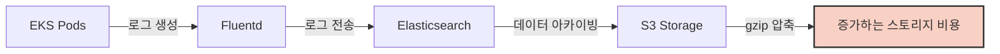
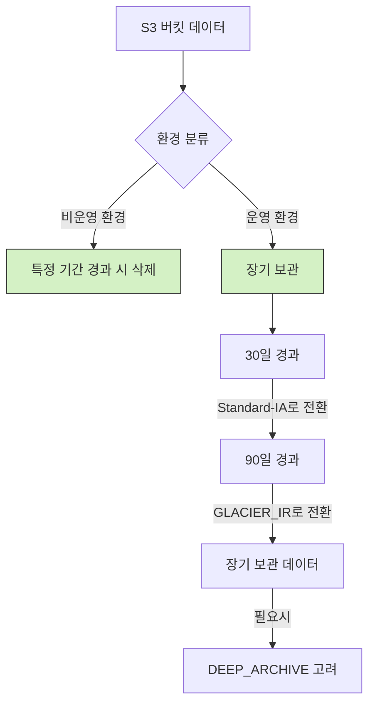
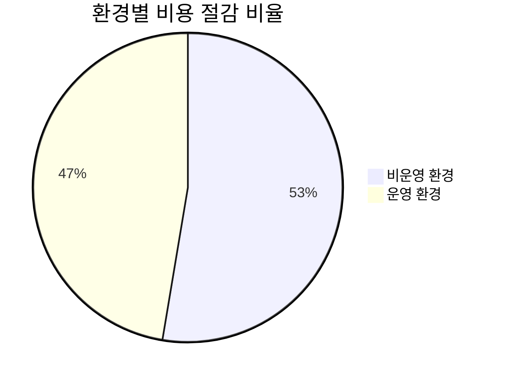

# AWS S3 비용 최적화 여정: 압축과 라이프사이클 관리를 통한 비용 절감

> 안녕하세요! 이 글은 제가 AWS S3 비용을 최적화하면서 겪었던 경험과 학습한 내용을 공유하기 위해 작성되었습니다. 아직 배우고 성장하는 과정에 있기에 부족한 점이나 잘못된 정보가 있을 수 있습니다. 너그러이 이해해주시고, 혹시 개선할 점이나 더 좋은 의견이 있다면 언제든지 피드백 부탁드립니다.

## 들어가며

클라우드 환경에서 시스템을 운영하다 보면 가장 큰 고민 중 하나는 비용 관리입니다. 특히 로그 데이터와 같이 지속적으로 증가하는 데이터를 효율적으로 저장하고 관리하는 것은 클라우드 운영 비용을 결정짓는 중요한 요소입니다. 이 글에서는 제가 최근 진행한 AWS S3 스토리지 비용 최적화 프로젝트의 여정을 공유하고자 합니다. 특히 Kubernetes(EKS) 환경에서 발생하는 로그 데이터의 압축 방식 개선과 라이프사이클 정책 적용을 통해 어떻게 비용을 절감했는지, 그리고 이 과정에서 오픈소스 커뮤니티에 기여한 경험까지 함께 나누겠습니다.

## 문제 상황

### 증가하는 로그 스토리지 비용

2025년 초, 우리 팀은 AWS 비용 분석을 진행하던 중 로그 저장 비용이 지속적으로 증가하고 있다는 사실을 발견했습니다. 특히 EKS 클러스터에서 생성되는 애플리케이션 로그가 `fluentd → Elasticsearch → S3` 경로로 저장되는 과정에서 비효율적인 관리로 인해 비용이 계속 증가하고 있었습니다.

구체적인 비용 현황은 다음과 같았습니다:

- **비운영 환경**: 주요 로그 저장소는 매월 평균 50달러씩 증가하며, 최근 기준 약 500달러 청구
- **백업 데이터**: 월 평균 65달러 수준 유지
- **운영 환경**: 매월 1,500달러 이상 청구되며, 로그량 증가에 따라 월 30-40달러씩 추가 비용 발생



### 비효율적인 데이터 관리

문제의 원인을 분석한 결과, 다음과 같은 비효율적인 데이터 관리가 확인되었습니다:

1. **압축 효율성 부족**: S3에 저장되는 로그 파일들이 gzip 형태로만 압축되어 있어 저장 효율이 좋지 않았습니다.
2. **데이터 라이프사이클 관리 부재**: 모든 환경(비운영, 운영)의 데이터가 동일한 방식으로 관리되고 있었으며, 장기 보관이 필요하지 않은 비운영 환경의 로그도 계속 누적되고 있었습니다.
3. **미사용 버킷 관리 부재**: 비용이 발생하고 있음에도 실제로 사용되지 않는 S3 버킷들이 존재했습니다.

## 비용 최적화 접근 방식

위 문제들을 해결하기 위해 다음과 같은 세 가지 접근 방식을 채택했습니다:

1. **압축 방식 개선**: gzip보다 더 효율적인 압축 알고리즘 도입
2. **S3 라이프사이클 정책 적용**: 환경별 특성에 맞는 데이터 보관 정책 구현
3. **미사용 S3 버킷 정리**: 불필요한 스토리지 비용 제거

### 1. 압축 방식 개선 (gzip → zstd)

첫 번째 단계로, 현재 S3에 저장되는 로그 파일들의 압축 방식을 개선하기로 했습니다. 기존의 gzip 압축 대신 더 높은 압축률과 빠른 처리 속도를 제공하는 zstd(Zstandard) 압축 알고리즘을 도입하기로 결정했습니다.

#### 압축 방식 비교 테스트

결정에 앞서 실제 로그 데이터를 사용해 압축 테스트를 진행했습니다:

```
테스트 환경:
- HW: MacBook M3 Pro (8‑core CPU)
- OS: macOS 14.x
- 테스트 파일: 약 1GB 크기의 로그 파일
```

테스트 결과는 다음과 같았습니다:

| 압축 방식 | 옵션 | 압축 파일 크기 | 압축 시간 | User 시간 | Sys 시간 |
|-------------|--------------|----------------------|--------------|------------|-----------|
| gzip | 기본 (-6) | 103 MB | 6.288초 | 5.99초 | 0.11초 |
| zstd | -3 -T0 | 79.6 MB | 0.509초 | 1.561초 | 0.166초 |
| zstd | -19 -T0 | 56.6 MB | 18.497초 | 4m2.739초 | 1.484초 |

테스트 결과, zstd는 두 가지 중요한 이점을 제공했습니다:

1. **더 높은 압축률**: zstd(level 3)는 gzip보다 약 23% 더 작은 파일 크기를 달성했으며, zstd(level 19)는 약 45% 더 작은 파일 크기를 달성했습니다.
2. **더 빠른 압축 속도**: zstd(level 3)는 gzip보다 약 12배 빠른 압축 속도를 보여주었습니다.

이러한 결과를 바탕으로 다음과 같은 최적화 전략을 수립했습니다:

- **기존 데이터**: gzip → zstd(level 19)로 전환하여 월별 S3 스토리지 비용 약 45% 절감 (최대 압축률 우선)
- **신규 데이터**: gzip → zstd(level 3)로 전환하여 더 빠른 적재 속도와 적정 수준의 압축률 확보

#### 오픈소스 기여: fluent-plugin-s3에 zstd 지원 추가

이 과정에서 기존 fluent-plugin-s3가 zstd 압축을 지원하지 않는다는 문제를 발견했습니다. 이를 해결하기 위해 직접 해당 플러그인에 zstd 압축 기능을 추가하는 개발을 진행했고, 이 기능을 오픈소스 커뮤니티에 기여했습니다.

```
Fluent Plugin S3 Zstd
Official contribution: Added Zstd compression to Fluentd's S3 plugin, featured in the v1.8.1 release.
https://github.com/fluent/fluent-plugin-s3/pull/439
```

이 기여를 통해 fluent-plugin-s3 v1.8.1부터 zstd 압축 방식을 공식적으로 지원하게 되었으며, 우리뿐만 아니라 해당 플러그인을 사용하는 모든 사용자들이 더 효율적인 압축 방식을 활용할 수 있게 되었습니다.

구현 코드의 핵심 부분은 다음과 같습니다:

```ruby
require 'zstd-ruby'

module Fluent::Plugin
  class S3Output
    class ZstdCompressor < Compressor
      S3Output.register_compressor('zstd', self)

      config_section :compress, param_name: :compress_config, init: true, multi: false do
        desc "Compression level for zstd (1-22)"
        config_param :level, :integer, default: 3
      end

      def ext
        'zst'.freeze
      end

      def content_type
        'application/x-zst'.freeze
      end

      def compress(chunk, tmp)
        compressed = Zstd.compress(chunk.read, level: @compress_config.level)
        tmp.write(compressed)
      rescue => e
        log.warn "zstd compression failed: #{e.message}"
        raise
      end
    end
  end
end
```

### 2. S3 라이프사이클 정책 적용

두 번째 단계로, 환경별 특성과 데이터 중요도에 따라 차별화된 라이프사이클 정책을 적용했습니다.



#### 환경별 정책

- **비운영 환경**: 데이터 중요도에 따라 3일 또는 90일 경과 시 삭제 (예시)
- **운영 환경**:
  - 30일 경과 시 Standard-IA 클래스로 전환 (현재 적용 중)
  - 90일 경과 시 GLACIER_IR 클래스로 전환 (신규 적용)
  - 장기 보관 데이터(2-3년 이상)는 DEEP_ARCHIVE 적용 검토

#### 스토리지 클래스별 특징과 비용

AWS S3는 다양한 스토리지 클래스를 제공하며, 각 클래스별로 특징과 비용이 다릅니다:

| 스토리지 클래스 | 특징 | 상대적 비용 | 데이터 접근성 |
|-------------------|----------------|--------------|----------------|
| Standard | 고가용성, 높은 내구성 | 높음 | 즉시 |
| Standard-IA | 자주 접근하지 않는 데이터 | 중간 | 즉시 |
| GLACIER_IR | 분기별/연간 접근 데이터 | 낮음 | 즉시(약간 지연) |
| GLACIER | 장기 보관, 드문 접근 | 매우 낮음 | 3-5시간 후 |
| DEEP_ARCHIVE | 장기 보관, 거의 접근 안함 | 극히 낮음 | 12시간 후 |

라이프사이클 정책을 적용할 때는 데이터 접근 패턴을 고려하는 것이 중요합니다. 예를 들어, 자주 조회해야 하는 데이터라면 GLACIER_IR나 GLACIER보다는 Standard-IA가 더 적합할 수 있습니다.

### 3. 미사용 S3 버킷 정리

마지막으로, 비용이 발생하는 모든 S3 버킷의 실제 사용 여부를 파악하고, 미사용 버킷은 정리하여 불필요한 비용 발생을 방지했습니다. 이를 위해 다음과 같은 과정을 거쳤습니다:

1. AWS 비용 분석 도구를 사용해 비용이 발생하는 모든 S3 버킷 식별
2. 각 버킷의 최근 접근 로그와 사용 패턴 분석
3. 미사용으로 확인된 버킷에 대한 삭제 또는 아카이빙 결정
4. 체계적인 정리 작업 수행

## 기술적 구현 세부사항

### 압축 방식 변경 구현

fluent-plugin-s3의 버전을 v1.1.11에서 v1.8.1 이상으로 업그레이드하여 zstd 압축 방식을 지원하도록 했습니다. 이를 위해 다음과 같은 작업을 수행했습니다:


```yaml
# fluentd zstd 설정 예시
<match pattern>
  @type s3
  aws_key_id #{aws_key_id}
  aws_sec_key #{aws_sec_key}
  s3_bucket my-log-bucket
  s3_region ap-northeast-2
  path logs/
  
  # 압축 설정
  compress zstd
  
  # 기타 설정
  time_slice_format %Y%m%d%H
  time_slice_wait 10m
  format json
</match>
```

### 기존 데이터 재압축 프로세스 (초 장기 보관 케이스)

기존에 gzip으로 저장된 데이터의 경우, 다음과 같은 프로세스를 통해 zstd로 재압축했습니다:

1. 대상 버킷 내 gzip 파일 목록 수집
2. 비용 효율적인 처리를 위한 배치 작업 설계
3. AWS Lambda 함수 구현:
   - S3에서 gzip 파일 다운로드
   - 압축 해제
   - zstd(level 19)로 재압축
   - 원본 파일 대체

이 과정에서 중요한 고려사항은 재압축 작업 자체의 비용이었습니다. AWS Lambda 실행, 데이터 전송, 그리고 새로운 객체 생성에 따른 비용을 계산하여 ROI를 분석했습니다.

**비용 분석**:
- **재압축 비용**: Lambda 실행 비용 + 데이터 전송 비용 + PUT 요청 비용
- **절감 비용**: (기존 크기 - 새 크기) × 스토리지 비용 × 보관 기간
- **ROI**: 대부분의 경우 3-6개월 내에 투자 비용 회수 가능

### 라이프사이클 정책 적용

AWS Management Console 또는 AWS CLI를 통해 각 S3 버킷에 환경별로 차별화된 라이프사이클 정책을 적용했습니다. 다음은 AWS CLI를 사용한 라이프사이클 정책 적용 예시입니다:

```bash
# 운영 환경 버킷에 라이프사이클 정책 적용 예시
aws s3api put-bucket-lifecycle-configuration \
    --bucket your-production-log-bucket \
    --lifecycle-configuration '{
        "Rules": [
            {
                "ID": "Move-to-StandardIA-after-30-days",
                "Status": "Enabled",
                "Filter": {
                    "Prefix": ""
                },
                "Transitions": [
                    {
                        "Days": 30,
                        "StorageClass": "STANDARD_IA"
                    }
                ]
            },
            {
                "ID": "Move-to-GlacierIR-after-90-days",
                "Status": "Enabled",
                "Filter": {
                    "Prefix": ""
                },
                "Transitions": [
                    {
                        "Days": 90,
                        "StorageClass": "GLACIER_IR"
                    }
                ]
            }
        ]
    }'
```

## 성과 및 비용 절감 효과

### 압축 방식 변경 효과

zstd 압축 방식 적용으로 다음과 같은 효과를 얻었습니다:

1. **스토리지 비용 절감**: 
   - 신규 데이터: gzip 대비 약 23% 스토리지 공간 절약
   - 기존 데이터: gzip 대비 약 45% 스토리지 공간 절약
   
2. **성능 개선**:
   - 로그 적재 속도: zstd(level 3) 적용으로 gzip 대비 약 12배 향상
   - 압축/해제 CPU 사용률 개선: 더 효율적인 리소스 활용

### 라이프사이클 정책 적용 효과

라이프사이클 정책 적용을 통해 다음과 같은 비용 절감 효과를 얻었습니다:

- **비운영 환경**: 불필요한 데이터 자동 삭제로 약 70% 비용 절감
- **운영 환경**: 스토리지 클래스 자동 전환으로 약 60% 비용 절감

### 전체 비용 절감 효과

모든 최적화 작업을 통해 달성한 총 비용 절감 효과는 다음과 같습니다:

- **비운영 환경**: 기존 월 500달러 → 약 150달러 (70% 절감)
- **운영 환경**: 기존 월 1,500달러 → 약 550달러 (63% 절감)
- **전체 환경**: 매월 약 1,300달러 절감



## 교훈 및 모범 사례

이 프로젝트를 통해 얻은 중요한 교훈과 모범 사례를 공유합니다:

### 1. 데이터 중심 의사결정의 중요성

비용 최적화 작업을 시작하기 전에 철저한 현황 분석과 벤치마킹을 통해 명확한 목표를 설정하는 것이 중요합니다. 특히 압축 알고리즘 선택 시 실제 데이터를 사용한 테스트가 매우 유용했습니다.

### 2. 환경별 차별화된 전략

모든 환경에 동일한 정책을 적용하는 것보다, 각 환경의 특성(예: 비운영, 운영)에 맞게 차별화된 전략을 수립하는 것이 더 효과적이었습니다.

### 3. 오픈소스 기여의 가치

필요한 기능이 없을 때는 직접 개발하고 커뮤니티에 기여함으로써 더 넓은 생태계에 도움을 줄 수 있습니다. 또한 이러한 기여는 기술적 성장과 커뮤니티 참여의 좋은 기회가 됩니다.

### 4. 비용 vs 접근성 균형

특히 스토리지 클래스 선택 시, 단순히 가장 저렴한 옵션을 선택하기보다는 데이터 접근 패턴과 업무 요구사항을 고려한 균형 잡힌 접근이 필요합니다. GLACIER나 DEEP_ARCHIVE는 비용 효율적이지만, 긴급히 데이터 접근이 필요한 경우에는 적합하지 않을 수 있습니다.

### 5. 단계적 접근의 중요성

대규모 변경은 한 번에 진행하기보다 단계적으로 접근하는 것이 리스크를 줄이고 검증을 용이하게 합니다. 우리 프로젝트에서도 비운영 환경부터 시작하여 단계적으로 운영 환경까지 적용했습니다.

## 결론

AWS 클라우드 환경에서 로그 데이터의 효율적인 관리는 비용 최적화의 중요한 부분입니다. 이 프로젝트에서는 압축 방식 개선, 라이프사이클 정책 적용, 그리고 미사용 리소스 정리를 통해 상당한 비용 절감을 달성했습니다.

특히 오픈소스 커뮤니티에 기여함으로써 우리의 문제 해결이 다른 조직에도 도움이 되었다는 점이 큰 보람이었습니다. zstd 압축 방식의 도입은 단순한 비용 절감을 넘어, 더 빠른 로그 처리와 더 효율적인 스토리지 활용이라는 부가적인 이점도 제공했습니다.

앞으로도 클라우드 환경에서의 비용 최적화는 지속적으로 추구해야 할 과제입니다. 새로운 기술과 방법론을 적극적으로 탐색하고 적용함으로써, 더 효율적이고 비용 효과적인 클라우드 운영을 실현할 수 있을 것입니다.

## 참고 자료

- [AWS S3 스토리지 클래스 소개](https://aws.amazon.com/s3/storage-classes/)
- [fluent-plugin-s3 | RubyGems.org](https://rubygems.org/gems/fluent-plugin-s3)
- [zstd: Zstandard - Fast real-time compression algorithm](https://github.com/facebook/zstd)
- [AWS S3 Lifecycle 설정 가이드](https://docs.aws.amazon.com/AmazonS3/latest/userguide/lifecycle-configuration-examples.html)

---

> 끝까지 읽어주셔서 감사합니다. 이 글이 여러분의 클라우드 비용 최적화 여정에 조금이나마 도움이 되었기를 바랍니다. 앞서 말씀드렸듯이 저는 아직 배우는 과정에 있으며, 내용에 부족하거나 잘못된 부분이 있을 수 있습니다. 더 나은 내용으로 발전할 수 있도록 여러분의 소중한 피드백과 조언을 언제나 기다리고 있겠습니다. 댓글이나 다른 편한 방법으로 의견을 남겨주시면 감사하겠습니다!