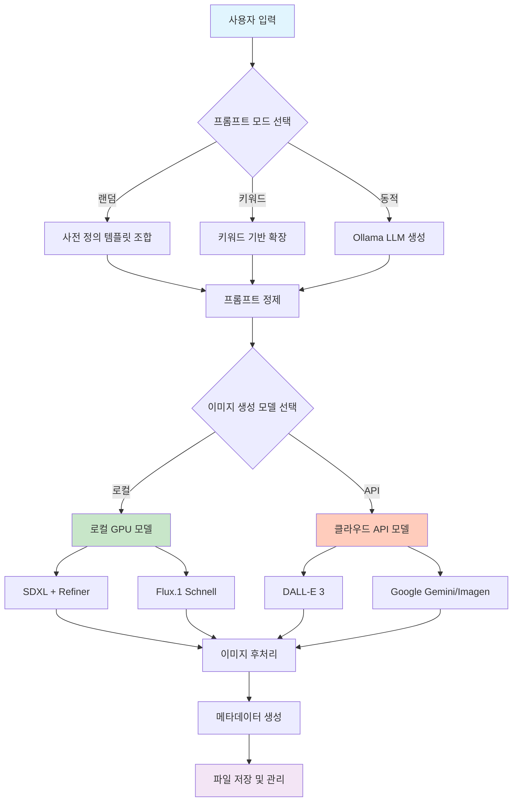

# 로컬 GPU와 LLM을 활용한 스톡 이미지 생성 자동화 시스템 구축 경험기

## 목차
1. [프로젝트 배경](#프로젝트-배경)
2. [시스템 아키텍처 설계](#시스템-아키텍처-설계)
3. [핵심 구현 사항](#핵심-구현-사항)
4. [동적 프롬프트 생성의 필요성과 구현](#동적-프롬프트-생성의-필요성과-구현)
5. [다중 모델 지원 및 폴백 전략](#다중-모델-지원-및-폴백-전략)
6. [로컬 vs 클라우드 모델 선택 가이드](#로컬-vs-클라우드-모델-선택-가이드)
7. [실제 구현에서 마주한 문제들과 해결책](#실제-구현에서-마주한-문제들과-해결책)
8. [성능 최적화 경험](#성능-최적화-경험)
9. [프로젝트 회고 및 개선 방향](#프로젝트-회고-및-개선-방향)

## 프로젝트 배경

미리캔버스나 Adobe Stock 같은 플랫폼에서 사용할 수 있는 디자인 에셋을 대량으로 생성해서 부가적인 수익을 창출할수 있는 사실 알고계시나요? 하지만 이미지 생성에 사용되는 API 비용은 많은 부담요소입니다. 그래서 저는 부담 없이 작업하고 싶었고, 로컬 GPU 자원을 최대한 활용해보고 싶었습니다. 그래서 여러 이미지 생성 모델을 통합하고, 프롬프트 생성부터 메타데이터 관리까지 전체 파이프라인을 자동화하는 시스템을 만들어보았습니다.

## 시스템 아키텍처 설계

전체 시스템을 다음과 같은 구조로 설계했습니다:



## 핵심 구현 사항

### 모듈화된 구조 설계

각 기능을 독립적인 함수로 분리하여 유지보수와 확장이 용이하도록 구현했습니다:

```python
# 프롬프트 생성 모듈
def generate_prompt(base_idea=None):
    """키워드 기반 또는 랜덤 프롬프트 생성"""
    # 구현 내용...

def generate_dynamic_prompt_with_ollama():
    """Ollama를 활용한 동적 프롬프트 생성"""
    # 구현 내용...

# 이미지 생성 모듈
def generate_image_with_local(prompt_data):
    """로컬 SDXL 모델 활용"""
    # 구현 내용...

def generate_image_with_flux(prompt_data):
    """로컬 Flux 모델 활용"""
    # 구현 내용...

# 후처리 모듈
def process_image(image, prompt_data, format_type):
    """이미지 후처리 및 메타데이터 생성"""
    # 구현 내용...
```

### 설정 기반 유연성 확보

환경 변수와 설정을 통해 다양한 환경에서 동작할 수 있도록 구현했습니다:

```python
# 환경별 설정
OPENAI_API_KEY = os.getenv("OPENAI_API_KEY")
GOOGLE_API_KEY = os.getenv("GOOGLE_API_KEY")
OLLAMA_API_URL = "http://localhost:11434/api/generate"
OLLAMA_MODEL = "qwen2.5:14b"  # 설정 가능한 모델

# 라이브러리 선택적 import로 의존성 문제 해결
try:
    from rembg import remove
    REMBG_AVAILABLE = True
except ImportError:
    print("경고: 배경 제거 기능이 비활성화됩니다.")
    REMBG_AVAILABLE = False
```

## 동적 프롬프트 생성의 필요성과 구현

### 왜 동적 프롬프트가 필요한가?

기존의 랜덤 조합이나 키워드 기반 프롬프트 생성 방식은 다음과 같은 한계가 있었습니다:

1. **제한된 창의성**: 사전 정의된 템플릿 조합으로는 참신한 아이디어 생성이 어려움
2. **반복적인 결과**: 비슷한 패턴의 이미지가 계속 생성됨
3. **맥락 이해 부족**: 단순 키워드 조합으로는 복합적인 개념 표현이 어려움

### 실제 구현 방식

Ollama LLM을 활용하여 구조화된 JSON 형식으로 프롬프트를 생성하도록 구현했습니다:

```python
def generate_dynamic_prompt_with_ollama():
    master_prompt = f"""
You are a creative assistant specialized in generating ideas for design assets.
Your task is to generate ONE creative concept for a design asset.

Output the result ONLY in JSON format with the following exact keys:
{{
  "korean_description": "<생성된 에셋 아이디어에 대한 간결한 한글 설명>",
  "english_image_prompt": "<Detailed English prompt for image generation>",
  "tags": ["<List of 5-7 relevant Korean and English tags>"]
}}

Generate a new, creative concept now.
"""
    
    try:
        payload = {
            "model": OLLAMA_MODEL,
            "prompt": master_prompt,
            "format": "json",
            "stream": False
        }
        response = requests.post(OLLAMA_API_URL, json=payload, timeout=120)
        
        # JSON 파싱 및 검증 로직
        parsed_result = json.loads(response.json().get("response"))
        
        return {
            "prompt": parsed_result.get("english_image_prompt"),
            "korean_prompt_base": parsed_result.get("korean_description"),
            "tags": parsed_result.get("tags", [])
        }
    except Exception as e:
        # 실패 시 기본 프롬프트 생성기로 폴백
        return generate_prompt()
```

### 동적 프롬프트 생성 예시

**입력**: "새로운 디자인 에셋 아이디어를 만들어줘"

**Ollama 출력**:
```json
{
  "korean_description": "우주 정거장에서 바라본 지구의 일출 풍경",
  "english_image_prompt": "Spectacular sunrise over Earth as seen from space station window, cinematic lighting, detailed planet surface, realistic space environment, high contrast, professional space photography style",
  "tags": ["우주", "지구", "일출", "space", "earth", "sunrise", "cinematic"]
}
```

이처럼 단순한 키워드 조합으로는 만들어내기 어려운 창의적이고 구체적인 프롬프트를 생성할 수 있었습니다.

## 다중 모델 지원 및 폴백 전략

### 구현한 폴백 시스템

각 모델이 실패할 경우를 대비해 단계적 폴백 시스템을 구현했습니다:

```python
def test_image_generation(count=1, model="local", user_prompt=None, prompt_mode="random"):
    # 모델별 실행 및 폴백 로직
    if selected_model == "gemini" and GOOGLE_API_KEY:
        image, prompt_data = generate_image_with_gemini(prompt_data)
        if image is None: 
            actual_model_used = "dalle"
    elif selected_model == "dalle" and OPENAI_API_KEY:
        image, prompt_data = generate_image_with_dalle(prompt_data)
        if image is None: 
            actual_model_used = "random"
    elif selected_model == "local":
        if DIFFUSERS_AVAILABLE:
            image, prompt_data = generate_image_with_local(prompt_data)
        else:
            # 라이브러리 미설치 시 API 모델로 대체
            if OPENAI_API_KEY: 
                actual_model_used = "dalle"
                image, prompt_data = generate_image_with_dalle(prompt_data)
    # 최종 실패 시 랜덤 색상 이미지 생성 (완전한 실패 방지)
    else:
        color = (random.randint(200, 255), random.randint(200, 255), random.randint(200, 255))
        image = Image.new('RGB', (1024, 1024), color=color)
```

### GPU 메모리 최적화

로컬 GPU를 사용할 때 메모리 효율성을 위해 다음과 같이 구현했습니다:

```python
def generate_image_with_local(prompt_data):
    # 장치 및 데이터 타입 자동 감지
    if torch.cuda.is_available():
        device = torch.device("cuda")
        torch_dtype = torch.float16  # GPU 메모리 절약
        print("🚀 CUDA 가속 (float16) 사용")
    elif hasattr(torch.backends, "mps") and torch.backends.mps.is_available():
        device = torch.device("mps")
        torch_dtype = torch.float16  # Mac GPU 지원
        print("🚀 MPS 가속 (float16) 사용")
    else:
        device = torch.device("cpu")
        torch_dtype = torch.float32
        print("⚠️ CPU 사용 (속도 저하 예상)")
    
    # 메모리 사용량 최적화를 위한 설정
    pipe = StableDiffusionXLPipeline.from_pretrained(
        base_model_id, 
        torch_dtype=torch_dtype, 
        variant="fp16",  # 절반 정밀도 모델 사용
        use_safetensors=True
    )
```

## 로컬 vs 클라우드 모델 선택 가이드

실제 사용 경험을 바탕으로 각 모델의 특성을 정리했습니다:

### 로컬 모델 사용을 권장하는 경우

**장점:**
- 무제한 생성 (API 비용 없음)
- 데이터 프라이버시 보장
- 네트워크 연결 불필요
- 커스터마이징 가능

**적합한 상황:**
- 대량 이미지 생성이 필요한 경우
- 예산이 제한적인 개인/소규모 프로젝트
- 데이터 보안이 중요한 프로젝트
- 실험적인 작업이 많은 경우

### 클라우드 API 모델을 권장하는 경우

**장점:**
- 빠른 생성 속도
- 높은 품질과 일관성
- 인프라 관리 불필요
- 최신 모델 지속 업데이트

**적합한 상황:**
- 빠른 프로토타이핑이 필요한 경우
- 높은 품질이 우선인 상업적 프로젝트
- GPU 하드웨어가 없는 환경
- 소량의 고품질 이미지가 필요한 경우

### 실제 성능 비교 (개인 경험)

| 항목 | 로컬 SDXL | 로컬 Flux | DALL-E 3 | Google Gemini |
|------|-----------|-----------|----------|---------------|
| 생성 속도 | 40-60초 | 15-20초 | 10-15초 | 8-12초 |
| 품질 | 좋음 | 매우 좋음 | 우수 | 우수 |
| 비용 | 전기료만 | 전기료만 | $0.04/장 | 무료 (제한적) |
| 커스터마이징 | 높음 | 중간 | 낮음 | 낮음 |

*테스트 환경: RTX 3060 12GB, 16GB RAM*

## 실제 구현에서 마주한 문제들과 해결책

### 1. GPU 메모리 부족 문제

**문제**: SDXL + Refiner 모델 동시 로딩 시 12GB GPU 메모리 초과

**해결책**: 
```python
# 단계별 메모리 관리
base_model = load_base_model()
latents = base_model.generate()
del base_model  # 베이스 모델 메모리 해제
torch.cuda.empty_cache()  # GPU 캐시 정리

refiner_model = load_refiner_model()
final_image = refiner_model.refine(latents)
```

### 2. Ollama JSON 파싱 실패

**문제**: LLM이 때로는 유효하지 않은 JSON을 반환

**해결책**:
```python
try:
    parsed_result = json.loads(generated_json_str)
except json.JSONDecodeError as json_err:
    logging.error(f"JSON 파싱 실패: {json_err}")
    # 정규식으로 JSON 부분만 추출 시도
    json_match = re.search(r'\{.*\}', generated_json_str, re.DOTALL)
    if json_match:
        parsed_result = json.loads(json_match.group())
    else:
        # 완전 실패 시 기본 프롬프트 생성기로 폴백
        return generate_prompt()
```

### 3. 다양한 이미지 해상도 대응

**문제**: 플랫폼별로 요구하는 최소 해상도가 다름

**해결책**:
```python
def process_image(image, prompt_data, format_type):
    target_min_resolution = 2500  # 미리캔버스 기준
    width, height = image.size
    
    if width < target_min_resolution or height < target_min_resolution:
        scale = max(target_min_resolution / width, target_min_resolution / height)
        new_width = int(width * scale)
        new_height = int(height * scale)
        # Lanczos 리샘플링으로 품질 유지
        image = image.resize((new_width, new_height), Image.Resampling.LANCZOS)
```

## 성능 최적화 경험

### 배치 처리 최적화

여러 이미지를 연속 생성할 때 모델 로딩 시간을 줄이기 위해 싱글톤 패턴을 검토했지만, 메모리 관리의 복잡성 때문에 단순한 방식을 유지했습니다:

```python
# 각 이미지 생성 시마다 모델 로딩 (단순하지만 안전)
def generate_image_with_local(prompt_data):
    pipe = StableDiffusionXLPipeline.from_pretrained(...)
    image = pipe(prompt_data["prompt"])
    return image
```

### 네트워크 요청 최적화

API 모델 사용 시 속도 제한을 고려한 대기 시간 추가:

```python
# API 모델 사용 후 대기
if actual_model_used not in ("local", "flux") and i < count - 1:
    wait_time = random.randint(2, 5)
    print(f"⏱️ {wait_time}초 대기 중...")
    time.sleep(wait_time)
```

## 프로젝트 회고 및 개선 방향

### 만족스러웠던 점

1. **비용 효율성**: 로컬 GPU 활용으로 API 비용 없이 대량 생성 가능
2. **유연성**: 다양한 모델과 프롬프트 모드 지원으로 다양한 시나리오 대응
3. **자동화**: 프롬프트 생성부터 메타데이터 관리까지 전체 파이프라인 자동화

### 아쉬웠던 점과 개선 방향

1. **속도**: 로컬 모델의 생성 속도가 API 모델 대비 느림
   - **개선 방안**: 더 빠른 GPU나 모델 병렬 처리 검토

2. **품질 일관성**: 프롬프트에 따른 품질 편차
   - **개선 방안**: 프롬프트 품질 검증 로직 추가

3. **에러 처리**: 예상치 못한 상황에서의 에러 처리 부족
   - **개선 방안**: 더 세밀한 예외 처리와 로깅 시스템 구축

### 향후 계획

1. **웹 인터페이스 개발**: 명령줄이 아닌 웹 기반 인터페이스
2. **품질 평가 시스템**: 생성된 이미지의 품질을 자동 평가하는 모듈
3. **데이터베이스 연동**: 생성된 이미지와 메타데이터를 체계적으로 관리
4. **ControlNet 통합**: 더 정밀한 이미지 생성을 위한 ControlNet 지원

---

이 프로젝트를 통해 로컬 GPU와 다양한 AI 모델을 효과적으로 조합하여 실용적인 자동화 시스템을 구축할 수 있었습니다. 완벽하지는 않지만, 실제 사용 가능한 수준의 결과물을 얻을 수 있었고, 무엇보다 비용 부담 없이 다양한 실험을 할 수 있었던 점이 큰 수확이었습니다. 

혹시 비슷한 프로젝트를 진행하시는 분들께 작은 도움이 되길 바라며, 더 좋은 아이디어나 개선 방안이 있으시면 언제든 공유해 주시면 감사하겠습니다.