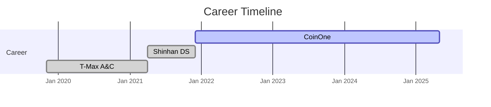

# About Me

**김용우**  
*DevOps Engineer*  
**System Status:** 🟢 ONLINE

---

## Career Timeline

저는 현재 **DevOps 엔지니어**로 활동 중이며,  
저비용·고효율 실현을 위해 끊임없이 고민하고 노력하고 있습니다.

---

## 🔧 최근 활동

- **AI 도구**를 활용하여 현실에 적용 가능한 의미 있는 결과물을 꾸준히 만들어 내고 있습니다.  
- 제 활동은 [GitHub](https://github.com/ddukbg)에서도 확인하실 수 있습니다. 아직 내용이 많지 않지만, 언제든 편하게 방문해 주세요!  

---

## 💻 이 블로그 소개

이 공간은 그간 쌓아온 기술적 경험과 지식을 **공유**하기 위해 마련한 곳입니다.  
특히, 제가 직접 개발한 마크다운 기반 블로그 생성 오픈소스 도구 
[StyleMD](https://github.com/ddukbg/stylemd)로 구현하였습니다.

> 언제든지 부족한 부분에 대한 **피드백**과 **조언** 환영합니다!  

## Contact

- LinkedIn: [@yongwoo-kim](https://www.linkedin.com/in/yongwoo-kim-b2a23a200/)
- Email: <wowrebong@gmail.com>

---